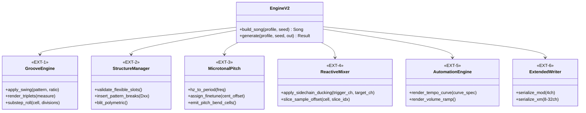

# マルチジャンル対応 MOD 生成エンジン 第二段階 core 拡張設計案（Design v2.0 Draft）

| 項目 | 内容 |
|:---|:---|
| 対象 | `mod_weaver` core レイヤーの次期拡張（v2.0 構想） |
| 前提ドキュメント | [EXTENSION_DESIGN.md](EXTENSION_DESIGN.md)（Design v1.2 / 第一段階実装仕様。march 実装完了により第一段階は完了） |
| ステータス | **EXT-1〜6（本書 §4）は将来拡張構想・検討案のまま（未着手）**。ただし §2 の8ジャンルが必要とする**音源合成基盤**（§8）は設計・実装済み（`core/synth.py` / `core/synth_presets.py`）。EXT-1〜6 はこの基盤の上に構築する |
| 目的 | 現行 core の制約（4ch、16分固定格子、64 row約数、12平均律、静的チャンネル独立）を超え、ジャズ、変拍子、現代ベースミュージック、民族音楽等への拡張を可能にする |

---

## 1. 概要と背景

### 1.1. 現行 core（v1.x）の前提境界と限界
第一段階（v1.x）の設計は、**ProTracker `M.K.` 標準規格（Amiga 4ch）への完全適合**を最優先として確立された（当初は既存 Nostalgic とのバイト完全一致＝bit-exact も要件だったが、サンプル合成を `core/synth.py` の Patch 方式へ移行した際に撤回済み。§8 参照。ProTracker 規格適合の要件は不変）。これにより安定した基盤が得られた一方、以下の構造的境界が存在する：

1. **時間軸の固定性**: Speed 6 固定、4 row = 1 拍（16分音符格子）。スウィング、シャッフル、3連符の表現が不可。
2. **小節構造の硬直性**: 1 パターン = 64 row の約数（16 row または 8 row）のみを小節として許容。変拍子（5/8, 7/8 等）に対応不能。
3. **音響ポリフォニーの限界**: 4 チャンネル固定。アルペジオ（`0xy`）による疑似和音では、5パート以上の独立対位法や分厚いオーケストレーションが物理的に破綻。
4. **調性・音律の制約**: 12平均律（半音 0..35）と固定 Period 表に完全拘束。微分音（クォータートーン等）や非西洋音律が扱えない。
5. **チャンネル間の完全分離**: チャンネルは独立してバッファへ書き込まれ、他チャンネルの発音状況を検知して自チャンネルの音量・音色を動的変化させるリアクティブ機構（サイドチェイン等）が存在しない。

### 1.2. 本書の目的
本書は、これらの制約を解消し、表現可能な音楽語彙を飛躍的に拡張するための **core レイヤー第二段階拡張（v2.0）** のアーキテクチャ、追加データモデル、およびアルゴリズムを体系化するものである。

---

## 2. 対象ジャンルと必要 core 拡張のマッピング

| # | 対象ジャンル | 表現上の必須要件 | 現行 core の壁 | 必要となる core 拡張モジュール |
|:---|:---|:---|:---|:---|
| 1 | **スウィング・ジャズ / ビバップ** (`swing-jazz`) | ハネたリズム、シャッフル、8分/16分3連符 | 16分均等格子、Speed 6 固定 | **EXT-1**: タイムベース＆グルーヴ・エンジン |
| 2 | **変拍子プログレ / マスロック** (`prog-rock`) | 5/8拍子、7/8拍子、小節ごとの拍数変化 | `rows_per_measure` が 64 の約数固定 | **EXT-2**: 可変小節＆パターンブレイク |
| 3 | **フルオーケストラ / 劇伴** (`orchestral`) | 弦5部＋木管＋金管＋打楽器の重層ポリフォニー | 4 チャンネル固定 | **EXT-6**: マルチチャンネル (8〜16ch) |
| 4 | **トラップ / ドリル** (`trap`) | 32分/64分ハイハットロール、808ピッチスライド | 1 row 単位の粗い分解能、独立スライド | **EXT-1**: サブステップ・シーケンサー<br>**EXT-5**: グライド・ジェネレータ |
| 5 | **中東マカーム / インド古典** (`maqam`) | クォータートーン（微分音）、純正調的音程 | 12平均律半音インデックス固定 | **EXT-3**: マイクロチューニング層 |
| 6 | **ミニマル / フェーズ音楽** (`minimalism`) | パートごとに周期が異なるポリメトリック構造 | 全トラック同一小節境界同期 | **EXT-2**: 非同期ポリメトリック・バッファ |
| 7 | **フューチャーベース / グリッチ** (`future-bass`) | キック連動ダッキング（サイドチェイン）、波形細切れ | チャンネル間リアクティブ機構の欠如 | **EXT-4**: パート間リアクティブ・ミキサー |
| 8 | **フリージャズ / 現代無調音楽** (`free-jazz`) | テンポの連続加減速（ルバート）、無調音響 | パターン単位の固定 BPM、調性強制 | **EXT-5**: テンポオートメーション |

---

## 3. 第二段階 core 拡張アーキテクチャ



---

## 4. 各拡張モジュールの詳細仕様

### 4.1. EXT-1: タイムベース＆グルーヴ・エンジン (`core/groove.py`)

ProTracker のタイマー割り込み（チック）を操作し、16分均等格子に縛られないリズムを実現する。

#### ① チック・オルタネーション（スウィング制御）
ProTracker では 1 row あたりのチック数（既定 Speed 6）を `F0x` コマンドで動的に変更できる。
奇数 row と偶数 row で Speed を交互に変更することで、正確なシャッフル／スウィングを生成する。

```python
@dataclass(frozen=True)
class SwingConfig:
    ratio: float = 0.667          # 3連符スウィング: 2:1 (約 67%)
    base_speed: int = 6           # 通常行の Speed
    # ratio ≈ 0.67 の場合: 偶数 row = Speed 7 (約 58%) / 奇数 row = Speed 5 (約 42%)
    # または base_speed=8: 偶数 row = Speed 10 / 奇数 row = Speed 6
```
- **エンジン処理**: `apply_tempo` と同様に、曲頭またはパターン内の空きチャンネルに `F07` / `F05` を交互に自動挿入する。

#### ② 1拍 = 6 row モード（完全3連符タイムベース）
- 1小節（4拍）= **24 row**（または 12 row）とするタイムベース。
- `rows_per_measure = 24` を許容し、後述の EXT-2（パターンブレイク）と組み合わせて 64 row の物理パターンへシームレスにマッピングする。

#### ③ サブステップ・シーケンサー（超高速ロール）
- 32分音符・64分音符のハイハットロールを、`E9x`（Retrigger Note every x ticks）および `EDx`（Delay Note by x ticks）を用いて 1 row 内部に合成する。
- 音量減衰（Crescendo Roll）は `E9x` 単体では行えないため、近傍の空きチックへ微小ディレイ音を分散配置する自動スプリット機構。

---

### 4.2. EXT-2: 可変小節＆パターンブレイク・マネージャ (`core/structure.py`)

#### ① 可変長 Measure と `Dxx` 自動挿入
5/8拍子（5 row/measure）、7/8拍子（7 row/measure）など、64 row を割り切れない小節構造を許容する。

- **仕組み**:
  1. Profile は自由な小節長（例: 7 row × 8 measure = 56 row）を定義する。
  2. パターン終端行（row 55）の空きチャンネルに、ProTracker コマンド **`D00`（Pattern Break: 次のパターンの row 0 へ即座にジャンプ）** を自動挿入する。
  3. これにより、物理的には 64 row のパターン枠を維持したまま、音楽的には 56 row で正確に小節が完結し次パターンへ遷移する。

#### ② 非同期ポリメトリック・バッファ (`PolymetricBuffer`)
ミニマル・ミュージック（ライヒ等）向けに、チャンネルごとに独立した小節長・ループ周期を与える。

```python
class PolymetricTrack:
    cycle_rows: int                # 例: Ch1=16 (4拍), Ch2=12 (3拍), Ch3=20 (5拍)
    generator: Callable[[int], Cell]

# エンジンが最小公倍数（LCM）または曲長に合わせて物理 Pattern (64 row) へ連続 blit する
```

---

### 4.3. EXT-3: マイクロチューニング層 (`core/pitch.py`)

#### ① クォータートーン・24-EDO 対応
12平均律（100セント単位）を細分化し、50セント単位（クォータートーン）や微分音律を表現する。

- **実現方式**:
  1. **Finetune 分散方式**: 同一波形サンプルから、あらかじめ `finetune`（$-8 \sim +7$、1ステップ約 7.8 セント）をズラした派生サンプル（例: +50セント用）を自動登録する。
  2. **リアルタイム・ピッチベンド方式**: 発音セル直後に `E1x` / `E2x`（Fine Portamento Up/Down: 1単位約 3〜4 セント）を付与して微分音高へ瞬時にシフトさせる。

```python
@dataclass(frozen=True)
class MicroNote:
    semitone: int                  # 基準半音 (0..35)
    cents_offset: float            # -50.0 .. +50.0
```

---

### 4.4. EXT-4: パート間リアクティブ・ミキサー (`core/mixer.py`)

特定パートの発音イベントをトリガーとして、他パートのセルを非破壊的に後処理（Post-Process）する機構。

#### ① サイドチェイン・ダッキング（Duck Compressor エミュレーション）
- **設定**: `SidechainRule(trigger_sample="kick", target_channel=1, duck_vol_ratio=0.3, release_rows=2)`
- **処理アルゴリズム**:
  1. 全チャンネルの `compose_measure()` 完了後、パターン全体を走査。
  2. キックが鳴った row を検出。
  3. 対象チャンネル（ベースやコードパッド）の該当 row の音量を $30\%$ まで急減衰（`0xC <ducked_vol>`）。
  4. 続く `release_rows` にかけて元の音量へ線形補間（`ramp`）で復帰させる。

#### ② サンプル・スライサー（`9xx` Sample Offset）
- ドラムンベースやグリッチ音楽向けに、長尺ブレイクビーツの特定位置（スネア位置、キック位置）を `9xx`（Offset $xx \times 256$ サンプル）で正確に叩き分けるスライス定義テーブル。

---

### 4.5. EXT-5: テンポ＆ダイナミクス・オートメーション (`core/automation.py`)

#### ① テンポカーブ・レンダラ
フリージャズのルバートや、EDM のビルドアップ（徐々に加速）を row 単位で自動描画する。

```python
@dataclass
class TempoCurve:
    start_bpm: int
    end_bpm: int
    start_row: int
    end_row: int
    curve_type: str = "linear"     # "linear" | "exponential"
```
- **処理**: 各 row の理論 BPM を計算し、値が変化した row の空きチャンネルに `F <bpm>` コマンドを連続挿入する。

#### ② 808 グライド（ピッチスライド追従）
トラップ特有の「低音キックが鳴ったままオクターブ上へ滑らかにピッチ変化する」動作を、`3xx`（Tone Portamento）のスピードパラメータと連動して自動計算する。

---

### 4.6. EXT-6: マルチチャンネル＆次世代フォーマット拡張 (`core/writer_xm.py`)

オーケストラやプログレッシブ・アンビエント等、4チャンネルでは物理的に不可能なジャンルに対応するため、出力フォーマットを拡張する。

1. **FastTracker II `.xm` 形式のサポート**:
   - チャンネル数を **8ch / 16ch / 32ch** まで拡張可能。
   - チャンネルごとのステレオパンニング（`8xx`）の完全サポート（固定 LRRL からの解放）。
   - インストゥルメントごとの音量・パンエンベロープ（ADSR）ネイティブ対応。
2. **アーキテクチャの抽象化**:
   - `core/writer.py` を基底インターフェース化し、`ModWriter`（現行）と `XmWriter`（拡張）を Profile 側の宣言（`target_format = "mod" | "xm"`）で切り替える。

---

## 5. データモデル拡張案

```python
# core/model.py への将来追加案

@dataclass(frozen=True)
class CellV2(Cell):
    fine_tune_offset: int = 0      # マイクロチューニング用
    substep_trigger: int = 0       # E9x / EDx 用
    pan: Optional[int] = None      # 0..128 (XM 拡張時)

@dataclass
class MeasurePlanV2:
    length_rows: int = 16          # 5, 7, 12, 16, 24 など任意
    swing: Optional[SwingConfig] = None
    sidechains: list[SidechainRule] = field(default_factory=list)

class GenreProfileV2(GenreProfile):
    # 機能ケーパビリティの宣言
    format: str = "mod"            # "mod" | "xm"
    max_channels: int = 4          # 4..32
    time_base: str = "straight"    # "straight" | "swing" | "triplet"
```

---

## 6. 下位互換性（Backward Compatibility）戦略

**バイト単位の完全一致（bit-exact）は要件としない**（Nostalgic のサンプル合成を `core/synth.py` へ移行した際に撤回済み。§8）。本拡張を導入する際に維持するのは、**第一段階（v1.x）で作成された Nostalgic / Suspense / March の構造的な健全性と作曲ロジックの安定性**であり、以下の基本方針で担保する：

1. **デフォルト挙動の維持 (Opt-in方式)**:
   - 新機能（スウィング、可変小節、サイドチェイン、XM出力等）はすべて Profile 側の明示的な宣言による Opt-in とする。
   - `strict_buffers=False` かつ標準宣言の Profile（Nostalgic）は、従来の `MeasureBuffer` とシリアライザをそのまま通過し、乱数消費順も一切変動させない（作曲ロジック＝`plan()`/`compose_measure()` は本拡張・§8 のいずれでも無変更）。
2. **レイヤーの直交性**:
   - `GrooveEngine` や `ReactiveMixer` は、基本生成が完了した後の「装飾・後処理パイプライン」としてプラグイン可能に設計し、既存の生成フック（`compose_measure`）の純粋性を汚染しない。
3. **独立した検証ルール**:
   - 拡張フォーマット（XM）や変拍子パターンに対しては、`verify.py` に対応する拡張バリデータ（例: `verify_xm`）を独立新設し、現行の V01〜V16 ルールセットを破壊しない。
4. **`verify()` による構造検査は常にクリーン**:
   - バイト完全一致は求めないが、生成物が ProTracker 規格として妥当であること（`verify()` にエラーが無いこと）は全ジャンル・全 seed で維持する。

---

## 7. 段階的ロードマップ（Phase 4 以降）

第一段階（Phase 1〜3）の完了・安定稼働後、以下のステップで順次拡張を検証・実装する。

| マイルストーン | 拡張内容 | 実証ジャンル |
|:---|:---|:---|
| **Phase 4a** | EXT-1（スウィング＆3連符）＋ EXT-2（可変小節＆Pattern Break） | `swing-jazz`（スウィング・ジャズ）<br>`prog-rock`（7/8拍子プログレ） |
| **Phase 4b** | EXT-4（サイドチェイン＆スライス）＋ EXT-1（サブステップ） | `future-bass`（ダッキングシンセ）<br>`trap`（細切れハット＆808） |
| **Phase 4c** | EXT-3（マイクロチューニング）＋ EXT-5（テンポオートメーション） | `maqam`（アラブ伝統音楽）<br>`free-jazz`（テンポ揺らぎ） |
| **Phase 4d** | EXT-6（FastTracker II `.xm` 8〜16ch バイナリライター） | `orchestral`（多声部シンフォニック） |

---

## 8. 音源合成基盤（実装済み・EXT-1〜6 の前提条件）

§2 の8ジャンルはいずれも新しいサンプル音色を必要とするが、ジャンルごとにベタ書き DSP コードを増やしていくと `core` が「特定ジャンル専用の音色コレクション」で肥大化する（実際、march 追加時に顕在化した）。EXT-1〜6 の実装に着手する前に、この音源合成の基盤を別途設計・実装し、nostalgic / suspense-slow / suspense-chase / march の既存18音色（全て）をこの方式へ移行済み。

### 8.1. 設計方針: 直交レイヤー方式（固定カテゴリではない）

楽器ファミリー（打楽器／金属／持続音／撥弦 等）で分類するアプローチは、ティンパニや808サブベースのような「音程を持つ打楽器」、スネアのような「トーン層＋ノイズ層を別々の減衰率で混ぜる」音色を無理に押し込むことになり、検討の初期段階で撤回した。代わりに `core/synth.py` は次の直交する要素だけを公開する：

- **`Layer`**（信号源）: `ToneLayer`（加算合成、倍音ごとに減衰率を持てる）／`PitchSweepLayer`（打撃音のピッチドロップ）／`NoiseLayer`（フィルタ付きノイズ、減衰 or 上昇の包絡）
- **`Finish`**（仕上げ方）: `OneShot`（一発音）／`Loop`（完全ループ、アタック窓の有無を選べる）
- **`Patch`**: `layers` の重み付き合成＋後処理パイプライン（`post_filter` → `decay_alpha` → `attack_ms` → `tail_fade_ms` → 正規化 → `saturate`）＋サンプルの素性（`rate_note`/`shift`/`finetune`/`volume`）
- **`render(patch) -> SampleSpec`**: core が公開する唯一のエントリ

減衰・上昇を表すフィールドは全レイヤーで `Optional[float]`（`None`＝無効）に統一し、判別用の文字列フィールド（`shape` 等）は持たない。「知覚寄りの少数パラメータでパッチを組み立てるファクトリ関数」は一度試したが、複数の技術パラメータを1ノブに連動させる設計は**サンプル音源の設計自由度を犠牲にする**ため撤回した（連動が必要なら、その判断はジャンルモジュール側のローカルなヘルパー関数に置く）。詳細な設計原則は `core/synth.py` の module docstring を正とする。

### 8.2. プリセット・ライブラリ（`core/synth_presets.py`）

「望む音色から逆算してパラメータを探索するのが難しい」という懸念に対し、動作・音質を確認済みの `Patch` 値を集めた参照ライブラリを用意した。新しい音色が欲しいときは、まず `find(keyword)` で近い説明のプリセットを探し、`dataclasses.replace()` で差分だけ調整して `render()` → 試聴し、良ければ新しいプリセットとして追加する（ゼロから `Patch` を組み立てない）。これは型としての分類ではなく検索用の参照データであり、§8.1 の直交設計とは矛盾しない。

nostalgic 7・suspense 7・march 7 の計21プリセットが登録済み（`PRESETS`/`DESCRIPTIONS`）。EXT-1〜6 の実証ジャンル（swing-jazz 等）で新しい音色が必要になったら、ここに追加していく。

### 8.3. 既存ジャンルへの適用状況

nostalgic / suspense-slow / suspense-chase / march の全音色（nostalgic 7、suspense 7 ── suspense-slow/suspense-chase で共有、march 7。計21で §8.2 のプリセット数と一致）を Patch 方式へ移行済み。移行は1音色ずつ、実際にレンダリングして構造検査（`SampleSpec.validate()`）・ヘッドルーム・ループ境界等を確認しながら進めた。移行の過程で、既存コードだけを見ていては気付けなかった `core/synth.py` 側の不足（`Patch.tail_fade_ms`・`Loop` の循環フィルタ・`Patch.decay_alpha`・`Patch.peak=None`・`Patch.post_filter`）が判明し、その都度 core を直してから移行を続けた。最終的に `Patch`/`Layer` の命名・パラメータ設計の一貫性（`Optional[float]` の統一、単位をフィールド名に明記する等）を見直すリファクタも行っている。

**バイト完全一致は要件から外れた**（§6）。移行前後で数式・定数は同一値を用いており、ピーク振幅は全音色で一致、長さは秒数→サンプル数の丸め方式の違いにより数サンプル程度の差にとどまる（実測で確認済み）。作曲ロジック（`plan()`/`compose_measure()`）は一切変更していないため、Cell 配置は旧実装とバイト単位で今も一致する。

### 8.4. EXT-1〜6 実装時の指針

EXT-1〜6（本書 §4）で新しいジャンルプロファイルを追加する際、新規サンプル音色は次の順で検討する：

1. `core/synth_presets.py` の `find()` で近い音色を探す
2. 無ければ `core/synth.py` の `Patch`/`Layer` を直接組み立てる（新しい Layer 種別やカテゴリを core に追加しない。既存の3 Layer 型の組み合わせで大抵の音色は表現できることを§8.1・§8.3の移行作業で確認済み）
3. 動作確認が取れたら `core/synth_presets.py` にプリセットとして追加する

EXT-3（マイクロチューニング）は `Patch.finetune` フィールドが差込口として既にある。EXT-1/EXT-5（グルーヴ・オートメーション）が必要とするエフェクト（`E9x` リトリガ、ポルタメント、テンポカーブ等）は `core/synth.py` の管轄外（Cell/effect レベルの話であり、`core/composer.py` や各プロファイルの文法メソッドが担当する）。
