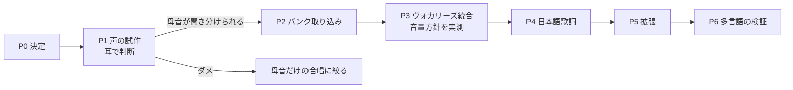
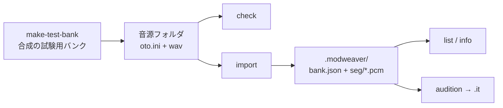
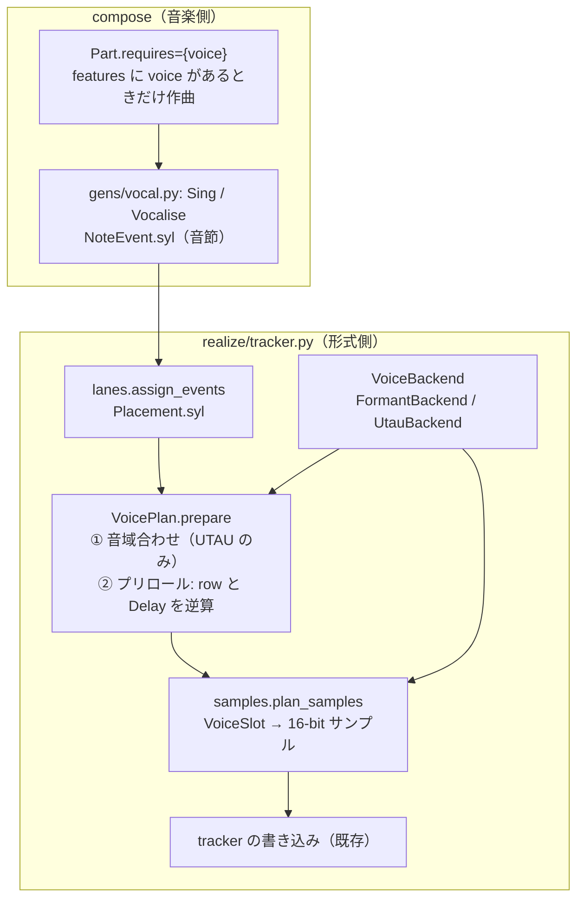

# ModWeaver 設計の経緯

現在の仕様は [DESIGN.md](DESIGN.md) を正とする。本書は「なぜそうなったか」「途中で何を直したか」「何を見送ったか」を時系列で残す。
2026-09-21〜24 に書かれた設計書7本（§14）を統合した際に、各文書に散らばっていた改訂履歴・訂正・レビュー記録・実装で判明したことをここに集めた。
統合前の原文はコミット `daf2e5b` 以前の git 履歴にある。2026-10-07 には歌声の設計草案 `VOCAL_DESIGN.md` も DESIGN.md §13 と本書（§17）に統合して削除した。2026-10-03 に、フレームワークの再設計書 `FRAMEWORK_REDESIGN.md` も DESIGN.md と本書（§15）に統合して削除した（原文は `framework-redesign` ブランチの履歴にある）。

---

## 1. 年表

| 日付 | 段階 | 主な出来事 | 当時の文書 |
|:---|:---|:---|:---|
| 〜2026-09 | 原初版 | 単体スクリプト `twilight_pad.py`（ノスタルジック1ジャンル）。Copilot 生成コードの欠陥を分析して作り直した | 旧 `DESIGN.md` |
| 2026-09 前半 | 多ジャンル化の構想 | サスペンス・マーチを加える拡張の検討書 | `EXTENSION_SPEC.md` |
| 2026-09-21〜22 | 第一段階 | 設計 v1.0〜v1.2（第三者レビュー T1〜T25 を反映）→ Phase 0〜3 を実装（nostalgic / suspense-slow / suspense-chase / march）。v1.3 で音源合成を Patch 方式へ統一 | `EXTENSION_DESIGN.md` |
| 2026-09-23 | core 拡張 | EXT-1〜6 を詳細設計し Phase 4a〜4e で実装。8ジャンル追加（計12） | `CORE_EXTENSION_DESIGN.md`、`GENRE_DESIGN_V2.md` |
| 2026-09-23 | 第１段階（次の検討事項） | 出力形式の選択（mod/xm/s3m/it/midi/mp3）とテンポ指定。実プレイヤー検査を導入。main にマージ（`a696667`） | `FORMAT_TEMPO_DESIGN.md` |
| 2026-09-24 | 第２段階（次の検討事項） | ジャンルの自動検出、引数なしで usage、`--genre random`、`--version`、英語版 README、出力先 `output/`、日本語表示と `-e`。orchestral の V15 誤警告を修正。main にマージ（`63d2aeb`） | `CLI_STAGE2_DESIGN.md` |
| 2026-09-24 | 文書の統合 | 設計書7本を `DESIGN.md`（現行仕様）と本書（経緯）に統合 | 本書 |
| 2026-09-24 | 第３段階（次の検討事項） | 35ジャンルの追加（計47）。共通の骨格 `BandProfile` と楽器名の音色ライブラリ、ジャンルごとに 4／6／8ch（§12.5） | 設計中は `DESIGN.md` §12、実装後に §6.14〜6.16 へ移した |
| 2026-09-24 | 努力目標（次の検討事項） | 曲ごとのチャンネル数（27ジャンルが 4／6／8 の編成から選ぶ）、`--channels`。rock・energetic のタムが鳴らない不具合を修正（§12.6） | `DESIGN.md` §6.14 |
| 2026-09-24 | 音色空間の分析 | 使っている音色を core のパラメータの軸に置いて疎な領域を調べ、そこを埋める gamelan・chiptune・industrial を追加（計50。§12.7） | `DESIGN.md` §6.17 |
| 2026-09-25 | サウンドトラックの解析 | 特定の作品（R4）の BGM 13曲を音声解析し、その特徴で racing-breaks を追加（計51。§12.8） | `DESIGN.md` §6.18 |
| 2026-10-01〜10-03 | フレームワークの再設計 | 形式を最初に決めて作曲する新しい枠組み（Target・Score・Genre・Realizer）を設計（第三者レビュー16項目を反映）し、フェーズ F0〜F8 で全51ジャンルを移植。旧 `profiles/`・`BandProfile`・Song 経由の書き出しを削除（§15） | `FRAMEWORK_REDESIGN.md`（統合して削除） |
| 2026-10-03 | 新ジャンル14 | ケルト・ロシア民謡・ムード歌謡・演歌・沖縄民謡・浪曲・雅楽・トランス・ゴスペル・クレズマー・タンゴ・ファド・バロック・出囃子を新フレームワークで設計・実装（計65。§16） | `NEW_GENRES_DESIGN.md`（統合して削除） |

---

## 2. 原初版（TwilightPad）の課題分析

初期の生成スクリプト（Copilot 生成）は「ノスタルジックに聞こえない」だけでなく、技術的に壊れていた。原初版の設計ではこれを次のように直した。

### 2.1 サンプル音源

| 問題 | 原因 | 直し方 |
|:---|:---|:---|
| 音程が2オクターブ以上沈み、再生が約5.3倍間延び | 44100 Hz で波形を作っていた（ProTracker の C-3 再生レートは約 8287 Hz） | 生成レートを `PAL クロック / (214×2) ≈ 8287.14 Hz` に合わせる |
| Pad が 0.06 秒で「プチッ」と途切れる | 512 サンプルでループ無し | 1024 サンプルに整数周期（K=32 など）を収め、始端と終端の位相を一致させた完全ループ |
| スネアが「ピピッ」という電子音 | 固定の正弦波の和でノイズが無い。ハイハットも無い | 指数的なピッチ降下のキック、トーン＋LP ノイズのスネア、差分 HP＋金属共鳴のハイハットを新設計 |
| 旋律楽器が無い | 歪んだノコギリ波のベースとパッドだけ | オルゴール（非整数倍音 5.4 倍を含む）、温かいベース、木管リードを追加 |

### 2.2 パターン・構成

| 問題 | 直し方 |
|:---|:---|
| Period 表の誤登録（`D#3`=381 は実際は D、`G-3`=303 は実際は F#）でトライトーンを含む不協和音になっていた | C-1〜B-3 の36音を網羅する正しい PAL 表 |
| コード進行が無く、同じ構成音を64行すべてで毎行トリガー（クリック音の乱打） | 休符と音価を置き、ノスタルジック下降進行・ii-V-I-vi を導入 |
| 64 行（約10秒）の1パターンだけ | Intro → Theme A → Theme B → Theme A → Outro の5区間 |
| テンポ指定が無く既定の BPM 125 | BPM 88〜96、`Cxx` で強拍・弱拍・ゴースト・フェードアウト |

当時の出力は 4ch `M.K.`、4 パターン、order `[0,1,2,1,3]`、合計 26,246 byte だった（旧サンプル `old/TwilightPad.mod`）。このときの音響・作曲の考え方は、現在も nostalgic ジャンルの設計根拠になっている（DESIGN.md §6.1）。

---

## 3. 多ジャンル化の構想と、設計での訂正

### 3.1 構想（EXTENSION_SPEC）

「不変のコア（DSP・バイナリ出力・シーケンス基盤、約75%）」と「可変のスタイル（ジャンルのプロファイル、約25%）」を Strategy パターンで分ける。`DspToolkit` クラス、`ModBinaryWriter`、4メソッド（ドラム・ベース・ハーモニー・メロディ）を持つ `GenreProfile` インタフェース、サスペンス・マーチ・ノスタルジックの3プロファイル、`twilight_pad.py` の互換ラッパー、3フェーズの移行を提案した。

### 3.2 設計（EXTENSION_DESIGN v1.x）での訂正

| # | 構想の内容 | 設計での扱い |
|:--|:---|:---|
| H1 | サンプル周波数を絶対値で記述、基準ピッチが未定義 | `SampleSpec.rate_note`・`shift` を導入し `n = t + shift` |
| H2 | チャンネル割当・同じ row での衝突が未定義 | `ChannelPlan` と優先度、検査 V09 |
| H3 | 1和音＝1小節＝16 row 固定で、7和音の進行が収まらない | `rows_per_measure`・`ChordSlot.measures`（sousa は最後の和音を2小節に） |
| H4 | `list[bytes]` を返す4メソッド、図とシグネチャの不一致 | `Cell` / `MeasureBuffer` / `compose_measure` 1本＋フック |
| H5 | 音名文字列の手書き和音、半音・転調に非対応 | 半音インデックス・`ChordSpec`（調非依存）・`Scale`。nostalgic だけ手書き |
| H6 | 「既存 mod とハッシュ一致」（基準の seed が不明） | 凍結した旧実装との多 seed 比較 |
| M1 | ループ合成が浮動倍率・因果 IIR | 整数周期の検査、`circular` フィルタ |
| M2 | 「短2度＋2 Hz のうなり」は音程と同音デチューンの混同 | 同音デチューン対2組。うなりは発音ピッチに比例 |
| M3 | 和音は単音 | 新ジャンルはアルペジオ `0xy` で和音感 |
| M4 | 音量と他エフェクトの排他が未定義 | `Cell` で明示、違反は例外 |
| M5 | 検査手段なし | `core/verify.py`（V01〜V16）＋ミューテーションテスト |
| M6 | セクションの抽象が無い（`is_chorus` のみ） | `PatternPlan.kind/intensity/key_offset`、`SongPlan.order` |
| M7 | 「共通化 75%」 | 未検証の見込み値だったので観測指標に格下げ |
| M8 | `ScaleRules` と旋律メソッドの二重責務 | 共通の `MelodyGenerator(ScaleRules)`。nostalgic だけ旧アルゴリズム |
| L1 | 36音の音域・オクターブの頭打ち | `shift` と `fold_into_range`。旧 `min(3,…)` は nostalgic の Q5 として保存 |
| L2 | サスペンスに2種類の BPM 域 | 2プロファイルに分割 |
| L3 | `tempo_range`（範囲） | `tempo_choices`（離散値）。※第１段階で「上書き可能な範囲」として `tempo_range` が別の意味で復活 |
| L4 | MOD タイトル固定 | ジャンルごとの `title` |
| — | サスペンス `Cdim → Cdim/Db → Cdim → B/C` | `Cdim → Db/C → Cdim → B/C`（Db は Cdim の構成音ではなく意図が不明だった） |
| — | マーチ「裏拍（Row 4,12）」「付点8分＋16分＝[0,6,8,14]」 | 2拍目（弱拍）／`[0,6]` は付点4分＋8分、付点8分＋16分は `(0,3,4,7)` |
| — | 高域の金属音を C-3 基準の 8.29 kHz で合成 | 高域サンプルは `rate_note=B-3`（15.7 kHz）で生成 |
| — | スネアロールを Row 12–15（16 row 前提） | 8 row の measure の row 4–7 |
| — | `DspToolkit` クラス・`core/periods.py` | モジュール関数（`additive`・`noise_lp` 等）、`core/pitch.py` に統合、`core/harmony.py` を新設 |
| — | `--seed` を 0 以上に制限 | 旧実装どおり任意の整数 |
| — | `python -m mod_weaver.cli` のみ | `__main__.py` を足して `python -m mod_weaver` も可 |

---

## 4. 第一段階の決定事項（D1〜D15）

| ID | 決定 | 理由 | その後 |
|:---|:---|:---|:---|
| D1 | nostalgic の Pad の −17.7 セントは移植時は直さない | リファクタと動作変更を分け、差異の原因を切り分けるため | 現在も未修正（DESIGN.md §11） |
| D2 | サスペンスを slow（64–72）と chase（138–148）に分割、`suspense` は slow の別名 | 2つのモードは文法が根本的に違う | 有効 |
| D3 | アルペジオは新ジャンルだけで使う | nostalgic の出力を変えないため | 有効 |
| D4 | マーチは6パターン・order 10（約80秒） | 1パターン8秒では曲にならない | 有効 |
| D5 | 設計書は新規 `EXTENSION_DESIGN.md`、構想書は原典として保持 | 履歴の保全（当時 git が無かった） | 2026-09-24 に本書へ統合 |
| D6 | Python 3.10 以上、全モジュールで `from __future__ import annotations` | 3.8 は EOL、検証できる環境が 3.10/3.11 だけだった（3.8 対応は未検証の主張になるため取り下げ） | 有効。README が一時期「3.7 以上」と誤って書いていた（2026-09-24 に訂正） |
| D7 | 内部の音高は整数インデックス、音名は入出力の境界だけ | 半音・転調・音域の扱い | 有効 |
| D8 | ジャンルは `compose_measure()` 1本＋フック | 乱数消費順の保存とパート間の協調 | 有効 |
| D9 | nostalgic は単一 `rng` の消費順を厳守、新ジャンルは用途別ストリーム | 旧実装との一致と、パート改修が他パートを変えない性質の両立 | 有効 |
| D10 | 回帰基準は凍結した旧実装との多 seed 比較 | 旧サンプルの生成 seed が不明でハッシュ基準が作れない | CP2・CP5 は D15 で緩和 |
| D11 | nostalgic のサンプル合成関数は式を書き換えず移設 | 浮動小数の演算順が変わると bit-exact が崩れる | **D15 で撤回** |
| D12 | ループ音色は「アタック部＋ループ本体」、消音は `off()` と `articulate()` | ループ音色はエンベロープを持たず、休符でも鳴り続けクリックも出る（T4） | 有効 |
| D13 | 衝突の優先度は `ChannelPlan` から自動導出、`put()` に priority 引数は無い、意図的上書きは `replace()` | 二重定義と同値衝突規則の矛盾の解消（T5） | 有効 |
| D14 | 和音の具体化は `harmony.voice()` に集約、音域は `Registers`、アルペジオの基音は `t ≤ 35 − max(x,y)` | 入口が未定義だった（T1）／音域超過（T3） | 有効 |
| D15 | 全ジャンルのサンプル合成を `core/synth.py` の Patch 方式に統一し、ベタ書き DSP を廃止。バイト単位の完全一致は要件から外す（ユーザー承認） | ジャンル追加のたびに音色合成コードが重複して増える | 有効。作曲ロジックは旧実装とバイト一致のまま、サンプルは長さ・ピークが近いことだけを確認 |

---

## 5. 第三者視点の設計レビュー（第一段階）

設計を「他人が書いた前提」で点検した記録。すべて設計に反映済み。

### 5.1 自己レビュー（v1.0、R1〜R12）

| # | 重大度 | 指摘 | 対応 |
|:--|:---|:---|:---|
| R1 | High | row 0 の全チャンネルが音量指定済みだとテンポの挿入先が無い | 挿入規則（空き → 音量なしの note → エラー）とジャンル側の責務 |
| R2 | High | 旧 `cell()` は vol をクランプするが新 `Cell` は例外を出す | nostalgic 移植用の `_legacy_cell()` |
| R3 | High | note 行にサンプル番号が無いとプレイヤーにより音量がリセットされない | V07 を ERROR、`Instrument.cell` は常に番号を付ける |
| R4 | Medium | 同値優先度の衝突が曖昧 | `strict_buffers`（のち T5 で自動導出に） |
| R5 | Medium | `3xx` は直前と同じサンプルでないと意図どおり動かない | 規則を明記しテストで固定 |
| R7 | Medium | 高レート生成の打楽器を別の note で鳴らすと音高がずれる | `pitched=False` なら n を無視して `rate_note` で発音 |
| R8〜R12 | Low〜Medium | 所要時間は BPM 依存、別名の通知、`loop_design` を実行時に使わない、官能評価のチェックリスト、Python 3.8 の型注記 | 反映（R12 は D6 に吸収） |

### 5.2 第三者レビュー（v1.0 に対する T1〜T16）

検算（アルペジオの音域超過 34 通り、うなりの周波数、swoosh の row 換算、旧実装の生成物の解析）を伴うレビュー。

| # | 重大度 | 指摘 → 対応 |
|:--|:---|:---|
| T1 | High | 和音の具体化関数が無い → `harmony.voice()` と `Registers` |
| T2 | High | サンプルの内容周波数の規則が無い → `F = f(rate_note + shift)`、`spc = R/F` |
| T3 | High | horn/section の音域 [24,35] でアルペジオが t≤35 を 34 通り超える → 二重検査と `HARMONY_REG=(17,28)` |
| T4 | High | ループ音色のアタックと消音が未定義 → `with_attack`・`off()`・`articulate(gate)`・`NoteEvent.dur` |
| T5 | Medium | 優先度の二重定義、同値衝突とスネアロールの矛盾 → 自動導出、`replace()`、OFF は note を上書きしない |
| T6 | Medium | 「Python 3.8+」が未検証 → 3.10+ |
| T7 | Medium | Phase 1 が大きすぎる → 1a（基盤・CP1）と 1b（移植・CP2〜CP5） |
| T8 | Medium | 2 Hz のうなりは基準音だけ → 「t=24 で 2.0 Hz、音域全体で約 1.3〜2.5 Hz」 |
| T9 | Medium | swoosh の開始 row が BPM に依存しない固定値 → `rows_per_measure − round(0.9/row_sec)` |
| T10 | Medium | 原子的書込が Windows の既存ファイルで失敗しうる → `os.replace` と上書きテスト |
| T11〜T16 | Low | マーチの intro/coda の矛盾、V15 の方針、要件外機能の混在（→ 要件区分）、差分一覧の漏れ、初期値の曖昧さ（pizz の τ、`noise_lp` の係数の向き）、テストの不足 |

### 5.3 第三者レビュー（v1.1 に対する T17〜T25）

| # | 重大度 | 指摘 → 対応 |
|:--|:---|:---|
| T17 | High | suspense-slow で strings＋arp と vol が同じセルに書かれ排他例外になる → arp は既定音量、dropout は `off()` |
| T18 | Medium | `RngStreams` の型とフックへの渡し方が未定義 → データクラスと利用規約 |
| T19 | Medium | V10 の条件が `tempo_policy` に依存し検査側で判定できない → 全ジャンル一律の検査に単純化 |
| T20 | Medium | 同一セルの再書込でも衝突エラーになる → 同一セルは no-op |
| T21〜T25 | Low〜Medium | `PatternCtx` の構文、休符・効果セルの規約、chase intro の音域、V11 のゼロ除算ガード、スネアロールの処理順 |

---

## 6. 第一段階の実装計画と回帰基準

| Phase | 内容 | 完了条件 |
|:---|:---|:---|
| 0 準備 | 旧実装を `tests/reference/twilight_pad_v1.py` に無改変で凍結（SHA-256 固定）、pytest 設定 | 参照実装のスモークテスト |
| 1a 基盤 | errors / pitch / model / dsp の一部 / writer / verify | CP1 |
| 1b nostalgic 移植 | engine / registry / cli、nostalgic、互換ラッパー | CP2〜CP5、core カバレッジ ≥90% |
| 2a 作曲基盤 | dsp 拡張、`harmony.voice`、composer | 単体テスト |
| 2b〜2d | suspense-slow（＋共通）、suspense-chase、march | ジャンル固有テスト、V15/V16 クリーン、試聴 |
| 3 統合 | README・第三者コードレビュー・要件整合チェック | 全テスト |

回帰のチェックポイント（固定 seed 20件で旧実装と比較。各段で不一致の原因を特定してから次へ）:

| CP | 対象 | 当初 | D15 以後 |
|:---|:---|:---|:---|
| CP1 | writer / Cell / pitch / verify | 旧出力を復元 → 再直列化でバイト一致 | 同じ |
| CP2 | nostalgic のサンプル | バイト一致 | 長さ・ピークが近い |
| CP3 | `plan()` | 進行名・BPM が一致 | 同じ |
| CP4 | pattern | 4 pattern × 1024 byte が一致（Q1〜Q7 を含む） | 同じ |
| CP5 | ファイル全体 | バイト一致 | サイズが近く検査が通る、`modweaver.py` の子プロセスが有効なファイルを作る |

当時の非機能目標: 1曲 ≤5 秒、出力 ≤200 KB、core カバレッジ ≥90%・profiles ≥85%。

---

## 7. core 拡張（EXT-1〜6）

### 7.1 動機

第一段階の core は ProTracker `M.K.` への適合を最優先にしたため、①Speed 6・16分格子固定（スウィング・3連符が無理）②64 の約数の小節だけ（変拍子が無理）③4ch 固定 ④12平均律固定 ⑤チャンネル間の連動なし（サイドチェインが無理）、という壁があった。8ジャンルを実証用に選び、必要な拡張を割り当てた。

| ジャンル | 壁 | 拡張 |
|:---|:---|:---|
| swing-jazz | 16分均等格子 | EXT-1 スウィング |
| prog-rock | 64 の約数の小節 | EXT-2 可変小節 |
| orchestral | 4ch 固定 | EXT-6 マルチチャンネル（当初は XM 出力として） |
| trap | 粗い分解能、独立したスライド | EXT-1 サブステップ、EXT-5 グライド |
| maqam | 12平均律 | EXT-3 微分音 |
| minimalism | 全トラックが同じ小節境界 | EXT-2 ポリメトリック |
| future-bass | チャンネル間の連動が無い | EXT-4 サイドチェイン・スライス |
| free-jazz | pattern 単位の固定 BPM | EXT-5 テンポカーブ |

詳細設計を進めると、8ジャンルが実際に使う拡張はこの表と過不足なく一致した。

### 7.2 詳細設計で分かった簡略化

構想では EXT-2・EXT-3 を新しい core クラスと考えていたが、大部分は既存の部品の組合せで表せた。

- ポリメトリックに新クラスは不要。1 measure を周期の最小公倍数の行数にして `row % cycle` で折り返すだけ（1行の関数）。
- 微分音に新モジュールは不要。`pitch.py` に純粋関数を数個（`SampleSpec.finetune` が差込口として既にあった）。
- スライサー・808 グライドは param を計算する純粋関数1つずつ。
- マルチチャンネルは `CellGrid` が元から任意チャンネル数を受け付けたので、①4ch 固定の検査を分岐 ②XM の読み書き ③`SampleSpec.pan` の3点だけ。インストゥルメントのエンベロープは synth が PCM に焼き込む設計と重複するので対象外。
- 状態を持つ新クラスが本当に要ったのは `SwingConfig`・`SidechainRule`・`TempoCurve` と XM の読み書きだけ。`Cell` の5フィールドは一切変えず、`SampleSpec` にフィールドを足しただけで全部表せた。
- 共通基盤として、`apply_tempo` の「空きチャンネルにコマンドを1つ書く」処理を `CellGrid.insert_command` に抽出した（`engine` の関数にすると core や genres が engine に依存する逆向きの依存になるため `CellGrid` のメソッドにした）。

### 7.3 実装の経過（Phase 4a〜4e、すべて 2026-09-23）

| Phase | 内容 | テスト件数 | 実装で分かったこと |
|:---|:---|:---|:---|
| 4a | 共通基盤、EXT-1、EXT-2 → swing-jazz、prog-rock | 989 → 1194 | 4パートが同時に鳴る密な編成では row 0 以外でも空きの無い row がある → `apply_swing` は例外を出さずその row をスキップ（200 seed で1曲平均1 row 程度）。強拍に全パートを集めない編成にしてスキップ自体も減らした。`MelodyGenerator` に `beat_rows` を、`MODES` に dorian・mixolydian を追加（どちらも既定値では既存ジャンルに影響しない）。`MeasureCtx.measure_rows` は既定値 16 を持たせ既存テストを無改修にした |
| 4b | EXT-4、EXT-5 → future-bass、trap | → 1387 | `portamento_param` に渡す period の添字は tracker note（当初案の logical note は誤り）。future-bass は kick と clap が優先度を共有し clap が kick を置き換えるので、両方をサイドチェインのトリガに登録。`sample_offset_param` の使われていなかった `length_words` 引数を範囲検査に使うよう修正 |
| 4c | EXT-3 → maqam、free-jazz | → 1551 | shift の違う楽器に和音の同じ音域を共有させると範囲外になる → free-jazz は `chord.bass` と `chord.chord_tones` を楽器ごとに役割分担 |
| 4d | EXT-2 のポリメトリック → minimalism | → 1616 | 全チャンネルが row 0 に音を持つとテンポを入れられない → woodblock のアクセントを row 1 に移して row 0 を空けた |
| 4e | EXT-6 → orchestral（当時は `target_format="xm"`） | → 1729 | XM の `header_size` と delta 符号化の誤り（§8）。弦4種は同じ Patch を `shift` だけ変えて派生、6声は `mctx.chord` から毎回導出でき `state` 不要 |

各 Phase で、それ以前のジャンルのコードは1行も変えず、出力も変わらなかった（opt-in の方針が最後まで守られた）。検査の順序では、未対応の `target_format` を他の検査より先に弾くよう並べ替えた（無関係なエラーメッセージが先に出ないため。この属性は第１段階で廃止）。

### 7.4 音源合成の基盤（Patch 方式、D15）

march を追加した時点で、ジャンルごとのベタ書き DSP が core の周りで増え続ける問題が顕在化した。楽器ファミリー（打楽器・金属・持続音・撥弦）で分類する案は、ティンパニや 808 のような「音程のある打楽器」、スネアのような「トーン層とノイズ層を別の減衰で混ぜる」音色を押し込むことになるので初期に撤回し、直交レイヤー方式にした。知覚寄りのパラメータ（1つのノブで複数を連動）で組み立てるファクトリ関数も一度試したが、設計の自由度を犠牲にするので撤回した。既存4ジャンルの21音色を1つずつ実際にレンダリングしながら移行し、その過程で `tail_fade_ms`・Loop の循環フィルタ・`decay_alpha`・`peak=None`・`post_filter` の不足が見つかってその都度 core を直した。

8ジャンルの設計初稿には、synth の制約（Loop は ToneLayer のみ・整数サイクル数のみ、`attack_ms` 等は OneShot 専用）に反する音色がいくつもあった（orchestral の弦、maqam の nay、future-bass の supersaw、free-jazz の arco bass、swing-jazz の sax、orchestral の trumpet）。ループ音色の息や擦弦のノイズ感は、ノイズを混ぜず隣接整数サイクル数のデチューンのうなりで出すのが正しい流儀だと分かった。

---

## 8. 自己検査だけでは見つからなかった不具合

自作の writer と、それを読み戻す自作の parser が**同じ誤解**を共有していると、読み戻しの検査は常に通る。次の2件はまさにそれで、第三者の実装で初めて見つかった。この経験から、形式の正しさは実プレイヤー（libopenmpt）で検査することにした（DESIGN.md §9.2）。

1. **XM の `header_size`**（2026-09-23、ユーザーが OpenMPT で orchestral を開くと「パターンの中身が見えない」）: 正しい規約は「`header_size` フィールド自身（offset 60）を含めて order 表の終わりまで」で、読み手はパターンの開始を `60 + header_size` とする。実装は起点を offset 64 と誤解し 272 を書き、parser も同じ誤解で読んでいたので 12ジャンル × 300 seed の読み戻し検査はすべて通っていた。値を 276 に直し、実際のバイトオフセットを独立に検算するテストを足した。同時に、XM の 8-bit サンプルは delta 符号化が必須だと仕様の再読で分かり直した（「delta 無しでも合法」という想定が誤り）。同じ日に、CLI が orchestral の XM を `.mod` という拡張子で保存していた不具合も直した。
2. **XM の音高が3オクターブ低い**（2026-09-23、第１段階の調査で libopenmpt により MOD と比較）: XM note を `t+1` と書いていたが、period 856 は FT2 の C-3（note 37）。MOD 600 Hz に対し XM 119 Hz だった。`t+37` に直し、周波数表も Amiga に変えた（MOD と同じ period 単位でスライドを効かせるため）。

---

## 9. 8ジャンルの設計で直した点

- **swing-jazz**: 当初の Speed 7/5 は1拍 12 tick で、表示 BPM（1拍 24 tick 前提）の2倍の速さ（152–168 が実際は 300–340）で鳴っていた。同じ比の 14/10 に直した（第１段階で発覚）。ベースの `PitchSweepLayer` は単純化のため削除。sax のブレスノイズは Loop の制約で削除。sax のターン装飾の `E9x` は Speed の倍化に合わせて 3→5 tick。
- **prog-rock**: `partials_square(5)` は奇数次だけを返すので実際は3項（当初の「h=1,3,5,7,9」は誤り）。crash は march の crash を短縮して流用。lead のビブラートは未実装。
- **trap**: 32 row の measure が1 pattern に2つしか入らないので、4和音進行を i–VI の2和音ループに簡略化。outro のフェードは根音1回の低音量に簡略化。808 のグライドは、先行音が鳴り終わっていれば新しい打鍵として書くよう変更（鳴り終わった後の `3xx` は ProTracker 固有の挙動で鳴り直すが XM/S3M/IT では無音。libopenmpt の形式間比較で発覚）。
- **maqam**: `MicroScale.absolute_cents()`（主音をどのオクターブに置くか）が欠けていたので追加。
- **future-bass**: supersaw の「±0.4%」デチューンは整数サイクル数の制約に反するので、隣接整数の3層に。`post_filter` は OneShot 専用なので各層のフィルタに。kick/clap の優先度共有によるダッキング漏れ（§7.3）。
- **free-jazz**: cymbal swell は orchestral から流用する予定だったが、実装順の都合で free-jazz が先に作り、逆に orchestral が流用した。初期 BPM の別挿入は不要だった（テンポカーブの描画が開始 row を含むため）。和音の役割分担（§7.3）。
- **minimalism**: チャンネル定数名を他ジャンルに合わせ `CH_<役割>` に。音型は関数ではなく辞書に。row 0 の空き（§7.3）。
- **orchestral**: 木管は既存の flute 1音色に簡略化。trumpet は `attack_ms` が Loop で使えないので `attack_samples` を短縮。声部を `PatternPlan.extra` に積む当初案は measure ごとに変わる和音を置けないので誤り → `mctx.chord` から毎回導出。measure 内のクレッシェンドは使わず、セクション単位の音量に簡略化。

---

## 10. 第１段階: 出力形式とテンポ（2026-09-23）

### 10.1 要求

①`.mod`／`.it`／`.xm`／`.s3m`／`.mp3`／`.midi`（General MIDI）を指定できる。指定が無ければ `.mod`。②BPM を指定でき、`80-100` のような範囲ならその中からランダムに決める。指定が無ければ従来どおりジャンルが決める。

### 10.2 調査で分かったこと

- XM の音高が3オクターブ低かった（§8）。
- sandbox の ffmpeg が libopenmpt と libmp3lame を内蔵していた → 実プレイヤーの自動テストと MP3 生成に使える。
- 「BPM」がジャンルによって体感とずれていた: nostalgic は一致、trap は設計どおりのハーフタイム、swing-jazz は2倍（§9）。
- 使われているエフェクトを洗い出し、変換表に無いものは例外で止める方針にした。

### 10.3 決定事項（ユーザー確認済み）

| # | 論点 | 決定 |
|:---|:---|:---|
| Q1 | orchestral（8ch）を既定の mod で出す場合 | 既定は mod のまま。`8CHN` で出す |
| Q2 | MP3 の作り方 | 外部の ffmpeg（libopenmpt＋libmp3lame）に任せる。README の動作要件に ffmpeg が必要と明記する |
| Q3 | `--tempo` の単位 | 全ジャンルが表示 BPM どおりに鳴るよう直す（4分音符 BPM に統一、swing-jazz を修正） |
| Q4 | ジャンルの範囲を外れたテンポ | 重なる部分に切り詰めて WARNING、重ならなければエラー（終了コード 2） |
| Q5 | 4ch ジャンルを MOD 以外で出すときの左右の幅 | L R R L を 64/192 に緩める |
| Q6 | MIDI の拡張子 | `.mid` |

MP3 の代替案（自前の再生エンジン＋`lameenc`、pure Python の MP3 エンコーダ）は、大きさ・遅さと「自作 writer を自作 player で検証する」自己一致の罠のため採らなかった。`GenreProfile.target_format` は廃止し、出力形式は実行時に選ぶ方式にした（ジャンルは自分のチャンネル数だけを宣言し、形式との整合は engine が検査する）。

### 10.4 実装で分かったこと

1. XM は Amiga 周波数表で書く（`portamento_param` は period 基準）。ヘッダの初期 BPM も曲の BPM に。
2. trap の 808 グライドの「sample swap」問題（§9）。再生位置の計算には実際の再生レート（`dsp.sample_rate()` の2倍）を使う。
3. S3M は 16 チャンネルが上限。IT は Old Effects=1 でビブラートの深さが MOD と一致する（0 だと半分）。
4. **MIDI の音高は実音から求める**: 合成が `dsp.sample_rate()`（実際の再生レートの半分）を基準に波形を作るため、ワンショットは logical note より1オクターブ上、ループはループ長次第の高さで鳴る（例: orchestral の弦は logical C3 だが実音 C5）。トラッカー形式は全形式が同じ規約なので問題ないが、絶対音高の MIDI のために `SampleSpec.sounding_hz` を記録するようにした（YIN による実測との差は 20 セント以内。トラッカー出力には影響しない）。
5. テンポの総当たり（全ジャンル × BPM 32..255 × 3 seed）で構造エラーになるジャンルは無かった。`tempo_range` を狭めたのは、カーブの形を保つための free-jazz（44..163）だけ。
6. 同じ seed でテンポだけ変えると、suspense は効果音の配置 row を BPM から逆算するので配置も変わる。他のジャンルはテンポ以外のセルが完全に一致する。

---

## 11. 第２段階: CLI の改善（2026-09-24）

### 11.1 要求

①引数なしで起動したら usage を表示して終了（`--help` と同じ）。②`--genre-lists` で表示するジャンルは、表示のたびにモジュールを調べて出す。各ジャンルモジュールにジャンル名と1行説明を持たせる。ジャンル以外のファイルが同じディレクトリにあるなら、ジャンル専用のディレクトリに移す。③`--genre random|r` で指定できるジャンルからランダムに選ぶ。④`--version|-v` で版と GitHub の URL を表示。⑤README の英語版を作り、GitHub では日本語版を優先表示する。

### 11.2 決定事項（ユーザー確認済み）

| # | 論点 | 決定 |
|:---|:---|:---|
| Q1 | オプション名 | 要求の `--genre-lists` は書き間違い。**`--list-genres` のまま** |
| Q2 | random と `--seed` の関係 | seed とは無関係に選ぶ（再現はバナーの再現コマンドで） |
| Q3 | random と `--tempo` の併用 | そのテンポに対応できるジャンルだけから選ぶ |
| Q4 | 版番号 | 1.1.0 |
| Q5 | ジャンルの置き場所 | `mod_weaver/genres/`（補助モジュールは `mod_weaver/profiles/` に残す） |

英語版は `README.en.md` とし、GitHub がトップに出すルートの `README.md` を日本語のまま残した（`.github/README.md` などは GitHub がそちらを優先するので作らない）。

### 11.3 追加要望（実装後）

- 既定の出力先を、ジャンル別フォルダ（`<genre>/<genre>_<seed>.mod`）から `output/<genre>_<seed>.<拡張子>` に変更。
- usage を日本語に。`-e` で usage・ジャンル一覧の説明・実行結果の表示を英語に。そのため各ジャンルに英語の1行説明 `description_en` を必須にした。
- 表示幅: argparse は全角を1桁と数えるので、ヘルプを表示幅で折り返す処理を足した。バナーの見出しも表示幅で揃えた。
- README ではジャンルのクラス定義までは書かず、`-e` で英語表示になることだけを書く（内部構造のため）。

### 11.4 実装で分かったこと

- ジャンルモジュールを直接 import すると、その途中で自動検出が走り、登録前のモジュールが返ってきて「登録していない」と誤警告しかけた → 検出前から import 済みのモジュールは検査しない。
- `cli.main` がロガーを `propagate=False` にするので、その後に caplog で警告を捕まえるテストは実行順に依存する → テスト側でロガーを戻すフィクスチャを使う。
- README の実行例のバナーの見出しが実際と違っていた（`Nostalgic` ではなく `TwilightPad Procedural`）。

---

## 12. orchestral の V15 誤警告（2026-09-24）

- 既定形式が MOD（`8CHN`）になった後、orchestral は**全 seed で**検査 V15（片側の同時合計音量 >120）の WARNING を出し、CLI 実行のたびに警告が表示されていた（MOD 100/100 seed、XM 30/30。最初は「seed 11 で出る」と記録したが、ランダムジャンルのテストでたまたま orchestral が選ばれた seed だっただけで誤り）。
- 設計時点（Phase 4e）で「全合奏を正しく反映した WARN であり許容する」と判断済みだった。
- libopenmpt で実際に再生して測ると音割れは無かった（最大振幅 MOD −5.1 dBFS、XM −1.9、IT −2.3。他ジャンルの MOD は −3.5〜−4.8）。V15 はチャンネル音量の単純合計による目安で、再生エンジンのミキシングを考えないため、多チャンネルの全合奏では割れなくても超える。
- 対処の候補は3つ: A）ジャンルが宣言して V15 を外し、実測の音割れ検査で置き換える／B）orchestral の音量を下げる（片側4chで合計 120 以下にすると1ch 平均 30 まで下がり、もともと他ジャンルより静かな orchestral の迫力が失われる）／C）V15 を実際のミキシングに近い計算に作り直す（プレイヤーごとに違うので正確にできない）。**A を採用**（ユーザー判断）。
- `GenreProfile.allow_volume_sum_over`（既定 False）を足し、orchestral だけが宣言。全ジャンル × MOD/XM/S3M/IT × 2 seed の実再生で最大振幅 <0 dBFS を検査するテストを追加し、振幅最大の矩形波に差し替えると失敗すること（検査が見逃さないこと）も確認した。生成される曲は変わらない。

---

## 12.5 第３段階: 35ジャンルの追加（2026-09-24）

### 要求

気分（Uplifting・Calm・Melancholic・Energetic・Dreamy・Dark/Tense・Warm・Cool・Focus）、ジャンル（Rock・Pop・Jazz・Bossa Nova・City Pop・Ambient・Lo-fi HipHop・EDM・House・HipHop/Trap・Classical・Cinematic・Folk・R&B/Soul・Synthwave・Minimal/Techno）、「〜風」（80s Japanese Pop・90s J-Rock・Anime OST・JRPG・Lo-fi Producer・Indie Rock・Cinematic Trailer・Ambient Drone・Acoustic Singer-songwriter・Neo Soul）の35ジャンルを追加する。努力目標: パターン構成に合わせて適切なチャンネル数を選ぶ。

### 決定事項（2026-09-24 ユーザー確認済み。すべて推奨案）

| # | 論点 | 決定 |
|:---|:---|:---|
| Q1 | 既存とほぼ重なるもの（Jazz≒swing-jazz、HipHop/Trap≒trap、Lo-fi Producer風≒Lo-fi HipHop） | 別ジャンルとして作り、違う方向に寄せる（jazz＝モーダル、hiphop＝ブーンバップ、lofi-chill＝ギターとサイドチェインのうねり）。35すべて作る |
| Q2 | 実在の人名 | id・表示名・説明に入れず、音楽的特徴で書く |
| Q3 | 47ジャンルの一覧とヘルプ | `GenreProfile.category`（mood/genre/style）を持たせて区分ごとに表示。`--help` の末尾は区分ごとの id だけ |
| Q4 | 多チャンネル曲の V15 | V15 は 4ch の曲だけ検査する。`allow_volume_sum_over` は廃止。音割れは実プレイヤー検査で全ジャンル確認 |
| Q5 | 気分ジャンルの「相性」 | 設計書に記録するだけ（属性は、天気・時間帯から選ぶ機能を作るときに足す） |
| Q6 | ギターのストローク | `WeightedLayer.offset_ms` を追加する |
| Q7 | テスト時間 | 実プレイヤー検査に `slow` の印を付け、普段は省略できるようにする（マージ前は全部流す） |
| Q8 | 進め方 | 基盤を先に作り、近いジャンルどうし約5つずつに分けて実装・コミット |

チャンネル数は、ファイル形式上1曲の中で変えられないため、ジャンル単位で 4／6／8 から選ぶことで努力目標に応える。

### 実装の経過

基盤（和音の種類14・旋法6の追加、`category`、`rows_per_beat`、V15 を 4ch だけに、`WeightedLayer.offset_ms`、`synth_presets` のパッケージ化、実プレイヤー検査の `slow` 印）→ 共有音色54と `BandProfile` → 近いジャンルどうし5〜12個ずつ、計5回に分けて実装・コミットした。各回で全ジャンル 30 seed × 5形式の構造検査（WARN も 0）と実プレイヤーの音割れを確かめた。既存12ジャンルの出力は変わらない（回帰テスト）。

### 実装で分かったこと

1. **和音サンプルに使えないループ素材がある**: `chord_patch` はループの各構成音のサイクル数を整数に丸めるので、基本サイクル数が小さい素材（`keys_organ`・`march_brass_section`・`syn_brass`）では sus4 以外の和音が 12 セントを超えてずれる。これらは単音で鳴らし（ホルンの対旋律・ブラスの決め）、和音のパッドには `orch_violin`・`vox_choir`・`pad_*` を使った。
2. **進行を無作為に選ぶと区間の役割が壊れる**: `plan()` は進行を `sample()` で選んで順序も混ぜるので、「前楽節は半終止、後楽節は完全終止」のように区間ごとに和声の役割が決まった曲（classical・cinematic・jrpg）が書けない。`BandProfile.FIXED_PROGRESSIONS` を足した。
3. **3/4 の pattern**: 12 row の measure を 64 row に詰めると 5小節（60 row）になり、4小節の楽節と合わない。`BandProfile.MEASURES_PER_PATTERN` を足して 4小節（48 row）＋`D00` にした。`D00` を書く最終 row に空きチャンネルが要る（4声が同時に鳴ると書けない）ので、classical は最終 row を1つ空ける。
4. **音程のある打楽器はドラムの型に書けない**: `Instrument.cell()` は音程のある楽器を音高なしで呼ぶと休符を返す。タム・ティンパニは `extra_measure` で音高付きで書く。
5. **平行長調へのクライマックス**: 設計では cinematic のクライマックスを `key_offset=+3` で平行長調に移すとしていたが、それだと主音だけが動き旋律の音階（エオリアン）が長調の主音から数えられてずれる。平行長調の I–V–vi–IV は短調の度数で III–VII–i–VI と同じ和音なので、`key_offset` を使わずにそう書いた。
6. **和音・旋法の追加**: モーダル・ジャズの4度堆積は既存の和音の種類で作れないので `quartal`（0・5・10・15・19）を、bossa-nova の m7b5 の旋法に `locrian` を足した（辞書の項目の追加だけ）。
7. **旋律の持ち替え**: anime-ost（サックス→ヴァイオリン→ブラス）・jrpg（フルート→トランペット）のため `BandProfile.lead_key(sec)` を足した。
8. **決めの上書き**: 「決め」は他のパート（ベース・ピアノ・キック）と同じ row に置くので、同じ優先度の別セルとして `put` すると `ChannelConflictError` になる。意図した上書きなので `buf.replace` を使う。
9. **スウィングのテンポずれ**: `apply_swing` は空きチャンネルの無い row を飛ばし、そこでは直前の row の Speed が続く（拍の表が短く、裏が長くなる）。4ch で全パートが同時に鳴る row が多い jazz は、1曲に 26〜34 row で飛び、実プレイヤーで表示 BPM より約3%速く鳴った（テンポの実プレイヤー検査で発見。16分スウィングのジャンルも数 row ずつ飛んでいたが許容差内だった）。`BandProfile` がスウィングするジャンルでは全 row に場所を作る（`make_room_for_row_commands`。§6.14）ようにして、全 row に Speed が入るようにした。
10. **rock・energetic のタムが鳴っていなかった**（第３段階のマージ後、努力目標の検討でチャンネルの使われ方を実測して発見）: フィルのタム（音程のある `drum_tom`）を音高なしでドラムの型に書いていたため、音量だけのセルになり、6ch のうちタムのチャンネルが1曲を通して無音だった。構造検査・実プレイヤー検査はどちらも「鳴らない」ことを検出しない。`Hit.note`（`hits(..., notes=...)`）を足して音高付きで書けるようにし、音程のある楽器を音高なしで型に書くとクラス定義時に `PlanError` にした。
11. **ベルの音高検査**: MIDI の音高の根拠（`sounding_hz`）を YIN で検算するテストが、`keys_bell`（部分音 1・2.76・5.4・8.93 倍）で 70 セントずれると判定した。基音は正しく、非調和な部分音で YIN が誤る（既存のトーンクラスター等と同じ）ので、検査の除外に加えた。

---

## 12.6 努力目標: 曲ごとのチャンネル数（2026-09-24）

### 要求

「各ジャンルごとに使用するチャンネル数を固定していないか。可能であればパターン構成を作成する際に適切なチャンネル数を選ぶようにできないか（必須ではない）」。

### 検討で分かったこと

- 47ジャンル × 10 seed で実測すると、盛り上がる区間ではほぼ全ジャンルが宣言したチャンネルを全部使っていた（ジャンル単位の 4／6／8 はおおむね適切）。一方、区間ごとの同時発音は 6ch のジャンルで平均 4〜5.5、8ch で 5〜6 で、静かな区間では 1〜2ch だけのこともある。
- 全形式でチャンネル数はファイル単位なので1曲の中では変えられないが、**曲ごと（seed ごと）には変えられる**。
- 実測の途中で、rock・energetic のタムのチャンネルが1曲を通して無音だった不具合を見つけた（§12.5 の 10）。

### 決定事項（2026-09-24 ユーザー確認済み。すべて推奨案）

| # | 論点 | 決定 |
|:---|:---|:---|
| 1 | 方式 | ジャンルが編成（チャンネル数ごとの物理チャンネル構成）を宣言し、曲ごとに1つを選ぶ。代案の「作曲後に同時に鳴らないパートを自動でまとめる」は、ループの止め方・音量や効果の状態の引き継ぎが難しく、減らせる数も 0〜1ch と小さいので採らない |
| 2 | 選び方 | seed から自動で選び、`--channels` でも指定できる |
| 3 | 対象 | 効果が見込める27ジャンル（6ch の20 → 4／6／8、4ch の5 → 4／6、8ch の2 → 6／8）。classical・jazz・techno・focus・ambient-drone・calm・ambient・melancholic と既存12ジャンルは固定 |
| 4 | 奇数 | 使わない（4／6／8 だけ） |
| 5 | タムの不具合 | 先に単独で直す |

### 実装で分かったこと

1. **ジャンルの作曲はチャンネル番号の定数（`CH_*`）に直接書いている**ので、曲ごとにチャンネル番号を変えるのは全ジャンルの書き直しになる。そこで「最も厚い編成の全パートを論理チャンネルとして作曲し、選んだ編成に畳む」ようにした。作曲のコードは変えずに済み、どの編成でも同じ音符になる。
2. **畳んでよいのは OneShot の音色だけ**: ループの音色（パッド・弦・持続する旋律）を別のパートと1チャンネルに畳むと、他のパートの音で途中で切れる。複数の論理チャンネルを畳む宣言にループがあればクラス定義時に `PlanError` にした。小さい編成では、ループのパートは畳まずに省く。
3. **任意パートは乱数を使わない**: 厚い編成でだけ鳴るパートが既存の乱数ストリームを使うと、他のパートの乱数列がずれて、それまでと同じ数の編成でも曲が変わってしまう。対旋律・パッドの層（`LayerSpec`）とエコーは乱数を使わずに書いた。その結果、それまでと同じ数の編成は、導入前の出力と音符・音色・音量・効果まで一致する（全27ジャンル × 5 seed で確認）。
4. **ループ音色の旋律のエコーは鳴り続ける**: 既存の `echo()` は発音だけを写すので、ループ音色の旋律を写すとエコーのチャンネルが止まらない。`EchoSpec.offs` で消音セルも写すようにした（既存のエコーは変えない）。
5. **畳んだ後に後処理が要る**: テンポ・スウィングの場所作り（`reserve_row0`・`make_room_for_row_commands`）は、チャンネル数が減ると空きが変わるので畳んだ後でなければならない。`finalize_pattern` から後処理（`_post`）へ移した（固定のジャンルの出力は変わらない。全47ジャンル × 3 seed でバイト一致を確認）。小さい編成では曲の先頭 row 0 の音が row 1 へ移るか消えることがある。
6. **4ch の V15**: 4ch の編成は V15（左右の合計音量 ≤120）の対象になるが、全27ジャンルの 4ch の編成が 30 seed で WARN なしだったので、音量の倍率（`Fold.gain`）は使っていない。実プレイヤーの最大振幅は全74編成で 0.27〜0.74。

## 12.7 音色空間の疎な領域を埋める3ジャンル（2026-09-24）

### 要求

これまでのジャンルが使うサンプル音源を、core に指定するパラメータで空間に置いたとき、空間全体にまんべんなく分散しているか。直交性の観点で疎な領域のパラメータで新しいサンプルを作り、それを使うのにふさわしいジャンルを立ち上げられないか。

### 分析

- 47ジャンルが `build_samples()` で合成する音色を集め（`synth.render` の呼び出しを記録。和音サンプルは素材の音色に戻す）、音量・名前だけが違うものをまとめて 115 種にした。
- 各音色を `Patch` のパラメータから導いた軸に置いた: 信号源の構成（トーン／ピッチスイープ／ノイズの重みの割合）、減衰の長さ（部分音の `decay_alpha` と長さ。ループは持続）、非調和度（基音に対する部分音の比が整数からどれだけ外れるかの重み付き平均）、音域（`sounding_hz`）、倍音の重心（オクターブ）、音程の動き（`PitchSweepLayer` の開始／終了）、立ち上がり（`attack_ms`・ループのアタック窓）、飽和（`saturate`）。
- 結果: 「整数倍音 74・中音域 66・即時の立ち上がり 88・音程が動かない 97」に偏っていた。疎な領域は、A 非調和 × 長い減衰・低音域（0。非調和の7種はシンバル類で高音・短い）、B 上昇する音程（1。fx_riser）、C ゆっくり立ち上がって短く消える音（0）、D 強い飽和 × 持続・非調和（強い飽和 8、持続 1、非調和 0）、E 明るい × 低音域・高音域（明るい 6）。
- C が空いているのは core の構造による: 上昇の包絡（`rise_power`）と時間変化するフィルタ（`lp_sweep`）は `NoiseLayer` にしかなく、トーンを膨らませるには直線のアタック窓しかない。他の領域は今のパラメータで作れる。

### 決定事項（2026-09-24 ユーザー確認済み）

| # | 論点 | 決定 |
|:---|:---|:---|
| 1 | 作るジャンル | gamelan（A）・chiptune（B・E）・industrial（D・E） |
| 2 | C のための core の変更（トーンの上昇包絡） | 行わない（shoegaze／space ambient 案は見送り） |
| 3 | 進め方 | 設計中の節を書いてから実装 |

### 実装で分かったこと

1. **音律の派生サンプル**: finetune の1段は約 7.8 セント。スレンドロ（0・240・480・720・960）とペロッグの5音（0・120・270・670・780）が使う finetune は合わせて 0・±3・−4・±5 の6種で、saron・bonang はその6種、kenong・kempul は構造音（主音と4番目の度数）の3種の派生で足りた（ガムラン全体で22サンプル）。
2. **ゴングの音域**: `shift=-24` のゴングを主音の logical note で鳴らすと 131〜247 Hz（実際の gong ageng より高い）。1オクターブ下（logical note を 12 下げる）で鳴らして約 65〜123 Hz にした。
3. **アルペジオと音量は同じセルに書けない**（`CellConflictError`）: chiptune の和音は、鳴らし直す音を効果 `0xy` 付きで書くので音量を持てず、サンプルの既定音量で鳴る。
4. **非調和の音程楽器は MIDI 音高の YIN 検算を誤る**: 金属パイプ（強い飽和）は1オクターブ下と判定された。基音の設計は正しいので、saron・bonang・kenong・kempul・gong ageng・金属パイプを検算の対象外に加えた（ベルと同じ扱い）。
5. **分析の指標の限界**: 追加後に同じ分析をやり直すと、B は上昇 1→2（ジャンプ音）、D は強い飽和 8→14・強い飽和 × 持続 1→3・強い飽和 × 非調和 0→1（金属の打撃）と埋まった。A は「やや非調和 × 長い減衰」が 0→3（gong・kempul・kenong）になったが、「非調和」の区分には入らなかった。ゴングは基音（と、うなりを作る 1.006 倍の部分音）が強く、重み付き平均の非調和度が低く出るため（実際の楽器も基音が強い）。指標は「部分音の比の外れ方」の平均で、聴感上の非調和さとは一致しない。

## 12.8 サウンドトラックの解析から作ったジャンル racing-breaks（2026-09-25）

### 要求

レースゲーム R4 の BGM 風の曲を生成するジャンルを、core を変えずに作れるか検討して追加する。ユーザーが OST の MP3（13曲＋繰り返し）を用意した。

### 経過

1. **最初の案は外れていた**: 曲を聴かずに一般的な知識から「ジャジーハウス、BPM 124〜138、スラップベース、ブラスのスタブ」と設計したが、音声解析では4つ打ちは1曲だけで、ドラムンベース（166〜175）とブレイクビーツ（144〜148）が中心、ベースはスラップではなくサブベースだった。解析の結果で設計をやり直した。
2. **解析の方法**（librosa。スクリプトはリポジトリに入れていない）: 曲ごとに、調（クロマと Krumhansl のプロファイル）、小節ごとの和音（テンプレート照合）、低域の比率・スペクトル重心・調波／打楽器比、構成（小節ごとの音量と境界）を求めた。テンポは、最初の拍追跡がフレーム単位に量子化され（112.3／117.5／143.6 に集中）倍テン・半テンの判定も曖昧だったため、打楽器成分の帯域別の立ち上がりを1小節に畳み込み、畳み込みが最も鋭くなる BPM を 0.005 刻みで探し直した。倍・半の候補は「スネアが2・4拍に来る」ものを採った。
3. **和音の判定の偏り**: 構成音の多いテンプレート（9th）ほど一致度が高く出るので、9th は多めに出ている可能性がある。「少なくとも 7th の響き」と読んで宣言値にした。
4. 曲の最後のチャプター「REPEAT」は冒頭と波形が一致しなかった（前半の繰り返しと推測）ので解析から外した。

### 決定事項（2026-09-25 ユーザー確認済み。1 の名前だけは実装時に改めた）

| # | 論点 | 決定 |
|:---|:---|:---|
| 1 | id・表示名 | 作品名を入れない（確認済み）。名前は推奨案の `racing-jazz-house` ではなく `racing-breaks`（"90s Racing Game Breaks"）にした。解析でハウスが中心でないと分かったため |
| 2 | リズムの幅 | ドラムンベース・ブレイクビーツ・2ステップの3系統を1ジャンルに入れ、曲ごとに選ぶ（重み 3：3：1） |
| 3 | トレモロ | `7xy` は S3M/IT の変換表に無い（core の変更が要る）ので、`4xy` の揺れで代える |

### 実装で分かったこと

1. **低音が出ない**: 生成した曲を OST と同じ方法で解析すると、リズムの形は狙いどおりだったが、120 Hz 未満が 1〜2%（OST は 43〜75%）だった。合成の実音が1オクターブ上になる（`DESIGN.md` §3.1）ため、`bass_deep` は 130〜250 Hz、キックは 96 Hz 以上でしか鳴っていなかった。core は変えず、ジャンルのファイル内でキックの掃引を半分の周波数に、ベースを `shift=0`（t=0..11 で鳴らす）にして 61〜75% にした（gamelan のゴングを1オクターブ下げたのと同じ問題。§12.7）。
2. **実プレイヤーの曲長の検査の下限**: BPM 172 の曲で、libopenmpt の再生時間が `timeline` の曲長より 2.5 ms 短くなり、「実測 − 計算 ≥ 0」の検査に落ちた。tick の長さの丸めによるもので、既存のジャンルでは検査の seed がこの BPM を引かなかっただけ。下限を −0.01 秒にした。
3. `BandProfile` の拡張点（`plan`・`_pattern_plan`・`drums`・`bass`・`comp` の上書き）だけで書けた。系統ごとのドラムの型は、区間の groove 名に系統を前置して `super().drums()` に渡すことで、既存の打点・確率・ゆらぎの処理をそのまま使った。

## 12.9 GUI（2026-09-25）

### 要求

CLI でできることを画面から使いたい（Windows 11 / macOS / Linux）。ユーザーが素案（リポジトリ直下の `GUI_DESIGN.md`・`mock_gui.py`。どちらも git 管理外。`GUI_DESIGN.md` は残すべき内容を DESIGN.md §12 に移したうえで 2026-09-25 に削除）を書き、「素案の通りに作ると思い込まず、良い案があれば積極的に検討する」「ジャンルの数や名前は起動時に CLI（`--list-genres` など）から取得する」ことを求めた。

### 素案のレビューで分かったこと

- 素案の「CLI を子プロセスで呼ぶ」「tkinter / ttk」は良い。tkinter は標準ライブラリなので NFR-1 を守れる（Linux の一部のディストリビューションでは `python3-tk` などの別パッケージになる）。
- ただし人向けの `--list-genres` にはテンポ範囲・選べるチャンネル数が無く、モックは `mod_weaver` を直接 import していた（方針と矛盾）。生成結果もバナーを正規表現で読んでおり、日本語表示では再現コマンドが取れない（「ください**:**」のコロン）、要約行は `Theme`/`->` を探していて実際の `Key`/`Progression` に合わない、と壊れていた。
- Windows では子プロセスの標準出力の文字コードが cp932 になり、UTF-8 で読むと化ける。
- 既定のファイル名は `<genre>_<seed>` なので、ランダムのときは生成前に決まらない。「出力ファイル」より「保存フォルダ」の方が合う。
- ジャンル数（50）が画面に書き込まれていた。ジャンルを足すたびに GUI を直すことになる。

### 決定事項（2026-09-25 ユーザー確認済み。すべて推奨案）

1. CLI に機械向けの出力 `--json` を足す（`--list-genres --json` でカタログ、生成時は結果）。GUI は CLI の人向けの表示を読まない。非 ASCII はエスケープして文字コードの問題を避ける。
2. 保存先は CLI に `--output-dir` を足して指定する（作業フォルダを変える方法より明示的）。
3. 最初の範囲はメイン画面・作った曲の一覧・ジャンルの閲覧まで。一括生成・アプリ内再生・設定の保存は後回し。

素案から変えたところ: ジャンル図鑑の別ダイアログをやめ、メイン画面の左にジャンル一覧（検索・区分の絞り込み）を置いた。4層（MVP）はこの規模には重いので、tkinter を使わない `bridge` と画面の `app` の2つにした。Windows 11 の色の固定はやめ、各 OS の ttk 標準テーマに任せた（macOS・Linux・ダークモードで崩れないように）。生成は 1 秒前後で終わるので、行ごとの出力の中継はやめ、終わってからまとめて受け取る。代わりに「別の形式でも書き出す」「設定に読み込む」を足した（生成 → 試聴 → 次、の繰り返しに合わせる）。

### 実装で分かったこと

- Windows の pythonw.exe（.pyw のダブルクリック）で動いているときは、隣の python.exe で CLI を起動する（CREATE_NO_WINDOW でコンソール窓は出さない）。Windows の Python 3.12 で、pythonw からの起動と mp3 の書き出しを確かめた。
- 「別の形式でも書き出す」は再現コマンドと同じく、指定があったテンポ・チャンネル数だけ渡す。指定しなかったものは seed で同じになる。
- ttk の indeterminate の進捗バーは、止めた後も塊が残る。止めたら determinate の 0 に戻す。
- ユーザーの Windows 11 では `.pyw` のダブルクリックで「アプリを選択」が出た。Python を `py` ランチャーなしで入れると `.pyw` の関連付けができない。関連付けに頼らない `modweaver_gui.bat`（`start "" pythonw …`）を足した。バッチに UTF-8 の日本語コメントを書くと、`chcp 65001` の後で cmd が行を読み違えてエラーを出したので、このバッチは ASCII だけにした。
- 同じ理由で `listen_samples.bat` も直した（生成はできていたが、日本語の行でエラーが出ていた）。項目の見出しは日本語のまま残したいので、中身（375 曲の一覧と見出し）を `listen_samples.py` に移し、バッチは ASCII だけの起動役にした。旧バッチと曲の一覧・見出しが一致することを確かめ、Windows で全曲を作って既存の 372 曲がバイト単位で同じことを確かめた。1曲ごとに Python を起動しなくなった。
- ジャンルを選んだときのテンポの初期値（ユーザーの要望）: 「ジャンルが対応できる上限と下限」を文字どおり `tempo_range` にすると、free-jazz 以外はすべて 32〜255 で役に立たない。ジャンルが自分で選ぶ候補 `tempo_choices` の最小〜最大を範囲の初期値、中央を固定の初期値にし、`tempo_range` は入力欄の上下限と検査に使う。カタログに `tempo_choices` を足した。

## 12.10 出力音量の底上げ（2026-09-26）

### 要求

「全体に音量が小さい。もっと音量を上げられないか」。ユーザーは MP3・MOD/XM・S3M/IT・MIDI のすべてで小さいと感じていた。

### 測って分かったこと

- libopenmpt で全ジャンル（seed 1）を再生すると、最大振幅は −2〜−13 dBFS、平均（RMS）は −15〜−30 dBFS（市販の曲はおおむね −10〜−14）。音割れの検査（< 0 dBFS）には余裕で通っていたが、その余裕がそのまま小ささになっていた。
- サンプルは合成時に最大 0.95 に正規化済み（`Patch.peak`）なので、波形側には余地が無い。余地は「音量の値」「S3M/IT のヘッダ音量」「MP3 の後処理」「MIDI の CC7」にある。
- 音量の値（最大 64）は多くのジャンルで最大 64 に達していた（p99 も 60 前後）。MOD/XM を一律の倍率で持ち上げられるのは ambient・calm（最大 33）などに限られる。
- S3M のマスター音量・IT の mix volume（どちらも 48）は libopenmpt で線形に効く（48→64→96→127 で +2.5／+6.0／+8.5 dB。計算どおり）。
- 最大振幅の seed によるばらつきは MOD で最大 6.8 dB と大きい（編成・音色の選び方が seed で変わる）。1つを除いた残りの最大を、除いた1つが超える量は最大 0.94 dB（全ジャンル × 4 形式 × 15 前後の実行、3372 例）。

### 決めたこと

1. **トラッカー形式は、ジャンルごとの実測値から倍率を決める**（`profiles/levels.py`、`tools/calibrate_levels.py`）。書き出す時点で再生して測る案は、ffmpeg を実行時の必須依存にしてしまう（NFR-1）ので採らない。自前の見積もり（簡易ミキサ）も、自前の再生エンジンを持たない方針（§7.8）に反する。測定値が古くなると、実プレイヤーの音割れ検査が失敗して気付ける。
2. 目標は測った最悪値で −2 dBFS（上の 0.94 dB に対して 2 dB の余裕）。
3. S3M/IT はヘッダの音量を先に使う（音量の値の比を一切変えない）。MOD/XM は音量の値の一律の倍率で、最大が 64 になるところまで。**大きい音を 64 で頭打ちにして全体を上げる（圧縮する）ことはしない**: ジャンルの音量の設計（強拍・弱拍の差、区間の intensity、サイドチェイン）を変えてしまうため。§11 に将来課題として残した。
4. 4ch の曲は、音量の値を上げても検査 V15（左右の同時合計 ≤ 120）に引っかからないところで止める。最初は MOD の固定配置（1・4ch が左）だけで見積もったが、XM の V15 は実際に書かれるパンで加重しており、`Px` の 4 bit への丸めで 64/192 のパンが 68/204 になって左右の重みの和が 1.07 になるため、XM だけ警告が出た（free-jazz・future-bass・minimalism）。形式ごとに検査と同じ重みで見積もるようにした。
5. MP3 は ffmpeg で2パス（`volumedetect` で測る → `volume` と `alimiter` で持ち上げる）。平均 −14 dBFS を目標に、リミッタで削るのは 4 dB まで。`alimiter` は既定で出力を自動正規化する（`level=1`）ので `level=0` を指定する。
6. MIDI は最大の音量が velocity 127 になるまで上げ、CC7 を 127 にする（GM の既定 100 は約 −4 dB）。

### 結果（seed 1）

| 形式 | 以前の平均 | 以後の平均 | 以後の最大振幅 |
|:---|:---|:---|:---|
| MP3 | −17〜−31 dBFS | −13〜−16 dBFS | −1 dBFS 前後 |
| S3M/IT | −17〜−31 dBFS | −13〜−24 dBFS（+2〜+10 dB） | −2〜−5 dBFS |
| MOD/XM | −15〜−30 dBFS | ジャンルにより 0〜+6 dB | 変わらないジャンルが多い |

---

## 13. 見送り・取り下げたもの

| 項目 | 扱い | 理由 |
|:---|:---|:---|
| `-v`/`-q`（ログの詳細度）、`--no-verify` | 実装しない | 要件外の任意機能として承認待ちのまま。のちに `-v` は `--version` に使われた |
| 外部ジャンルのプラグイン読込（`--plugin`） | 見送り | 要件外。`genres/` にファイルを置く方式で足りる |
| WAV レンダラ（自動の音響評価） | 見送り | 非目標。実プレイヤー（libopenmpt）で代替 |
| `GenreProfile.target_format` | 廃止（第１段階） | 出力形式は実行時に選ぶ |
| 知覚寄りの音色ファクトリ | 撤回 | 設計の自由度を犠牲にする（§7.4） |
| 楽器ファミリーによる音色の分類 | 撤回 | 音程のある打楽器などを押し込むことになる（§7.4） |
| XM のエンベロープ・キーマップ・vol column と effect の同時使用 | 当時は使わない → 2026-10 の再設計で使えるようにした（§15。エンベロープは `Instrument.release_s` の opt-in、ボリューム列は全面的に使う。キーマップは使わない） | 当時: 包絡は PCM に焼き込み済み、Cell の排他制約を保つ |
| MIDI でのグライド・`9xx` の再現 | グライドは 2026-10 の再設計で実装（ピッチベンド。§15）、`9xx`（`Offset`）は無視のまま | 当時は即時切替・頭から鳴らすで近似 |
| nostalgic の Pad の音程修正（F1） | 未実施 | 出力が変わるので回帰基準の更新とセットで行う |
| Rast 以外のマカーム | 未実装 | 将来課題 |

---

## 14. 統合した文書と、新しい章との対応

2026-09-24 に次の7本を統合した（原文は `daf2e5b` 以前のコミットにある）。コード中のコメントの参照はこの対応に従って付け替えた。

| 旧文書 | 内容 | 現在の場所 |
|:---|:---|:---|
| `DESIGN.md`（原初版） | twilight_pad の課題分析・合成式・作曲 | 本書 §2、DESIGN.md §6.1 |
| `EXTENSION_SPEC.md` | 多ジャンル化の構想 | 本書 §3.1 |
| `EXTENSION_DESIGN.md` | 第一段階の設計（要件・決定・データモデル・core API・ジャンル契約・4ジャンル・CLI・エラー・テスト・レビュー） | 仕様は DESIGN.md §1〜6・8〜10、経緯は本書 §3〜6 |
| `CORE_EXTENSION_DESIGN.md` | EXT-1〜6・音源合成基盤・影響レビュー | 仕様は DESIGN.md §3〜5、経緯は本書 §7〜8 |
| `GENRE_DESIGN_V2.md` | 8ジャンルの詳細設計 | 仕様は DESIGN.md §6、経緯は本書 §9 |
| `FORMAT_TEMPO_DESIGN.md` | 出力形式とテンポ | 仕様は DESIGN.md §5.5・§7・§9.2、経緯は本書 §10 |
| `CLI_STAGE2_DESIGN.md` | CLI の改善 | 仕様は DESIGN.md §5.6・§8、経緯は本書 §11〜12 |

---

## 15. フレームワークの再設計（2026-10-01〜10-03）

### 15.1 要求

2026-10-01 にユーザーから、①**選んだ出力形式の規格を最大限生かした曲を作る**（それまでは全形式で MOD の最小構成〔8-bit・約 8.3 kHz の合成・36音・31サンプル・1セル1エフェクト・4〜8ch〕に合わせて作曲し、各形式に変換していた）、②**今後の仕様変更のときに、どこをどう直せばよいかの見通しを立てやすくする**、③そのための共通のフレームワークを作り、全51ジャンルをその上に書き直す、という要求があった。

### 15.2 現状の問題（作り直した理由）

- ジャンルがトラッカーの細部を知っていた: `buf.put(row, ch, inst.cell(effect=0x4, ...))` が36ファイル・207か所。チャンネル番号・`shift` を前提にした音域・64 row の pattern・row 0 の空き確保・`D00` の空き確保がジャンルの責任だった。
- 骨格が3系統（`BandProfile` の39ジャンル、`GenreProfile` を直接書いた12ジャンル、`SuspenseBase`）。宣言から外れる（`compose_measure` などを上書きする）とセル書きに落ちた（BandProfile のジャンル26）。
- 編成がチャンネル基準（`CHANNELS`・`ARRANGEMENTS`・`Fold`）で、形式ごとに予算が違うと組合せが増えすぎた。
- S3M・IT に変換できない MOD のエフェクト（トレモロ）が使えないなど、形式の能力を使えなかった。

### 15.3 決定事項（ユーザー確認済み。すべて推奨案。推奨案が無い項目は「コードの見通しの良さ」、次に「実行時の資源の節約」を優先した）

| ID | 決定 | 由来・理由 |
|:---|:---|:---|
| D1 | 出力形式を作曲の前に決める。形式間で同じ曲になること・変換できることは要件にしない | 目的①。FR-2「同じ genre・seed・format・tempo から同じ出力」は維持 |
| D2 | ただし**骨格は形式に依存しない**（同じ seed なら、どの形式でも調・進行・各パートの音符の時刻と高さが同じ）。形式で変わるのは、どのパートを入れるか・和音の鳴らし方・奏法の表現・音色の解像度だけ | 聴き比べと試聴の再現に便利。テストで保証する（I1） |
| D3 | **実音は全形式で MOD と同じ高さ**にする（上げるのは解像度だけ） | 全音色は「実音が書かれた音高より上に出る」状態で耳で調整されている。実音を書かれた音高に合わせると全楽器が1オクターブ下がる |
| D4 | MOD のチャンネル数は 4／6／8 から選ぶ（奇数は使わない） | 互換性と既存の編成の判断を保つ |
| D5 | S3M のサンプルは 8-bit のまま高レートにする。XM・IT は 16-bit・高レート | 本家 ST3 は 16-bit サンプルを再生できない |
| D6 | XM・IT・S3M では `--channels N` を「予算の上限」とする。MIDI では引数エラー | |
| D7 | MP3 は IT を中継し、320 kbps で符号化する | |
| D8 | MIDI は Score から直接作る（`MidiRealizer`）。和音は本物の同時発音、グライドはピッチベンド | 旧版はトラッカーの曲からの変換で、和音サンプルが1音になる等の損があった |
| D9 | **既存の出力との互換は求めない**（MOD のバイト一致も求めない）。nostalgic の旧挙動（Q1〜Q7、乱数の消費順）も保たない | 互換を保つと、古い挙動を再現する仕掛けが要り、作り直しより高くつく |
| D10 | 移行は**グループ単位で短期間に切り替える**。最後に旧コードを削除する | 並行期間が長いと2系統の保守とテストが続く |
| D11 | ジャンル固有の文法はジャンルのファイル内のジェネレータとして書く。部品集に入れるのは2つ以上のジャンルが使うものだけ | 汎用化の設計に時間をかけない |
| D12 | 音楽の値は MOD と同じ単位で書く（音量 0..64、ビブラート・アルペジオは MOD の param、時刻は step）。形式ごとの換算は Realizer | 耳で調整済みの値をそのまま写せる。移植の誤りを減らす |
| D13 | XM・IT のスライドの設定は検証済みのもの（XM は Amiga 周波数表、IT は Amiga スライド＋Old Effects）を使う | グライドとビブラートの深さが実プレイヤーで MOD と一致することを確認済み |
| D14 | 形式の能力は2段階で使う。**自動**（全ジャンルに効く）: 高解像度の音色、和音の声部化、打楽器の分離、予算に応じた任意パートの追加、専用の制御チャンネル。**opt-in**（宣言を足したジャンルだけ）: リリースのエンベロープ、IT のフィルタ、ステレオの重ね、大きな予算でだけ鳴らすパート | 自動の部分で耳の調整が崩れる範囲を限定する |

### 15.4 第三者レビュー（2026-10-01。16項目すべて反映）

重大2件: ①エコー・レイヤーのパートが区間の `parts` に無く一度も呼ばれない → `Part.follow` を追加。②「同じ楽器・同じ step は `PlanError`」と march のスネアロール（prio で置換）が矛盾 → `prio` が同じときだけ `PlanError`、違えば高い方を残す。中程度の指摘: `GmVoice` が `core/midi` にあり依存の規則に反する（`core/model.py` へ移動）、実音の基準があいまいで MOD の Period の丸め（最大 5.9 セント）が許容を超える（基準を `sounding_hz` から求めた平均律と定義）、スウィングの短い row で `Delay` が Speed 以上になる（上限を `min(long, short)`）、1つの優先度の表では旧 `Fold` の優先度を表せないジャンルがある（`Kit.single_priority`）、旧出力との一致を捨てた後に意図しない変化を検出できない（F8 で出力のハッシュを基準にする）、作業量の見積もり（8〜11日に修正）、高解像度の合成の遅さ（F1 で実測してから判断）。軽微な指摘（features の `true_chords` の削除、MIDI のチャンネル割当の基準をパートの宣言順に統一、`measure_steps` と `measures` の優先、和音パートの `poly` の禁止、サイドチェインのトリガの判定時点など）も反映した。

### 15.5 経過（フェーズ F0〜F8。各フェーズの終わりにユーザーの確認を取って進めた）

| フェーズ | 内容と結果 |
|:---|:---|
| F0 準備 | 旧 main で全形式の基準の曲を保存。16-bit サンプル・任意の再生レートが libopenmpt で意図どおり鳴ることを実測（設計の前提の確認） |
| F1 core | `SampleSpec.bits`/`rate_hz`、`synth.render(oversample, bits)`、`chord_patch` の一般化、`GmVoice` の移動、プロセス内キャッシュ。全プリセットの描画時間の実測で最悪が gamelan の約1.2秒だったので**ディスクキャッシュは入れない** |
| F2 framework | `target`・`score`・`plan`・`genre`・`context`・`compose`・`registry`・部品集 `gens/`。設計書の隙間を埋めた（`NoteEvent.chord` は根音を含む、`SectionCtx.genre`、`Section.parts` の既定値、など） |
| F3 TrackerRealizer（MOD） | lane・ladder・セル化・音の終わり・ミックス・row コマンド・pattern。pop・racing-breaks・march を試験移植し、ladder の結果が旧 `ARRANGEMENTS` のチャンネル数と一致することを確認。`Kit.group_pan` を追加 |
| F4 S3M・XM・IT・MP3 | `core/native*.py`、`encode.Codec`。`RealizedSong` の導入。実測で分かったことは §15.6 |
| 音量の底上げ | F4 の後に前倒しで実装（ユーザーの指摘: MP3 に比べて他形式が小さい）。S3M・IT はマスター音量で約 −2〜−3.5 dBFS まで上がるが、XM・MOD は上がらない（§15.6） |
| F5 MIDI | `MidiRealizer`（PPQ 480）と検査器。スウィング・グライド（ピッチベンド）・微分音（セントごとに別チャンネル）・サイドチェイン（CC11）を実装 |
| F6 A・B の移植 | 39ジャンル。旧 `BandProfile` から宣言を生成する変換ツール（今は無い）と、旧版との編成の対応表・畳んだ打楽器の優先度のテスト。MOD の finetune の変種とトラッカーのスウィングを実装 |
| F7 C の移植 | 個別実装の12ジャンル（nostalgic・suspense 2・march・swing-jazz・prog-rock・trap・future-bass・maqam・free-jazz・minimalism・orchestral）。`Glide` の実装（period の計算と実測）、`tempo_curve`、`Harmony.arp` |
| F8 仕上げ | engine・CLI・GUI を新しい経路だけにし、旧コード（`profiles/`・`BandProfile`・Song 経由の書き出し・`effects`・`timeline`・`mixer`・`automation`・旧 `level`）と旧テスト（旧出力との一致〔`tests/regression/`・`tests/reference/`〕・`tests/profiles/`）を削除。出力の基準 `golden.json`、試聴用の曲の一覧、README・DESIGN.md への統合 |

### 15.6 実測・実装で分かったこと

- **MOD の finetune の刻みは 12.5 セント**（-8 で -100、+7 で +87。実プレイヤーで測定）。旧実装の定数 `FINETUNE_CENTS = 7.8125` は誤りで、旧パイプラインの maqam・gamelan の微分音は、残差が大きいほど最大で 20 セント以上ずれて出力されていた。新しい実装は 12.5 セントを使う（50 セントのクォータートーンは ±4 で正確に出る）。
- **S3M の音高には ST3 の整数の周期表由来の誤差がある**（基準オクターブで最大 ±5.6 セント、C2Spd が 44.1 kHz だと高いオクターブで 8〜12 セント）。ファイル側では直せないので、音高の検査の許容は S3M だけ 12 セントにした。
- **S3M・IT のトレモロの深さは MOD・XM の正確に半分**。`Codec.tremolo` が深さのニブルを 2 倍にして合わせる（MOD の深さ 8 以上は S3M・IT で頭打ち）。
- **IT の `===`（キーオフ）はエンベロープの無い楽器では止まらない**（XM のキーオフは止まる）。`release_s` の無い楽器は `NOTE_CUT` で止める。
- **`Glide` の速さ**: 速さ 1 につき tick あたり「Amiga 換算の period（クロック ÷ 再生レート）」が 1 動く。MOD・S3M・XM・IT の4形式で同じ（S3M・IT は period の単位が 4 倍だがスライドも 4 倍で相殺）。スライドは row の最初の tick には掛からない。MOD で note が 0..35 に収まる限り、拡張音域の外挿は不要。旧 trap は MOD 専用に再生位置を自前で追跡していたが、規則を Realizer に一般化した（先行音が鳴り終わっていれば普通の発音にする）。
- **音量の底上げ**: XM と MOD はヘッダのマスター音量が無く、最大の発音の音量が上限 64 に近く、サンプル波形の最大値も 0.9〜0.95 で、上がらない（XM −4〜−5、MOD 8ch −7〜−8 dBFS）。S3M・IT はマスター音量で上がる。
- **スウィングの Speed を全 row に書くとき**、全チャンネルが埋まった row で「効果だけのセルを消して場所を作る」処理が、先頭のテンポのセル（`Fxx` は効果だけのセル）まで消すことがあった（jazz・seed 4・90 BPM で再現。`order[0]` にテンポ設定が無く V10 になった）。Speed・テンポ・pattern の中断のセルは消さないようにした。
- **区間は音を持ち越さない**（ループは区間の終わりで止まる）という規則から、旧実装が pattern をまたいで鳴らし続けていた持続音（suspense-slow の shock の最初の小節の drone）は区間の頭で鳴らし直す。
- **カテゴリの取りこぼし**: 個別実装の9ジャンル（march・swing-jazz など）は旧実装が `category` を宣言せず既定の `genre` だったが、移植のとき `style` にしてしまった。全51ジャンルのメタ情報（区分・別名・説明・タイトル・テンポ）を旧版と突き合わせて直した。
- **XM は発音のたびにサンプルのパンへ戻る**ので、lane のパンごとに別のサンプルにした（セルごとの `Px` をやめ、ボリューム列は音量だけに使える）。
- IT は 32 row 未満の pattern を作れない（32 row にして最後の実際の row に `C00`）。S3M のサンプルは 64000 byte 以下に収める（描画の倍率を下げる）。
- **XM・IT の `header_size` や音高のような、writer と parser が同じ誤解を共有する不具合を検出するため**、全形式で実プレイヤー（libopenmpt）の検査を維持した。曲全体の零交差の平均周波数は、形式でサンプルの高域が違うので形式間の比較に使えない（音高は楽器ごとの FFT で測る）。
- 旧実装の「編成の対応表」（28ジャンル分）は、旧実装を消す前に旧クラスから生成して `tests/framework/port_layouts.py` に固定した。

### 15.7 見送り・持ち越し

| 項目 | 扱い |
|:---|:---|
| IT の NNA、XM・IT の複数サンプルの楽器（音域ごとに別サンプル） | 範囲外（lane の考え方を単純に保つ。将来 features に足せる） |
| opt-in の能力（リリースのエンベロープ・IT のフィルタ・ステレオの重ね・12ch 以上の追加パート） | 部品は使えるが、どのジャンルも宣言していない。試聴で基準と比べてから |
| MIDI の GM 音源での聴感の確認 | この環境に GM 音源が無く、未実施 |
| nostalgic の pad の −17.6 セント | 音色の値の問題として残した（D9 で出力の互換は求めないが、直すなら golden の更新とセット） |
| サイドチェインのダッキングの重なり（2つ目のトリガが既にダッキング済みの音量を基準に下げる） | 簡略化のまま（racing-breaks などトリガの間隔が十分あるジャンルでは実害が無い） |

---

## 16. 新ジャンル14（2026-10-03）

### 16.1 経緯

- 2026-09-26/27 に「新ジャンル9種」（trance・gospel-shout・klezmer・tango・fado・baroque・弦楽四重奏〔既存の classical と重なるので取り下げ〕・okinawan・celtic。のち debayashi〔出囃子〕を追加）の検討をした（設計はチャットだけで、リポジトリには未反映）。その後フレームワークの再設計（§15）で全51ジャンルの書き方が変わったので、再設計の完了（2026-10-03）の後に検討をやり直した。
- ユーザーの要求（2026-10-03）: 「設計したフレームワークを利用して雅楽、沖縄民謡、演歌、浪曲、ロシア民謡、ケルト音楽、ムード歌謡のジャンルを設計してください。」→ 設計書 `NEW_GENRES_DESIGN.md` を作成 → 「実装は設計レビュー後。id と区分は推奨値でよい。以前の検討にあった7ジャンルも併せて設計、実装してほしい。実装順は推奨案でよい。音色の方針も推奨案でよい。進めてください。」→ 計14ジャンルを実装。
- 決定: id・区分は推奨値（gagaku・enka・russian-folk・celtic・trance・klezmer・tango・fado・baroque＝genre、okinawan・rokyoku・mood-kayo・gospel-shout・debayashi＝style）。音色は「既存プリセットの `replace` で近似し、足りないものだけ新規」。旧検討の決定（baroque は進行＋ゼクエンツ＋通奏低音まで、debayashi は和音なし・実在曲と掛け声は使わない、MODES の追加）を引き継ぐ。実装順は、共通部品 → celtic・russian-folk・mood-kayo → enka・okinawan・rokyoku・gagaku → trance・gospel-shout・klezmer・tango・fado・baroque・debayashi。試聴の確認は実装後にまとめて行う（ユーザー）。

### 16.2 設計レビュー（第三者視点。設計書 §13 の記録）

| 重大度 | 指摘 | 対応 |
|:---|:---|:---|
| High | 設計書の初版が `Tremolo` をジェネレータとして挙げたが、`score.Tremolo`（奏法）と名前が衝突し、`Retrig` で足りる | `OrnamentedLead(tremolo=ticks)` に統合し、独立のジェネレータは作らなかった |
| High | 笙の合竹のような和音パートに `Part.poly` が要ると考えたが、`poly != 1` のパートは和音を書けない | 和音（`NoteEvent.chord`）の1パートにし、ladder が声部／焼き込みを決める（`poly` は使わない）。要確認だった R-3 はこれで解消 |
| Medium | 区間の拍子・スウィングは宣言（`Section`）が固定なので、系統ごとに変えられない | `plan()` で `SectionPlan` の `measures`・`meter`・`swing`・`section.motifs` を差し替える `retime`（実プレイヤーの検査〔I5〕が拍子・スウィングの時間軸を確かめる） |
| Medium | 系統ごとに曲の長さ・区間が違うと `form` が足りなくなる | `form` は全系統の区間の和集合、`plan()` で `order` を決めて使わない区間を消す（実装中に okinawan で `KeyError: 'c'` が出て確定した） |
| Medium | 装飾の追加が骨格（I1）や `Heterophony` を壊さないか | 装飾は空き step への挿入と同じ音価内の分割だけ。しゃくりのピックアップ・トレモロの続きは `prio=0`（骨格ではない印）にし、`Heterophony` が読み飛ばす |
| Low | 設計書の件数・節番号の食い違い | 実装時に整合を取り、DESIGN.md §6.19 に統合した |

### 16.3 実装中に分かったこと

- **和音を焼くと最高倍音が Nyquist を超えうる**: `jp_sho` の倍音を 8 次まで書くと、合竹（最高音 +14 半音）を焼いたときのサイクル数が 1920（L/2 = 1900 超）になり `SampleConstraintError`。倍音を 6 次までにした（ループの和音の焼き込みは `サイクル数 × 比 < L/2`）。
- **`Glide` の「直前が鳴っている」はループ音色なら常に真**（ワンショットは再生長で判定）。しゃくりは「低い音を `dur=None` で1 step 前に置く」で、ループ・ワンショットのどちらでも滑る。
- `fold_into_range` は幅が 11 未満だと `PitchRangeError`（debayashi の初版）。
- `Heterophony` の既定の `min_dur=2` は、8分格子（1 step ＝ 8分）や `gate` で音価が1になる旋律の音まで落とす。ジャンルごとに `min_dur=1` を指定した（celtic・klezmer・debayashi）。
- トレモロは頭の音を元の音価のままにする（`dur=1` にすると、それを読む `Heterophony` の骨格が潰れる）。
- 和音を焼けるかの検査は `gen.inst` を読むので、`WithTempo` で包んだジェネレータにも `inst` を見せる必要がある。
- 実プレイヤー（libopenmpt）の検査: 全14ジャンルの MOD（最大の予算）・IT の長さが Score の時間軸（`WithTempo` のテンポ曲線・スウィングを含む）と一致し、−0.5 dBFS 以下。ファズ（compose 60 seed ×14、MOD 最大・最小の予算・IT・MIDI × 12 seed）でエラー 0。

### 16.4 見送り・持ち越し

| 項目 | 扱い |
|:---|:---|
| 音色の質・装飾の確率・テンポの倍率・音量の釣り合い | 初期値のまま（耳での確認は未実施）。試聴は `listen_samples.py` の 17_world-genres。DESIGN.md §11 |
| 雅楽の笙の和音の自然な変化・龍笛との掛け合い、浪曲の語りの間の長さ、演歌・ムードの歌の旋律型（下行・跳躍） | 旋律の文法は「音階＋装飾」まで。必要なら `ScaleRules`・動機を調整する |
| okinawan の三線の調弦（本調子・二上り）の音の並び、celtic のロール（5音）の厳密な形 | 見送り（近似）。`OrnamentedLead` の `roll` は「本命・上・本命」の3音 |
| バロックのフーガの模倣、klezmer の krekhts の細かい表現、tango のバンドネオンの蛇腹の息継ぎ | 見送り（旧検討の決定を維持） |

### 16.5 第2弾: reggae・flamenco・samba・raga（2026-10-03）

- ユーザーの要求: 追加すべきバリエーションの提案を求め（低コスト: reggae・flamenco・samba、中コスト: raga ほか）、「1，2を順に」＝reggae・flamenco・samba、続けて raga を実装した（計69）。
- 設計の判断: 系統（reggae の roots/ska、flamenco の solea/rumba、samba の pagode/batucada）は §16 の仕組み（`retime`・`plan()` の系統選択）をそのまま使った。**raga はラーガ（音階）を `plan()` で差し替える**: `harmony.mode` は1つしか宣言できないので、`default_plan` の後で各区間の `scale` と全小節の `chord_tones`・`scale_tones` を選んだラーガの音だけにした（`MelodyGenerator` の強拍が和音の構成音を要求しても、ラーガの音のどれでもよくなる）。raga の拍子は1小節＝ティーンタール16拍（64 step）にして、タブラのテカーを小節に合わせた。
- 実測: 4ジャンルとも共通検査・ファズ（compose 60 seed、MOD 最大・最小・IT・MIDI × 12 seed）でエラー 0。既存ジャンルの golden・音量は変わらない。
- 見送り: ラーガの微分音（平均律の近似）、タールの種類（ティーンタールだけ）、タブラの bol の細かい音色の違い、samba のクイーカ、reggae のホーン（ska の吹奏）。

---

## 17. 歌声機能（2026-10-05〜10-07）

現在の仕様は DESIGN.md §13。ここには、なぜそうしたか・途中で何を直したか・見送ったものを残す。設計草案 `VOCAL_DESIGN.md`（2026-10-05）は、実装が終わった 2026-10-07 に DESIGN.md §13 と本章に統合して削除した（原文は git 履歴にある。コード中の `VOCAL_DESIGN.md §x` の参照は §13 の節番号に付け替えた）。

### 17.1 要求と調べたこと

- 要求（2026-10-05）: 歌声（ヴォカリーズ、次に日本語歌詞）を、オープンソースだけで足したい。将来の多言語を塞がない。高品質にしたい。
- 方針: 同じリポジトリで進める（フォークしない）。実行時は標準ライブラリだけ（NFR-1）。重い OSS 合成（NNSVS・DiffSinger・Sinsy）は本体に入れず、入れるなら任意のオフライン変換ツールにする案も検討した。声の源は「コードだけの組込み合成」と「声のバンク」の2系統を同じ interface の後ろに置く。Score は言語に依存しない音素ベースの `Syllable` を持つ。
- ライセンスの調査（2026-10-05。使う前に原文で再確認すること）: ソフトウェアは NNSVS が MIT、DiffSinger（openvpi）が Apache-2.0、Sinsy が修正 BSD（日本語のみ。最終リリース 2016）。制約になるのは**データ**で、NIT-song070 F001 は CC BY 3.0、PJS コーパスは CC BY-SA 4.0（商用可・継承）、東北きりたんの DB は非商用・研究用、波音リツの DB は再配布不可、DiffSinger の声のバンクの大半は NC/ND。ほかに JSUT-song（研究・非商用・再配布不可）、OpenCpop（CC BY-NC-ND・中国語）、Synthesizer V（クローズド）、Style-Bert-VITS2（AGPL・TTS）などを確認。**同梱できそうなのは VocalSet（CC BY 4.0・母音のみ）だけ**で、子音（歌詞）の出所が無い。
- 同梱案: 小春音アミの UTAU（商用・加工・再配布可、クレジット必須、R18・宗教・政治・暴力の作品は禁止。単独音と多音高「17色サラダ」がある）は候補になったが、つくよみちゃん UTAU は再配布禁止（自分で用意する形のみ。ソフトウェアでの利用は事前相談）。CC0 の UTAU 音源は見つからなかった。
- **決定（2026-10-05。同梱案を取り下げる）**: 「グレーゾーンを作らない」ため、**リポジトリに声のデータを一切含めない**。声の源は、組込みのフォルマント合成（コードだけ）と、利用者が自分で用意する UTAU 形式（`oto.ini`）の音源（README が入手先と置き場所を案内する）。開発中の評価は、個人利用の音源を gitignore の `voices/` に置いて行い、テストは合成した試験用バンクを使う。取り込み形式に UTAU を選んだのは、1 音節＝1 wav＋5 つの数値（ms）という言語に依存しない構造がトラッカーのサンプルに直結するため（第二候補は OpenUtau の DiffSinger バンク〔ONNX〕）。

### 17.2 P0 の決定（2026-10-05、推奨案を採用）

1. **最初に歌声パートを宣言するジャンル**: okinawan・enka・mood-kayo（民謡・演歌系。旋律が声向きで、母音中心でも成立する）。gospel-shout・gagaku は P5 の `Choir` 後、pop 系はその後。
2. **音源管理**: 別コマンド `modweaver_voice.py`（既存 CLI にサブコマンドが無いため）。
3. **歌声ありの音量**: §5.8 の方針は P3 で実測してから決める。

### 17.3 段階と受け入れ基準

（本節の §x.y は統合前の `VOCAL_DESIGN.md` の節番号。DESIGN.md §13 での対応: §3→13.3、§4→13.4、§5.1〜5.3→13.5、§5.4〜5.9→13.6、§6→13.7、§7・§9→13.8。D・V・R の番号は §13.1・§17.5 を参照）

| 段階 | 内容 | 受け入れ基準 |
|:---|:---|:---|
| **P0** | 本草案のレビュー、DESIGN.md への統合方針の確認、`xx`（人工言語）の前段を含む型の確定 | 未決事項（§10）の回答 |
| **P1** 試作（コードは使い捨て可） | `FormantLayer` の試作。母音5つ・子音数種を `listen_samples.py` 流に聴けるようにする | **母音が聞き分けられる**（耳で判断）。ダメなら D3(A) を見直す（母音だけの合唱的な声に絞る、など） |
| **P2** バンク取り込み | `voice/bank/`（oto.ini・wav・切り出し・ループ・F0・キャッシュ）と `modweaver_voice.py` の `check`・`import`・`audition`（単独の曲）。試験用バンクと、手元の実音源で確認 | 試験用バンクでの単体テスト通過。実音源で `audition` が鳴り、ループの「うなり」が許容範囲。**cutoff の符号規約を実音源で確定**（§5.3.3） |
| **P3** 生成への統合（ヴォカリーズ） | Score の `syl`・`Voice`・`Part.requires`、`gens/vocal.py`、samples・音域合わせ・プリロール整列、CLI の `--voice`、クレジット出力。IT・XM・MP3 | `--voice` 無しの全 golden が不変。`--voice formant` と実音源の両方で IT・XM が実プレイヤーで鳴り、**母音の頭と拍の誤差が ±1 tick 以内**、音高が±10セント以内（ループ音節）。クリップ無し |
| **P4** 日本語歌詞 | `voice/lang/ja.py`、`--lyrics`、割当、メリスマ・促音・長音、`LyricsError` | 試験用の歌詞で単体テスト通過。実音源で歌詞が聞き取れる（耳） |
| **P5** 拡張 | VCV（連続音）音源、多音高音源（`prefix.map`）、`Choir`、MIDI の歌詞、GUI、S3M | 各項目ごとに別の受け入れ基準を、着手時に書く |
| **P6** 多言語の足場の検証 | 2つ目の前段（例: 英語の簡易 g2p）を、**実装して `ja` と同じ API で動かす** | `Syllable`・`VoiceBackend`・バンクの対応表の変更が不要（または最小）であること |

各段階の終わりに、実プレイヤー・単体・結合・golden の全テストが通ること（既存の方針どおり）。

### 17.4 実施記録

#### 17.4.1 P2 の実施状況（2026-10-05）

- 実装済み: `voice/bank/`（`wavio`・`otoini`・`cut`・`resample`・`pitch`・`loopfind`・`credit`・`cache`・`importer`・`discover`・`audition`・`synthetic`）、`voice_cli.py`、`modweaver_voice.py`（`check`・`import`・`list`・`info`・`audition`・`make-test-bank`）。
- **合成した試験用バンクでのみ検証済み**。実音源での再評価（cutoff の符号規約 §5.3.3・文字コード・zip の文字化け・ループの「うなり」）は未実施で、利用者が実音源を `voices/` に置いてから行う（R6）。cutoff の規約は `voice/bank/cut.py` の定数 1 つで反転できる。
- 取り込みの速度（R9）: 25 音節で約 4 秒（純 Python）。

#### 17.4.2 P3 の実施状況（2026-10-05）

- 実装済み: `Voice`・`Part.requires`・`NoteEvent.syl`・`Score.skipped_parts`、`gens/vocal.py`（`Sing`・`Vocalise`）、`voice/phoneme.py`・`voice/formant.py`・`voice/credits.py`、`realize/voice.py`（`VoiceBackend`・`FormantBackend`・`UtauBackend`・`VoicePlan`）、`--voice`・`--voices-dir`・`--list-voices`、`<出力>.credits.txt`、IT・XM・MP3・MIDI。最初のジャンルは okinawan・enka・mood-kayo。
- **設計からの変更**:
  - 最初のジャンルの歌声は、独自の旋律ではなく **`lead` の旋律をなぞる `Sing`**（島唄・演歌は歌と楽器が同じ旋律をなぞる）。`Vocalise`（歌声パート自身が旋律を作る）は部品として用意した。
  - 組込みの声は `core/synth.py` の Layer ではなく **`voice/formant.py` が直接描画**する（周期が整数サンプルの母音をループにするため。`Patch` の後処理は不要）。
  - プリロールは §5.6 の「スウィングなしの row_ticks で近似」をやめ、**row ごとの tick 長（スウィング含む）から逆算**した（row と `Delay` を決める）。2:1・3:1 のスウィングでも母音の頭が拍に ±0 tick で乗る（単体テスト）。テンポ変化（`TempoEvent`）の途中は未対応（初期 BPM で近似）。
  - 引き当てられない音節（P3 は母音のみ）は代替せず `PlanError`（§5.1 の代替は P4 で実装）。
- **R3（音量）の決定**: 歌声ありの曲も底上げするが、測定値（歌声なし）に **+1.0 dB の余裕**を足す（`VOICE_HEADROOM_DB`）。実プレイヤーで 3 ジャンル × IT・XM × 数 seed を測り、歌声ありの最大振幅は 0.3〜1.0 の内、歌声なしの 70% 以上で、音割れなし。
- **試聴の結果（P3 後）**: 最初の実装は「声に聞こえない・楽器のよう・母音が聞き分けられない」だった。原因は、P1 の試作にあった揺れ（ビブラート・ジッタ・息）を本実装で落とし、**静的な周期波形をループ**にしていたこと（オルガン・リードに聞こえる）。加えて、全音符が同じ「あ」で母音の差が出ていなかった。対策: `voice/formant.py` を、**ビブラート・ジッタ・シマー・息をループ長に整数周期入る形で焼き込む**作りに替えた（ループは継ぎ目なしのまま）。高い音では F1 を基本周波数の少し上へ（フォルマントチューニング）。`choir`（3 声を離調して重ねる）を追加。`Sing` はビブラートをサンプルに任せる。**結果は未確認（再試聴待ち）**。それでも「声」に聞こえない場合は、R1 のとおり実音源（UTAU）が本命で、組込みの声は合唱の「ア〜」に絞る。
- 未実施: IT の曲メッセージ欄へのクレジット（P3 では楽器名・サンプル名・サイドファイル・バナーのみ）、歌声ありの `tools/calibrate_levels.py`、GUI。
- 実音源（重音テト単独音）での初回評価（2026-10-05）: **cutoff の符号は仮定と逆**（正＝末尾から捨てる）だった。直す前は全 152 音節が数十 ms に切れてループ不可になった。直したあとも、ループ検出が実声（ビブラート・振幅の揺れ）では不一致が大きかった（96/152 が mismatch>0.35）ため、`loopfind` を、複数の長さ・始点・F0 のオクターブ違いを試す探索に改め、不一致は 0.04〜0.2 に下がった。取り込みは 152 音節で約 80 秒（R9）。

#### 17.4.3 P4 の実施状況（2026-10-06・かなのみ）

- 実装済み: `voice/lang/ja.py`、`voice/lyrics.py`、`--lyrics`（`engine.build/generate(lyrics=)`、再現コマンドにも出す）、`Sing` の割当、バンクに無い音節の母音への代替（WARNING は音節ごとに1回。バナーにも出す）。`tests/voice/test_lyrics.py`。
- 区間名を指定しない歌詞（文字列）は、**歌う区間へ作曲順に流し込む**（区間をまたぐ。尽きた後の区間はヴォカリーズ）。`[区間]` 書式は、無い区間をヴォカリーズで歌う。区間名がこの曲に無ければ `LyricsError`。
- **設計からの変更**:
  - 音節が尽きたとき、残りの音符は**最後の母音のメリスマにせず歌わない**（§4.3 の2）。数十音符が同じ母音の連打になって聞くに堪えないため。このとき歌声パートの音符数は歌詞の長さで変わる（V-4 は「音符の時刻・高さが同じ」を、歌う音符については保つ）。メリスマは長音「ー」だけ。
  - 句読点・空白は「その位置の音符を1つ飛ばす」休符。改行は区切りにしない。
  - 代替は「同じ母音」まで。組込み formant への代替は P3 の formant が母音しか出せないため行わない（`--voice-strict` も同じ理由で未実装）。
  - formant の子音は未実装（formant では子音付きの音節は母音で歌う）。
  - MIDI は音符のみ（歌詞メタイベントは P5）。MOD・S3M は対象外のまま。
- **耳での確認は未実施**: `output/listen/vocal_lyrics/`（A: 歌詞あり、B: ヴォカリーズ）で、歌詞が聞き取れるか・子音が拍の前に出ているかを聴く。

#### 17.4.4 README・GUI の実施状況（2026-10-06）

- README（ja/en）に「歌声を加える」の章（`--voice`・音源の用意・取り込み・歌詞の書式・公開前の注意）とオプション表の行を追加。
- GUI: 「歌声」（なし／`--list-voices --json` の声）と「歌詞」（複数行）。対応ジャンル・形式は `--list-genres --json` の `vocal`・`voice_formats` から決め、使えないときは欄を無効にして理由を出す（ジャンル名などは GUI に書かない）。「別の形式でも書き出す」「設定に読み込む」は声と歌詞を引き継ぐ（非対応形式へは声を渡さない）。`--lyrics` の文字列は、ファイルと同じ書式（`[区間]` ブロック可）。結果 JSON に `lyrics` を追加。
- 未実施: 実機の GUI 表示確認（テストは xvfb で通過）、音源フォルダを開くボタン、規約未確認の警告の見た目の調整。

#### 17.4.5 歌詞の聞き取りやすさ（音量バランス。2026-10-06）

- 症状: 歌詞付きの曲が「すごく聞き取りにくい」（バンク単体・歌声だけの再生は聞き取れる）。
- 測定（enka seed 3、歌う区間）: 声は伴奏より全体で −4.4 dB、子音の帯域（1.5〜6 kHz）で −5 dB。声の帯域で `strings`（声より +4 dB）・`lead`・`comp` が声と同じかそれ以上に鳴っていた。ピッチ移動（全音符の 67% が 2 半音以上）は耳で問題にならなかった。
- 対策: `Part.duck_ratios`（パートごとの倍率）を追加。3 ジャンルとも `ducks=("lead", 声と同じ帯域の楽器 2 つ)`、`lead` は 0.2・他は 0.35。`Sing(vel_ratio=1.3)`。結果は声が伴奏より 1〜4 dB 前に出て、1.5〜6 kHz は +2〜9 dB（seed 3・7 の 3 ジャンル）。
- **耳で確認済み**: バンク単体・歌声だけ・直した曲は聞き取れる。直す前の曲は聞き取れない。→ 原因は音量バランス。多音高化（ピッチ移動の対策）は不要。
- 歌詞を入れたジャンルを増やすときは、声と同じ帯域（300〜6000 Hz）の楽器を `ducks` に入れ、上の測定（声のみ／声以外を別々に描画して帯域ごとに比べる）で 1.5〜6 kHz が声 +2 dB 以上になることを確かめる。

#### 17.4.6 P5 の実施状況（2026-10-06）

| 項目 | 状況 |
|:---|:---|
| MIDI の歌詞 | 済み。歌声の音符ごとに Lyric メタイベント（UTF-8）。発音と同じ tick。 |
| 多音高音源（`prefix.map`） | 済み（合成の試験用バンクで検証。**実バンクでは未検証**）。`voice/bank/prefixmap.py`、`BankInfo.pitches/pitch_hz/variants`、`UtauBackend` が音域ごとの版を選び、音域合わせは録音の高さの「範囲」で行う。音域の内側の移調は隣り合う音域の間隔の半分（約 3 半音）以内。 |
| S3M | 済み。サンプルを 8-bit にし、上限（64000 バイト）を超える音節は再サンプルする。実プレイヤーで試験（鳴っている・音割れ無し）。 |
| 歌声ありの音量表 | 済み。`PEAK_DB_VOICE`（`tools/calibrate_levels.py --voice`）。ダッキングで他パートが下がるため、歌声なしの測定値とは別。 |
| `Choir` | 済み（ジェネレータと試験。gospel-shout・gagaku が採用済み（2026-10-08。母音の合唱を背景に重ねる。測定: 合唱は中域で伴奏と同程度、全体で +1〜2 dB））。和音の各声を同じ母音で、次の和音の変わり目まで伸ばす。`Part(poly=声部数, min_channels=…)` で宣言し、声部は lane に 1 声ずつ載る（焼けない）。`poly>1` のパートが同じ楽器の音を同じ step に重ねられるよう、`compose` の検査を緩めた（同時数は従来どおり `poly` まで）。 |
| VCV（連続音）音源 | 未着手。手元に VCV の実バンクが無く、合成の試験用でしか検証できないため。必要になったとき着手する |

- XM は全体音量が無く、声（音量 64 が上限）を前に出すために他パートを下げた分を持ち上げられないので、歌声あり曲は歌声なしより約 5〜8 dB 小さい（試験は XM だけ許容を緩めた）。IT・S3M は全体音量で持ち上げる。
- S3M の `mood-kayo` はチャンネル上限（16）にすでに達しており、歌声の lane は他パートを詰めて収める。

### 17.5 リスクと結果

| # | リスク | 結果 |
|:---|:---|:---|
| R1 | フォルマント合成の品質が「声」に聞こえない | **現実になった**。最初の実装は「声に聞こえない」。P1 の試作にあった揺れを本実装で落とし、静的な周期波形をループにしたのが原因で、揺れを焼き込む作りに直したが、3 声のコーラス（母音を音符ごとに替える）が最も声らしくても「実用にならなさそう」。標準の声は合唱の「ア〜」に絞り、**実用は UTAU 音源**とした（§13.5.2） |
| R2 | プリロール整列を `tracker` に足せるか | 解決。row ごとの tick 長（スウィングを含む）から逆算して row と `Delay` を決める。2:1・3:1 でも母音の頭が拍に ±0 tick。`TempoEvent` の途中変化は初期 BPM で近似（未対応） |
| R3 | 歌声ありの音量（底上げとの関係） | P3 で測定値に +1.0 dB を足して決めたが、2026-10-06 に歌詞を埋もれさせない調整（`ducks`）で歌声ありの最大振幅が変わったため、歌声ありの表 `PEAK_DB_VOICE` を測って使う方式に変え、余裕を 0.5 dB にした（§13.6.5）。XM は全体音量が無く持ち上げられない |
| R4 | 単一音高の音源は移調で音色が変わる | 音域合わせ（オクターブ単位＋折り返し）で最小化。全音符の 67% が 2 半音以上ずれる曲でも、**耳では問題にならなかった**（歌詞が聞き取れない原因はこれではなかった。§17.4.5）。多音高の音源（`prefix.map`）は P5 で実装（合成バンクのみで検証） |
| R5 | 母音部が短い音源はループできない | ワンショット代替・`report.txt` で警告。実バンクでは複数の長さ・始点・F0 のオクターブ違いを試す探索にして解決（§17.6） |
| R6 | `cutoff` の符号規約・文字コード・zip の文字化け | 実音源で確定: **`cutoff` は正＝末尾から捨てる、負＝`offset` からの長さ**（仮定と逆だった）。文字コードは UTF-8 厳密 → cp932。zip の文字化けは README に展開方法を書いた |
| R7 | サンプル数の上限 | IT・XM は余裕あり。S3M は 8-bit・64000 バイトに収める。超過時の置換規則は未実装（既存の計画がエラーにする） |
| R8 | 規約の解釈（声のサンプルが曲に埋め込まれる点、`terms_checked` を信用できない点） | ツールは判断せず、README・クレジット・サイドファイル・バナーで利用者に明示した。法的な助言ではない |
| R9 | 純 Python のリサンプリング・自己相関の速度 | 取り込みは 152 音節で約 80 秒。進捗表示・並列は未対応（困ったときに） |
| R10 | 歌詞の長さと旋律の長さの不一致 | 設計の「尽きたら最後の母音のメリスマ」は、数十音符が同じ母音の連打になって聞くに堪えないので、**尽きたら歌わない**に変えた（メリスマは長音だけ。§13.4.3） |
| R11 | `credit` を空にして使うこと | 防げない（利用者の責任）。空は `credit_required: false` の明示を要求し、既定では取り込みを止める |

### 17.6 実音源（重音テト単独音）で分かったこと（2026-10-05）

実音源は手元の個人利用（gitignore の `voices/`）で、合成バンクでは見えなかった次のことが分かった。

- `oto.ini` の `cutoff` の符号は仮定と逆だった（上記 R6）。直す前は全 152 音節が数十 ms に切れてループ不可になった。
- 実声（ビブラート・振幅の揺れ）では、最初のループ検出の不一致が大きかった（96/152 が不一致 > 0.35）。複数の長さ・始点・F0 のオクターブ違いを試す探索に改めて 0.04〜0.2 に下がった。
- 主旋律をなぞる `lead` が声と同じ旋律をユニゾンで鳴らすと、歌が隠れる → `Part.ducks`（§13.3）の導入のきっかけになった。
- 実音源は `- X`・`* X` の VCV 形の別名も含む（319 エントリのうち CV 152 を取り込み、残りは未対応として報告）。
- 規約（2026-10-05 に確認。公開前に再確認すること）: 個人の曲の公開・販売（配信を含む）は可、クレジットは必須ではない、音源そのものの再配布は禁止、UTAU の声の商用利用は別途許諾が要る。

### 17.7 見送り・持ち越し

- VCV／CVVC 音源（連続音）。手元に実バンクが無く検証できない。
- formant の子音。formant では子音付きの音節は母音で歌う。
- `Choir` を使うジャンル（gospel-shout・gagaku など）と、歌声パートを持つ新しいジャンル（pop 系は `Vocalise` で独自の旋律が要る）。ユーザーが後回しにした。
- IT のメッセージ欄のクレジット、MOD の歌声、`TempoEvent` の途中変化でのプリロール、2 つ目の前段（英語など。P6）、`--voice-strict`・サンプル数超過時の置換・`tools/voice_eval.py`（設計案にあったが不要になった）。
