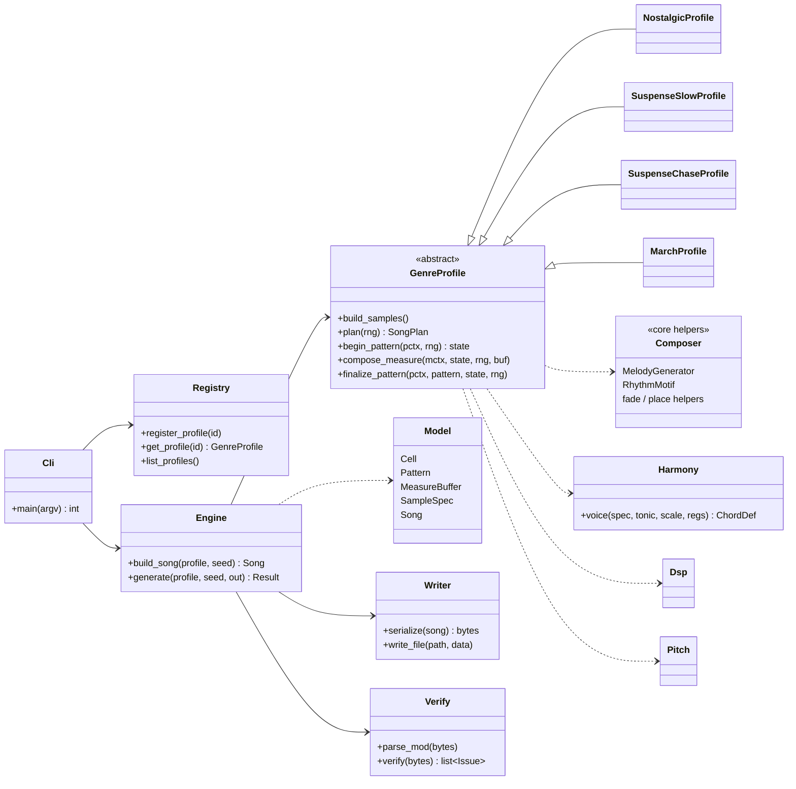
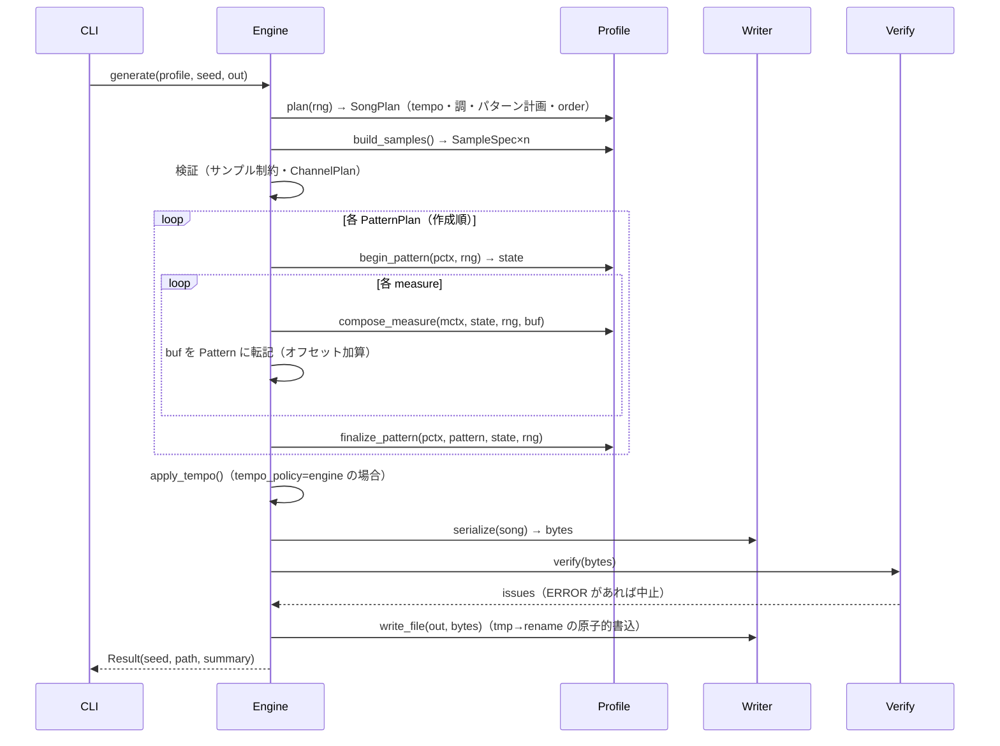

# マルチジャンル対応 MOD 生成エンジン 設計書（Design v1.2）

| 項目 | 内容 |
|:---|:---|
| 対象 | `twilight_pad.py` の拡張（Nostalgic / Suspense-Slow / Suspense-Chase / March） |
| 要件の原典 | [EXTENSION_SPEC.md](EXTENSION_SPEC.md)（拡張仕様検討書）。本書は原典の**設計具体化版**であり、両者が食い違う箇所は**本書を正**とする（§13 に訂正一覧） |
| ステータス | **実装完了**（Phase 0〜3、march 含む全ジャンル）。ただし D11（サンプル合成の bit-exact 要件）は v1.3 で撤回済み（下記改訂履歴・§2 D15） |
| 実行環境 | Python 3.10+（標準ライブラリのみ。全テストは 3.10、スモークは 3.11 で実施）、Windows / WSL2 / Linux |
| 開発時のみ | pytest（`requirements-dev.txt`）。実行時依存は無し |

### 改訂履歴

| 版 | 日付 | 内容 |
|:---|:---|:---|
| v1.0 | 2026-09-21 | 初版（旧仕様の H1–H6 / M1–M8 / L1–L4 を反映。§14 の R1–R12 を自己レビューで反映） |
| v1.1 | 2026-09-22 | 第三者レビュー T1–T16 を反映（§14.2）。主な変更: 和音の具体化 `voice`（§6.6）、サンプル内容周波数の規則（§5.1）、アルペジオ音域制約と `HARMONY_REG`、持続音色の「アタック＋ループ」と OFF 規約（D12）、優先度の自動導出（D13）、Python 3.10+（D6）、Phase 1 の分割と CP1–CP5、要件区分（§1.6） |
| v1.2 | 2026-09-22 | 第三者レビュー T17–T25 を反映（§14.3）。主な変更: `strings+arp` と `vol` の排他矛盾解消（H-1/T17）、`RngStreams` クラス定義とフック引数型の明確化（M-1/T18）、V10 の全ジャンル一律検査化（M-2/T19）、`MeasureBuffer.put` の同一セル冪等性と空セル判定定義（M-3/T20）、`PatternCtx` の dataclass 構文修正（M-4/T21）、`Instrument.cell` の休符・効果セル規約（M-5/T22）、音域・除算ガード・ロール順序の注記（L-1〜L-3/T23–T25） |
| v1.3 | 2026-09-22 | 実装完了後の改訂。**D11 を撤回**（D15、§2）: 全ジャンルのサンプル合成を `core/synth.py` の Patch 方式（直交レイヤー合成）へ移行し、ジャンルごとのベタ書き DSP コードを廃止。数式・定数は同一値を使用したため音響特性はほぼ同一（ピーク振幅は全音色で一致、長さは丸め方式の差で数サンプル程度）だが、**バイト単位の完全一致はもはや要件ではない**（ユーザー承認）。回帰テスト CP2・CP5 は「旧実装との構造的な近さ」の確認に緩和、CP3・CP4（作曲ロジック）は無変更のためバイト一致を維持。詳細は `core/synth.py` の docstring、`core/synth_presets.py`、[CORE_EXTENSION_DESIGN.md](CORE_EXTENSION_DESIGN.md) §8 を参照 |

---

## 0. 本書の読み方

1. §1 要件の構造化 → §2 決定事項 → §3〜5 アーキテクチャとデータモデル
2. §6〜7 共通コアと Profile 契約（実装者が最初に読む）
3. §8 各ジャンルの具体パラメータ
4. §9〜11 CLI・エラー処理・テスト方針、§12 ロードマップ
5. §13 仕様書からの訂正、§14 設計レビュー記録

用語: **row**=パターンの1行、**measure**=プロファイルが定める小節（Nostalgic/Suspense=16 row、March=8 row）、**pattern**=64 row（ProTracker 標準）、**tracker note**=Period 表上の音名（`C-1`〜`B-3`）、**logical note**=実際に鳴る音高（§5.1）。

---

## 1. 要件の構造化

### 1.1. 機能要件（FR）

| ID | 要件 | 出典 |
|:---|:---|:---|
| FR-1 | `--genre` で `nostalgic` / `suspense-slow` / `suspense-chase` / `march` を選択して .mod を生成する | SPEC §7 Phase 3 |
| FR-2 | 同一 genre + 同一 seed は常に同一バイナリを出力する（再現性） | README |
| FR-3 | トップレベル起動スクリプト（`modweaver.py`）は `--genre` 省略時、既存 `python twilight_pad.py [--seed N] [--output P]` と同等の出力（nostalgic）を返す（~~バイト単位で同一~~ は D15 で撤回。作曲ロジックはバイト単位で同一、サンプル波形は構造的に近い） | SPEC §7 Phase 1 |
| FR-4 | ジャンル追加は Profile クラス1つ＋レジストリ登録のみで完結する（core 無改造） | SPEC §1.2 |
| FR-5 | 生成物を自己検査（構造検査）し、規格違反があれば出力しない | 品質要件（新規） |
| FR-6 | Suspense は「無音→突発アクセント」「固執反復＋クレッシェンド」、March は「Oom-Pah・スネアロール・ファンファーレ」の文法を持つ | SPEC §5 |
| FR-7 | March は複数パターンの曲構成（イントロ→ストレイン→トリオ→コーダ）を持つ | 決定 D4 |

### 1.2. 非機能要件（NFR）

| ID | 要件 | 基準 |
|:---|:---|:---|
| NFR-1 | 依存 | Python 標準ライブラリのみ（実行時） |
| NFR-2 | 性能 | 1曲の生成 ≤ 5 秒（現行実測 < 1 秒） |
| NFR-3 | サイズ | 出力 ≤ 200 KB |
| NFR-4 | 互換 | ProTracker `M.K.` 4ch。OpenMPT / MilkyTracker / XMPlay で再生可 |
| NFR-5 | 保守性 | 新ジャンルの Profile は core を変更せず追加できる。共通化率は目標値ではなく**観測指標**として Phase 2 完了時に計測（SPEC の「75%」は未検証の見込み値だった） |
| NFR-6 | テスト | core 行カバレッジ ≥ 90%、profiles ≥ 85% |

### 1.3. 制約条件

- ProTracker 制約: 4ch、pattern=64 row、note は Period 表 113〜856 の 36 音、1セル=1エフェクト、sample ≤ 31、sample 長 ≤ 131070 byte（65535 word）、8-bit signed PCM
- 再生レート: note `C-3`（Period 214）で `SR = 3546895 / (2×214) ≈ 8287.14 Hz`
- テンポ: Speed 6 固定（既定値）。BPM は `Fxx`（xx ≥ 32）で指定。**4 row = 1 拍**（16分音符=1 row）
- 三連符・スイングは表現しない（row 格子は16分）

### 1.4. 入出力仕様

- 入力: CLI 引数（§9）。外部ファイル入力なし
- 出力: `.mod` 1ファイル（上書き）。標準出力にバナー、標準エラーにログ
- 終了コード: 0=成功 / 2=引数エラー / 3=生成・検査エラー / 4=I/O エラー

### 1.5. 想定ユーザー・環境

- ユーザー: CLI で曲を量産・再現したい個人（トラッカー音楽・ゲーム音楽制作者）
- 環境: Windows / WSL2 / Linux、Python 3.10+（全テストは 3.10、スモークを 3.11 で実施。3.9 以下は非対応）

### 1.6. 要件の区分（T13）

`skil.md` の「要件を勝手に拡張しない」に従い、機能を次のとおり区分する。

| 区分 | 項目 | 扱い |
|:---|:---|:---|
| 必須（旧仕様・依頼に由来） | `--genre` / `--seed` / `--output`、4 ジャンル、既存出力の不変、`register_profile` による追加、DSP・Writer の共通化 | Phase 1〜2 で実装 |
| 品質保証（M5 として依頼済み） | 構造検査 `verify`（V01〜V16）、生成前の契約検査（`PlanError` 等） | Phase 1〜2 |
| 実装上の堅牢化（外部仕様に影響なし） | 原子的書込（`os.replace`）、用途別乱数ストリーム、`--genre suspense` 別名（D2 で承認済み） | Phase 1〜2 |
| 任意・実装済み（ユーザー承認済み） | `--list-genres`（全ジャンルの id・別名・説明を表示。`--help` の epilog にも同じ一覧を掲載） | 実装済み（§9） |
| **任意（要件外・未承認）** | `-v` / `-q`、`--no-verify`、INFO/DEBUG ログ | **Phase 3 でユーザー承認後にのみ実装**。未承認なら実装しない（その間のログは WARNING 以上のみ） |

---

## 2. 決定事項

| ID | 決定 | 理由 |
|:---|:---|:---|
| D1 | **Pad の −17.7 cent 音程ズレは移植時は現状維持**（K=32, L=1024 を不変のまま D15 でも保持。この値自体を修正するのは別変更 F1、§8.1.5） | リファクタと動作変更を分離し、差異の原因を切り分けるため |
| D2 | Suspense は **`suspense-slow`（BPM 64–72）と `suspense-chase`（BPM 138–148）の2プロファイル**に分割。`--genre suspense` は `suspense-slow` の別名 | 2モードは文法（ドラム・リズム）が根本的に異なる |
| D3 | 和音感を出す**アルペジオ（`0xy`）は新ジャンルのみ**で使用。Nostalgic は使わない | Nostalgic の出力を変えないため |
| D4 | March は **6ユニークパターン・順序10エントリ（約80秒）**の曲構成 | 1パターン=8秒では曲にならない |
| D5 | 設計書は**新規 `EXTENSION_DESIGN.md`**。`EXTENSION_SPEC.md` は要件原典として保持 | 履歴保全（git 無し） |
| D6 | Python **3.10+**、全モジュールで `from __future__ import annotations` | 3.8 は EOL・3.9 も 2025-10 で EOL。検証可能な環境は 3.10 / 3.11 のみ（3.8 対応は未検証の主張になるため取り下げ、T6）。`tuple[int, ...]` などの組込ジェネリクスを実行時式でも使える。README を更新 |
| D7 | 内部の音高は**整数インデックス**（§5.1）。音名文字列は入出力境界のみ | 半音を含むスケール・転調・音域管理のため |
| D8 | Profile は `compose_measure()` 1メソッド＋フック（§7）。4トラック別メソッドは廃止 | 乱数消費順の保存と、チャンネル間協調（競合解決）のため |
| D9 | 乱数: **Nostalgic は従来の単一 `rng` 消費順を厳守**。新ジャンルは用途別サブストリーム（§7.2） | bit-exact 再現と、パート改修が他パートを変えない性質の両立 |
| D10 | 回帰基準は「基準 mod のハッシュ」ではなく、**凍結した旧実装 `tests/reference/twilight_pad_v1.py` との多seed比較**（§11.4） | 既存 `old/TwilightPad.mod` の生成 seed が不明で、ハッシュ基準が成立しないため |
| D11 | ~~Nostalgic のサンプル合成関数は式を書き換えずそのまま移設（新 DSP プリミティブに置換しない）~~ **→ D15 で撤回済み** | 浮動小数の演算順序が変わると bit-exact が崩れる |
| D12 | 持続（ループ）音色は**「アタック部＋ループ本体」構造**（`loop_start>0`）とし、音の切り方は **`Instrument.off()`（vol 0 のセル）** と `articulate()` で規定する | ループ音色はエンベロープを持たず、休符でも鳴り続けクリックも出るため（T4） |
| D13 | チャンネル衝突の優先度は **`ChannelPlan` から自動導出**（`put()` に priority 引数は無い）。意図的上書きは `replace()` | 二重定義と、同値衝突規則との矛盾を解消（T5） |
| D14 | 和音の具体化は **`core/harmony.voice()`** に集約。各プロファイルは音域 `Registers` を宣言する。アルペジオ使用ch の基音は `t ≤ 35 − max(X,Y)` に収める | 新ジャンル3つの入口が未定義だった（T1）／アルペジオの音域超過（T3） |
| D15 | **実装完了後の改訂。D11 を撤回**: 全ジャンル（Nostalgic 含む）のサンプル合成を `core/synth.py` の `Patch`/`Layer`/`Finish` 方式に統一し、`profiles/*.py` のベタ書き DSP コードを廃止。**バイト単位の完全一致は要件から外す**。D1（Pad −17.7 cent）・D9（Nostalgic の乱数消費順）は作曲ロジックの話であり本改訂で無変更。D10（回帰基準）は CP2・CP5 のみ「構造的近さ」比較に緩和（CP3・CP4 はバイト一致を維持） | ジャンル追加のたびに音色合成コードが core 周辺で重複増殖する問題を解消するため。詳細は `core/synth.py` docstring・[CORE_EXTENSION_DESIGN.md](CORE_EXTENSION_DESIGN.md) §8 |

---

## 3. アーキテクチャ

### 3.1. コンポーネント図



### 3.2. 生成シーケンス



### 3.3. 設計原則

1. **Song は純粋データ**: `build_song()` は I/O を持たず、テストは Song／bytes を直接検査する
2. **エンジンが所有する処理**: テンポセル挿入、pattern への転記、順序表、バイト化、検査、書込。**プロファイルが所有する処理**: 音色、和声、リズム、フレーズ、パート間の音の配置
3. **競合は宣言的に解決**: チャンネル占有は `ChannelPlan` と `priority` で表現し、暗黙の上書きに頼らない（Nostalgic のみ従来の上書き挙動を維持）

---

## 4. モジュール構成

```text
28_ModGenerator/
├── mod_weaver/
│   ├── __init__.py
│   ├── __main__.py               # `python -m mod_weaver`（cli.main へ委譲）
│   ├── cli.py                    # 引数解析・バナー・終了コード
│   ├── engine.py                 # build_song / generate
│   ├── errors.py                 # 例外階層（§10）
│   ├── core/                     # 【不変層】
│   │   ├── pitch.py              # 半音index・Period表・Scale・音域補助
│   │   ├── harmony.py            # ChordSpec→ChordDef の具体化（voice）・arp 導出（§6.6）
│   │   ├── model.py              # Cell / Pattern / MeasureBuffer / SampleSpec / Song / Plan 系
│   │   ├── dsp.py                # 波形・フィルタ・整数周期ループ・レート算出のプリミティブ
│   │   ├── synth.py              # Patch/Layer/Finish → SampleSpec のレンダラ（D15。CORE_EXTENSION_DESIGN.md §8）
│   │   ├── synth_presets.py      # 動作確認済み Patch のプリセット・ライブラリ（D15）
│   │   ├── composer.py           # MelodyGenerator / RhythmMotif / フェード・配置ヘルパ
│   │   ├── writer.py             # M.K. シリアライザ・原子的書込
│   │   └── verify.py             # 独立パーサ + 構造検査（旧 verify_mod.py の代替）
│   └── profiles/                 # 【可変層】
│       ├── base.py               # GenreProfile 抽象基底
│       ├── registry.py           # PROFILE_REGISTRY / register_profile
│       ├── nostalgic.py          # 旧ロジックの移植（+ nostalgic_samples.py）
│       ├── suspense_common.py    # 音色・和声・語彙の共有
│       ├── suspense_slow.py
│       ├── suspense_chase.py
│       └── march.py
├── tests/
│   ├── reference/twilight_pad_v1.py   # 凍結した旧実装（Phase 0 で現行をコピー、以後不変）
│   ├── unit/ … / integration/ … / regression/ …
├── modweaver.py                   # トップレベル起動スクリプト（`--genre` 対応。省略時は nostalgic で従来と同一出力）
├── requirements-dev.txt          # pytest, pytest-cov
├── pytest.ini
├── EXTENSION_SPEC.md / EXTENSION_DESIGN.md / DESIGN.md / CORE_EXTENSION_DESIGN.md / README.md / LICENSE
└── old/                          # 旧版バックアップ（配布対象外）
```

依存規則（違反は循環 import になるため禁止）: `profiles → core`、`engine → profiles.base / core`、`cli → engine / registry`。`core` は `profiles` を import しない。`core` 内は `pitch`（依存なし）← `dsp` ← `synth`（D15）← `synth_presets`、`model` ← `harmony` ← `composer`、`writer` / `verify` は `model`・`pitch` のみ参照。

---

## 5. データモデル

### 5.1. 音高の表現（`core/pitch.py`）

- **tracker note index** `t`: `0=C-1 … 35=B-3`（Period 表の並び）。Cell に格納する値
- **logical note index** `n`: 実際に鳴る音高。周波数 `f(n) = 65.4064 × 2^(n/12)` Hz。MIDI ノート番号 = `n + 36`（`C-1`=n0=65.41Hz=MIDI36）
- サンプルごとの `shift`（半音）で両者を結ぶ: **`n = t + shift`**（発音時の tracker note は `t = n − shift`、`0 ≤ t ≤ 35` を要求）
- 既存（Nostalgic）は全サンプル `shift=0` のため `n == t` で音名は従来のまま

これにより「低音サンプルを C-3 で鳴らして 65Hz を出す（`shift=−24`）」「ピッコロを 1 オクターブ上の音域に置く（`shift=+12`）」が可能になり、**36 音の音名制約を音域制約から切り離せる**（旧 SPEC H1 の解）。

#### サンプル内容周波数の規則（T2。合成周波数を導く唯一の式）

- 生成レート `R = sample_rate(rate_note) = CLOCK / (2·PERIODS[rate_note])`
- **pitched サンプルの内容周波数 `F = f(rate_note + shift)`**。すなわち「`rate_note` の tracker note で発音したとき、logical note `rate_note + shift` が鳴る」ように波形を作る。1 周期あたりのサンプル数は `spc = R / F`。ループ設計（K, L）は `L/K ≈ spc` を満たす（§6.1 の `loop_design`）
- **unpitched サンプル**（打楽器・効果音）は常に `rate_note` で発音し、内容周波数は**絶対 Hz で記述**する（例: 38Hz、920Hz）
- 発音時の tracker note は `t = n − shift`。**任意の n で `spc` は一定**（ピッチと再生レートが比例するため）
- 例（`rate_note=C-3`、R=8287.14Hz）:

| サンプル | shift | F | spc | 備考 |
|:---|:---|:---|:---|:---|
| drone | −24 | 65.41Hz | 126.7 | logical 0..11 を t=24..35 で発音 |
| tuba | −12 | 130.81Hz | 63.4 | logical 0..11 を t=12..23 で発音 |
| strings / horn / section / pizz | 0 | 261.63Hz | 31.68 | t = n |
| lead / picc | +12 | 523.25Hz | 15.84 | logical 12..47 を t=0..35 で発音 |

```python
NOTE_MIN, NOTE_MAX = 0, 35
NOTE_NAMES: tuple[str, ...]          # ("C-1","C#1",...,"B-3")
PERIODS: tuple[int, ...]             # len 36, 標準PAL表 (856..113)

def name(t: int) -> str                      # 0 -> "C-1"
def parse(s: str) -> int                     # "C#2" -> 13  / 不正は PitchRangeError
def hz(n: int) -> float
def fold_into_range(n: int, lo: int, hi: int) -> int   # オクターブ単位で [lo,hi] へ折返し（旧 min(3,oct) の一般化）
def nearest(pool: Sequence[int], target: int) -> int
def lowest_note_with_pc(pc: int, lo: int, hi: int) -> int          # [lo,hi] 内で pitch class=pc の最低音（hi−lo ≥ 11 を要求）
def notes_with_pcs(pcs: Collection[int], lo: int, hi: int) -> list[int]   # [lo,hi] 内で pc ∈ pcs の全音（昇順）

@dataclass(frozen=True)
class Scale:
    tonic_pc: int                    # 0..11（C=0）
    intervals: tuple[int, ...]       # 例 phrygian=(0,1,3,5,7,8,10)
    def notes_in(self, lo: int, hi: int) -> list[int]      # 範囲内の全 logical note
MODES = {"ionian": (0,2,4,5,7,9,11), "aeolian": (0,2,3,5,7,8,10),
         "phrygian": (0,1,3,5,7,8,10), "dim_wh": (0,2,3,5,6,8,9,11)}

CHORD_QUALITIES = {  # 半音オフセット
  "maj": (0,4,7), "min": (0,3,7), "dim": (0,3,6),
  "maj7": (0,4,7,11), "m7": (0,3,7,10), "dom7": (0,4,7,10),
}
```

### 5.2. セルとパターン（`core/model.py`）

```python
@dataclass(frozen=True)
class Cell:
    note: Optional[int] = None     # tracker note index or None(休)
    sample: int = 0                # 0=指定なし, 1..31
    effect: int = 0                # 0..0xF
    param: int = 0                 # 0..0xFF
    vol: Optional[int] = None      # 0..64。effect/param と排他
    @property
    def has_effect(self) -> bool: return self.effect != 0 or self.param != 0   # アルペジオ(0xy)も「効果あり」
    @property
    def is_empty(self) -> bool: return self.note is None and self.sample == 0 and self.vol is None and not self.has_effect
```

- **`vol` と他エフェクトは同一セルで併用不可**（併用すると `CellConflictError`）。シリアライズ時、`vol` は `0xC vv` に変換される（旧 `cell()` と同一）。ポルタメントや E9x を使うセルの音量はサンプル既定音量に頼る（旧 SPEC M4 の解）
- `Cell` は `serialize() -> bytes`（4 byte）を持つ。旧 `make_cell` と一致することをテストで保証（§11）
- **アルペジオ制約（T3）**: `effect=0, param=0xXY (≠0)` の Cell はアルペジオとみなし、`t + max(X, Y) ≤ 35`（Period 表の上限）を要求する。`Instrument.cell` が検査し、違反は `PitchRangeError`、`verify` V16 でも二重検査する。アルペジオを使うチャンネルの基音は `t ≤ 35 − max(X,Y)`（最大 +7 → t ≤ 28）に収める（§8.2.4 の `HARMONY_REG`）

```python
class MeasureBuffer:               # rows_per_measure × 4ch の作業領域
    def __init__(self, rows: int, plan: ChannelPlan, strict: bool): ...
    def put(self, row, ch, cell) -> None
        # strict=False : 無条件上書き（Nostalgic 互換）
        # strict=True  : 優先度は plan[ch].priority.get(cell.sample, 1) から自動導出（引数では渡さない。sample=0 のセルは 0）
        #   既存セルが空(existing.is_empty) → 書く
        #   新 > 既存 → 置換
        #   新 < 既存 → 書かない（DEBUG ログ）
        #   新 == 既存 かつ cell == existing → no-op（冪等。同一セル再書き込みは成功）
        #   新 == 既存 かつ cell != existing → ChannelConflictError（異なるセルの衝突）
        #   ※ OFF・音量のみのセル（sample=0, 優先度 0）は note セルを上書きしない。note は OFF を置換する
    def replace(self, row, ch, cell) -> None    # 意図的な上書き（優先度・同値を問わず置換）。使用は限定的（例: スネアロールの通常スネア）
    def get(self, row, ch) -> Cell

class Pattern:                     # 64 row × 4ch
    def blit(self, buf: MeasureBuffer, base_row: int) -> None
    def put / replace / get(row, ch)   # finalize_pattern 用（MeasureBuffer と同規則。engine が plan・strict を渡して生成）
    def serialize(self) -> bytes   # 1024 byte

@dataclass
class SampleSpec:
    name: str                      # ASCII ≤22
    data: bytes                    # 偶数長 ≥2、符号なし表現の 8bit signed PCM
    volume: int                    # 0..64
    loop: Optional[tuple[int,int]] = None   # (start_words, length_words) length>1。None は (0,1)
    rate_note: int = 24            # 生成レートを決める tracker note（既定 C-3）
    shift: int = 0                 # §5.1
    pitched: bool = True           # False: 常に rate_note で発音（打楽器）
    finetune: int = 0

@dataclass
class Song:
    title: str                     # ASCII ≤20
    samples: list[SampleSpec]      # 位置=sample番号-1
    patterns: list[Pattern]
    order: list[int]               # 1..128 エントリ
```

**Instrument ハンドル**（プロファイルが Cell を作る唯一の入口）:

```python
@dataclass(frozen=True)
class Instrument:
    slot: int                      # 1..31
    spec: SampleSpec
    def cell(self, n: Optional[int] = None, *, vol=None, effect=0, param=0) -> Cell
        # pitched=False（打楽器）なら n は無視され rate_note で発音（sample=self.slot）
        # pitched=True で n が指定された場合: tracker note t = n - shift。sample=self.slot を付与
        #   検査: t ∈ [0,35] 外なら PitchRangeError。アルペジオ（effect=0,param≠0）なら t + max(X,Y) ≤ 35 も検査
        # pitched=True で n is None の場合（T22）:
        #   vol is None かつ not has_effect なら休符 Cell(note=None, sample=0)
        #   vol is not None または has_effect なら効果/音量専用セル。原則 sample=0（V14 抵触回避）、
        #   ポルタメント(3xx)継続など直前サンプル番号の維持が必要な場合は sample=self.slot
    def off(self) -> Cell
        # 持続（ループ）音色の消音セル = Cell(None, 0, vol=0)。次の note 発音でサンプル既定音量に戻る（note 行は sample 番号付き）
```

### 5.3. 和声・構造データ

```python
@dataclass(frozen=True)
class ChordSpec:                   # 調非依存の和音記述（度数ではなく半音オフセット）
    root: int                      # 主音からの半音 0..11
    quality: str                   # CHORD_QUALITIES のキー
    bass: Optional[int] = None     # スラッシュ／ペダル用（主音からの半音）。None=root
    label: str = ""

@dataclass(frozen=True)
class ChordDef:                    # 具体化済み（調・音域適用後）
    label: str
    bass: int                      # ベース logical note
    harmony: int                   # パッド/持続用の代表音
    chord_tones: tuple[int, ...]   # 強拍用（メロディ音域）
    scale_tones: tuple[int, ...]   # 経過音用
    arp: Optional[int] = None      # 0xy の param（新ジャンルのみ。例 短3+減5 → 0x36）
    explicit: bool = False         # True: 手書きボイシング（Nostalgic）

@dataclass(frozen=True)
class ChordSlot:
    chord: ChordDef
    measures: int = 1              # 何 measure この和音が続くか

@dataclass
class PatternPlan:
    kind: str                      # "intro"|"a"|"b"|"outro"|"trio"|"climax"|…（プロファイル定義）
    slots: list[ChordSlot]         # Σ(measures) × rows_per_measure == 64
    intensity: float = 0.5         # 0..1（音量・密度の目安）
    key_offset: int = 0            # 転調（半音、トリオ用）
    extra: dict = field(default_factory=dict)

@dataclass
class SongPlan:
    bpm: int
    patterns: list[PatternPlan]    # 作成順（旧実装の rng 消費順を規定）
    order: list[int]               # PatternPlan の index 列
    key_pc: Optional[int] = None
    summary: list[str] = field(default_factory=list)   # バナー表示用の行

@dataclass(frozen=True)
class PatternCtx:
    kind: str                      # "intro"|"a"|"b"|"outro"|...
    index: int                     # PatternPlan 作成順のインデックス
    bpm: int
    key_pc: Optional[int]
    key_offset: int
    intensity: float
    is_first_in_order: bool        # 曲順 order[0] に配置されるパターンか（Nostalgic イントロ等で使用）

@dataclass(frozen=True)
class MeasureCtx:
    pattern: PatternCtx
    measure_idx: int               # pattern 内 0..
    n_measures: int
    chord: ChordDef
    chord_measure_offset: int      # 現和音内での位置
    is_last: bool                  # pattern 最終 measure
    instruments: Mapping[str, Instrument]

@dataclass(frozen=True)
class RngStreams:                  # 用途別乱数ストリーム（D9・T18）
    plan: random.Random
    drums: random.Random
    bass: random.Random
    harmony: random.Random
    melody: random.Random
```

**ChannelPlan**（旧 SPEC H2 の解）:

```python
@dataclass(frozen=True)
class ChannelRole:
    name: str                              # "drums"/"bass"/"pad"/"lead"
    allowed: frozenset[int]                # 許可する sample 番号（0 は常に可）
    priority: Mapping[int, int]            # sample番号→優先度（未記載は 1、sample=0 は 0）。MeasureBuffer が自動適用（D13）
ChannelPlan = tuple[ChannelRole, ChannelRole, ChannelRole, ChannelRole]
```

`verify` は「Cell の sample 番号が `allowed` に含まれること」を検査する（実装ミスの早期検出）。

---

## 6. 共通コア API 仕様

### 6.1. `core/dsp.py`

現行の `clamp` / `pad_even` は同名・同挙動で移設する（Nostalgic のバイト同一性のため）。

```python
CLOCK = 3546895.0
def sample_rate(rate_note: int) -> float          # CLOCK / (2 * PERIODS[rate_note])
                                                  # C-3 → 8287.14, B-3 → 15694.2, C-2 → 4143.6
def clamp(x: float) -> int                        # [-128,127] へ丸め（旧 clamp）
def pad_even(b: bytes) -> bytes                   # 旧 pad_even
def to_pcm(values: Iterable[float], gain=127.0) -> bytes   # clamp(v*gain) & 0xFF → pad_even

# 波形・エンベロープ（core/synth.py の Patch レンダラが内部で使用。全ジャンル共通。D15 でこの区分は撤廃）
def additive(f0, t, partials) -> float            # partials=[(mult, weight)]。f0*mult が Nyquist 超の項は自動除外（エイリアス防止）
def partials_saw(n) / partials_square(n) / partials_triangle(n) -> list[tuple[float, float]]
    # 旧 SPEC の osc_saw / osc_pulse / osc_tri の代替。saw: h=1..n の 1/h、square: 奇数 h の 1/h、triangle: 奇数 h の (−1)^((h−1)/2)/h²
def exp_decay(t, alpha) -> float                   # e^(−αt)
def adsr(t, total, a, d, s, r) -> float
def noise_lp(rng, n, a_start, a_end) -> list[float]
    # ホワイトノイズを 1 次 IIR LP に通す。y[i] = a[i]·y[i−1] + (1−a[i])·x[i]、a[i] は a_start→a_end の線形補間
    # a が大きいほど暗い（旧スネアの `lp = lp*0.35 + raw*0.65` は a=0.35）
def one_pole_lp(data, a) -> list[float]           # 上式の固定 a 版（因果）
def diff_hp(data) -> list[float]                   # 一次差分 HP（旧ハイハットと同式）

# 完全ループ（float 列で扱い、最後に to_pcm で bytes 化）
def seamless_loop(length, cycles, partials) -> list[float]
    # partials=[(mult, weight)]。各 (cycles*mult) が整数でなければ SampleConstraintError（旧 SPEC M1）
    # 例: cycles=6, mult=0.5 → 3 は可、cycles=5, mult=0.5 → 2.5 は不可
def seamless_terms(length, terms) -> list[float]
    # terms=[(k_int, weight)]。周期数 K を整数で直接指定（デチューン対など、倍率で表せない構成用）
def circular(filter_fn, body) -> list[float]
    # body を 3 周連結してフィルタを通し、中央の 1 周を返す（ループ境界の連続性を保つ）
def with_attack(body, attack_len) -> list[float]
    # 「アタック部 + ループ本体」を作る（D12）。アタック部 = body の末尾 attack_len 個 × 半コサイン窓 0.5(1−cos(π·i/attack_len))（i=0..attack_len−1）
    # 位相がループ先頭へ連続するため境界にクリックが出ない。attack_len は偶数かつ ≤ len(body)
    # SampleSpec.loop = (attack_len // 2, len(body) // 2)（word 単位）
def loop_design(target_spc, l_max, k_step=1) -> list[tuple[float, int, int]]
    # target_spc = R/F（§5.1）。(誤差cent, K, L[偶数]) の候補。設計時のオフライン補助（実行時は定数を使う）
```

**ループ音色の合成手順（例: drone）**: `body = seamless_loop(760, 6, partials)` → `circular(lambda d: one_pole_lp(d, 0.35), body)` → 各要素に `tanh` → `data = to_pcm(with_attack(body, 60))` → `SampleSpec(loop=(30, 380), …)`。

**設計値の根拠（`C-3` 基準、SR=8287.14Hz）**

| 用途 | 目標 | 採用 (K, L) | 実効周波数 | 誤差 |
|:---|:---|:---|:---|:---|
| `C-3`（261.63Hz）基準の持続音 | 31.676 spc | K=6, L=190 | 261.70Hz | +0.49 cent |
| 低音ドローン（65.41Hz） | 126.70 spc | K=6, L=760 | 65.42Hz | +0.49 cent |
| 1オクターブ上（523.25Hz） | 15.84 spc | K=12, L=190 | 523.40Hz | +0.49 cent |
| （参考）現行 Pad/Flute | — | K=32, L=1024 | 258.97Hz | **−17.6 cent** |

### 6.2. `core/composer.py`

**RhythmMotif** — measure 内の発音 row の集合と各音の長さ。`RhythmMotif(rows=(0,6), lengths=None)`。`lengths` 省略時は「次の発音（または measure 末）まで」。休符を作る場合のみ明示する（例: `rows=(0,4), lengths=(3,3)`）。

**ScaleRules / MelodyGenerator**（旧 SPEC の `ScaleRules` を拡張し、責務を「共通ジェネレータの制御パラメータ」に一本化）:

```python
@dataclass(frozen=True)
class ScaleRules:
    step_choices: tuple[int, ...] = (-1, 1, -2, 2)  # スケール上の段数（順次進行）
    leap_probability: float = 0.25                  # 経過音で跳躍を選ぶ確率
    leap_semitones: tuple[int, ...] = ()            # 跳躍として許可する音程（空=任意のコードトーン）。March は (4,5,7)
    max_leap: int = 12                              # 半音
    leap_recovery: bool = True                      # 跳躍後は逆方向の順次進行を強制
    dissonance_weight: float = 0.0                  # 弱拍でコード外音（半音・増4度）を置く確率
    color_semitones: tuple[int, ...] = (1, 6)       # dissonance 時にコード音との距離として選ぶ音程
    strong_nearest_prob: float = 0.75               # 強拍で「直前音に最も近いコードトーン」を選ぶ確率

class MelodyGenerator:
    def __init__(self, rules, register: tuple[int,int], scale: Scale, rng): ...
    def bar(self, motif: RhythmMotif, chord: ChordDef, prev: Optional[int],
            *, cadence: bool = False, cadence_target: Optional[int] = None,
            octave_shift: int = 0) -> tuple[list[NoteEvent], int]:
        """NoteEvent 列と終端音を返す"""

@dataclass(frozen=True)
class NoteEvent:
    row: int; note: int; vol: int
    dur: int          # 発音の長さ（row）。motif.lengths、なければ次の発音（または measure 末）まで
```

アルゴリズム（各 onset）:
1. **強拍**（row が拍頭 `row % 4 == 0`）: `chord_tones` から直前音に近い順に並べ、確率 `strong_nearest_prob` で最近傍、それ以外は次点
2. **弱拍**: 確率 `dissonance_weight` で「最寄りのコードトーンから `color_semitones` 離れたスケール音」を選ぶ（次の強拍でコードトーンへ解決）。それ以外は確率 `1−leap_probability` で `step_choices` の順次進行（`scale_tones` に丸める）、残りで跳躍（`leap_semitones` に合致するコードトーン、`max_leap` 以内）
3. 跳躍直後の音は `leap_recovery` なら逆方向 1〜2 段
4. `cadence=True` の最終 onset は `cadence_target`（無指定なら `chord_tones[0]`）
5. すべての音を `fold_into_range(register)` で音域内へ折返し
6. 音量: 強拍 = 基準、弱拍 = 基準−(4〜12) の乱数（`rng` 使用）

Nostalgic は本ジェネレータを使わず、旧アルゴリズムを移植する（§8.1）。

**配置・ダイナミクス補助**:

```python
def ramp(v0, v1, i, n) -> int                       # 線形補間（i=0..n-1 で v0→v1）
def fade_cells(target, ch, r0, r1, v0, v1) -> None   # 既存セルの vol を書換え（vol を持たないセルは対象外）
def articulate(buf, ch, events: Sequence[NoteEvent], inst: Instrument, *, gate: float = 1.0) -> None
    # 各 event を inst.cell(note, vol=vol) で put。持続（ループ）音色向けに、
    #   off_row = row + max(1, round(dur × gate)) が「measure 内」かつ「次の発音 row より前」のときだけ inst.off() を put（D12）
    #   gate=1.0: 休符（音価の終端が次の発音より前）があるときだけ OFF。gate<1: スタッカート
```

### 6.3. `core/writer.py`

```python
def serialize(song: Song) -> bytes
    # 20B タイトル（ASCII で 20 文字超、または非 ASCII なら PlanError）
    # 31×30B サンプルヘッダ（length words=len(data)//2, finetune=0, volume, loop_start, loop_length）
    # 曲長(=len(order)) / 0x7F / order[128] / b"M.K."
    # パターン: max(order)+1 個（未使用の高番号 pattern は書かない）
    # サンプルデータ連結
def write_file(path, data: bytes) -> None       # 同一ディレクトリの一時ファイルへ書き、`os.replace`（Windows でも既存ファイルを置換できる）で置換。失敗時は一時ファイルを削除し OutputError（T10）
```

### 6.4. `core/verify.py`

書込側と**独立した実装**のパーサ `parse_mod(bytes) -> ParsedMod` と、規則検査 `verify(bytes, plan: Optional[ChannelPlan] = None) -> list[Issue]`（`Issue(level: "ERROR"|"WARN"|"INFO", code, message)`）。

| コード | 検査 | レベル |
|:---|:---|:---|
| V01 | ファイルサイズ = 1084 + 1024×(max(order)+1) + Σsample長 | ERROR |
| V02 | マジック `M.K.`、タイトル 20 byte | ERROR |
| V03 | 曲長 1..128、restart=0x7F、order の各値 < 実 pattern 数 | ERROR |
| V04 | サンプル: 長さ偶数、volume ≤ 64、`loop_len>1` なら `start+len ≤ length(words)` | ERROR |
| V05 | 全 Cell の period ∈ Period 表 ∪ {0} | ERROR |
| V06 | 全 Cell の sample 番号 ≤ 定義済みサンプル数 | ERROR |
| V07 | **note を持つ Cell は sample ≠ 0**（同一 note 行でサンプル番号を必ず指定。プレイヤー間の音量リセット差異を避ける） | ERROR |
| V08 | `0xC` の param ≤ 64、`0xF` の param は 0 不可（Speed 設定は 1..31、BPM 設定は 32..255） | ERROR |
| V09 | ChannelPlan 指定時、チャンネルごとの sample 番号 ∈ allowed ∪ {0} | ERROR |
| V10 | order[0] の pattern に Fxx（テンポ、param ≥ 32）が存在（全ジャンル共通要件。T19） | ERROR |
| V11 | 全ループ: 境界段差 `abs(d[start]−d[end−1])` ≤ max(2.0, 1.5 × ループ内最大の隣接差)（ゼロ除算・微小段差の過剰警告防止ガード。アタック部は対象外。`with_attack` の連続性も同基準で検査。T24） | WARN |
| V12 | pattern 数 ≤ 64 | ERROR |
| V13 | 未使用サンプルがある | INFO（Nostalgic の MellowFlute は既知） |
| V14 | note を持たず effect=0/param=0 のセルに sample≠0 | WARN |
| V15 | チャンネル音量を追跡（note セル=`vol` またはサンプル既定音量、vol/OFF セル=その値）し、左（Ch1+Ch4）・右（Ch2+Ch3）それぞれの同時合計が **120 を超える** row（同時発音の歪み警告。T12） | WARN |
| V16 | アルペジオ（effect 0, param≠0）を持つ Cell で、period の tracker note `t` について `t + max(X, Y) ≤ 35` を満たさない（T3） | ERROR |

### 6.5. `engine.py`

```python
@dataclass
class Result:  seed: int; path: Optional[Path]; song: Song; plan: SongPlan; issues: list[Issue]

def build_song(profile: GenreProfile, seed: int) -> Song            # 純粋関数（I/Oなし）
def generate(profile, seed: Optional[int], out: Path, *, verify=True) -> Result
    # seed=None → random.randint(100000, 999999)（旧仕様どおり）。ERROR があれば OutputError 前に VerificationError
```

**テンポ挿入（`tempo_policy="engine"` の新ジャンル）**: `order[0]` の pattern の row 0 で、①セルが空のチャンネルのうち最小番号、②なければ note を持つが `vol`/effect の無いチャンネル（サンプル既定音量で鳴る）、のどちらかに `F BPM` を付与する。いずれも無ければ `ChannelConflictError`（プロファイルの不具合）。プロファイルは「order[0] pattern の row 0 で少なくとも1chを空または音量指定なしにする」責務を負う。`tempo_policy="profile"` の場合はエンジンは何もしない（Nostalgic）。

### 6.6. `core/harmony.py`（和音の具体化。T1・D14）

```python
@dataclass(frozen=True)
class Registers:
    bass: tuple[int, int]; harmony: tuple[int, int]; melody: tuple[int, int]   # logical note の範囲。各 hi−lo ≥ 11

def voice(spec: ChordSpec, tonic_pc: int, scale: Scale, regs: Registers, *,
          arp: bool = False, mode_by_quality: Optional[Mapping[str, str]] = None) -> ChordDef
```

`tonic_pc` は `(key_pc + PatternPlan.key_offset) % 12`。規則:

1. `root_pc = (tonic_pc + spec.root) % 12`、`bass_pc = (tonic_pc + (spec.root if spec.bass is None else spec.bass)) % 12`、`tone_pcs = {(root_pc + i) % 12 for i in CHORD_QUALITIES[spec.quality]}`
2. `bass = lowest_note_with_pc(bass_pc, *regs.bass)`
3. `harmony = lowest_note_with_pc(root_pc, *regs.harmony)`（上声の根音。スラッシュ／ペダルでも上声側の根音）
4. `chord_tones = notes_with_pcs(tone_pcs, *regs.melody)`（昇順）
5. `scale_tones = sorted(active_scale.notes_in(*regs.melody) ∪ chord_tones)`。`mode_by_quality` に該当 quality があれば `active_scale = Scale(root_pc, MODES[…])`（例: dim→`dim_wh`）、なければ `scale`
6. `arp=True` のとき `arp = (q[1] << 4) | q[2]`（`q = CHORD_QUALITIES[quality]`。第3音・第5音のオフセット。7th 和音も三和音分のみ）。`arp=False` は `None`
7. `label = spec.label or (pc 名 + quality [+ "/" + bass pc 名])`、`explicit=False`

音域の上限検査は `Instrument.cell`（アルペジオの `t + max(X,Y) ≤ 35`）が担う。Nostalgic は `voice` を使わず手書きの `ChordDef(explicit=True)` を使う。

例（主音 C、`HARMONY_REG=(17,28)`、`BASS_REG=(0,11)`）:

| ChordSpec | bass | harmony | arp | chord_tones の pc |
|:---|:---|:---|:---|:---|
| `Cdim` (0,dim) | 0（C-1） | 24（C-3） | `0x36` | {0,3,6} |
| `Db/C` (1,maj,bass 0) | 0（C-1） | 25（C#3） | `0x47` | {1,5,8} |
| `B/C` (11,maj,bass 0) | 0 | 23（B-2） | `0x47` | {11,3,6} |

---

## 7. Profile 契約（`profiles/base.py`）

```python
class GenreProfile(ABC):
    # --- 宣言的属性 ---
    id: str;  aliases: tuple[str,...] = ()
    display_name: str;  description: str
    title: str                         # MODタイトル（ASCII ≤20）
    default_filename: str
    tempo_choices: tuple[int, ...]     # 離散値（旧 tempo_range を置換）
    rows_per_measure: int = 16         # 16 または 8（64 の約数であること）
    channel_plan: ChannelPlan
    tempo_policy: str = "engine"       # "engine" | "profile"
    rng_mode: str = "streams"          # "single"（Nostalgic）| "streams"
    strict_buffers: bool = True        # True: MeasureBuffer が ChannelPlan の優先度で衝突を解決（同値は ChannelConflictError）。False: 無条件上書き（Nostalgic）

    # --- 生成フック（エンジンがこの順で呼ぶ。T18） ---
    @abstractmethod
    def build_samples(self) -> dict[str, SampleSpec]: ...        # 挿入順=sample番号(1..)、キー=Instrument名。seedに依存しない
    @abstractmethod
    def plan(self, rng: Union[random.Random, RngStreams]) -> SongPlan: ...                           # tempo・調・構成・進行の選択
    def begin_pattern(self, pctx: PatternCtx, rng: Union[random.Random, RngStreams]) -> Any: return None     # pattern 内で共有する状態（motif 等）
    @abstractmethod
    def compose_measure(self, mctx: MeasureCtx, state, rng: Union[random.Random, RngStreams], buf: MeasureBuffer) -> None: ...
    def finalize_pattern(self, pctx, pattern: Pattern, state, rng: Union[random.Random, RngStreams]) -> None: pass   # フェード等の後処理
```

### 7.1. 呼出し順序（乱数消費順の規定）

```
plan(rng)
  for pp in plan.patterns:                       # 作成順（order 順ではない）
      state = begin_pattern(pctx, rng)
      for m in range(measures_per_pattern):      # measure 昇順
          compose_measure(mctx, state, rng, buf) # single では drums→bass→harmony→melody の順に同一 rng を消費
          pattern.blit(buf, m * rows_per_measure)
      finalize_pattern(pctx, pattern, state, rng)
```

### 7.2. 乱数（D9・T18）

- `rng_mode="single"`: 全フックの引数 `rng` に同一の `random.Random(seed)` を渡す（旧実装と同一の消費順。Profile は `rng.randrange(...)` 等を直接呼ぶ）
- `rng_mode="streams"`: 全フックの引数 `rng` に `RngStreams(plan, drums, bass, harmony, melody)` を渡す。Profile 側では `plan` 内で `rng.plan` を使い、`compose_measure` 内では各パートに応じて `rng.drums`, `rng.bass`, `rng.harmony`, `rng.melody` を使い分ける（`MelodyGenerator` には `rng.melody` を渡す）。各ストリームは `random.Random(f"{seed}:{profile.id}:{name}")`（文字列シードは sha512 由来で Python バージョン間安定）。ドラムの変更がメロディを変えない
- サンプル合成は seed 非依存（各レシピが固定シードの局所 `Random` を使用。旧 42/123 と同様）

### 7.3. エンジンが検査する契約

1. `Σ(slot.measures) × rows_per_measure == 64`（各 PatternPlan）／ `order` は PatternPlan の index、長さ 1..128、ユニーク pattern ≤ 64 ／ `plan.bpm ∈ tempo_choices` → 違反は `PlanError`
2. `title` は ASCII ≤ 20、サンプル名 ASCII ≤ 22、サンプル制約（偶数長・loop 範囲・長さ ≤ 131070）→ `SampleConstraintError`
3. `compose_measure` が置いた全 Cell は `channel_plan` に適合（違反は生成中に `ChannelConflictError`）
4. `Instrument.cell()` は `t = n − shift ∈ [0,35]`、アルペジオでは `t + max(X,Y) ≤ 35` を強制（`PitchRangeError`）

### 7.4. ジャンル追加手順（FR-4）

`profiles/xxx.py` に `@register_profile` 付きのクラスを1つ書き、`profiles/__init__.py` で import するだけ。core・engine・cli は無改造。

---

## 8. 具象プロファイル設計

### 8.1. Nostalgic（`profiles/nostalgic.py`）— 旧ロジックの等価移植

#### 8.1.1. 対応表

| 旧 `twilight_pad.py` | 移設先 |
|:---|:---|
| `PAL_AMIGA_CLOCK, SR, clamp, pad_even` | `core/dsp.py`（同名・同式） |
| `PERIODS`（36音） | `core/pitch.PERIODS`（index 並び）＋ `NOTE_NAMES` |
| `make_cell / cell` | `Cell.serialize()` ＋ `nostalgic._legacy_cell()`（下記 clamp 参照） |
| `gen_kick … gen_flute` | `profiles/nostalgic_samples.py`（当初は式・定数を一切変更せず移設。D15 で `core/synth.py` の Patch 方式へ再移行。数式は同一値を保持） |
| `CHORD_DEFS / PROGRESSION_PRESETS / RHYTHM_MOTIFS / SCALE_NOTES` | `nostalgic.py` の定数（`ChordDef(explicit=True)` に変換。音名→index は `pitch.parse`） |
| `generate_melody_bar` | `nostalgic._melody_bar`（ロジック同一。`SCALE_NOTES.index` は index 演算に置換し結果同一を保証） |
| `build_procedural_pattern` | `begin_pattern`（motif_a/b・has_ghost）＋`compose_measure`＋`finalize_pattern`（アウトロのフェード） |
| `build_procedural_mod`（seed/進行/BPM選択） | `plan(rng)` |
| ヘッダ/オーダー/書込 | `core/writer.py` |

`_legacy_cell(note, sample, vol)` は旧 `cell()` と同じく `vol` を `max(0, min(64, int(vol)))` にクランプする（新 `Cell` は範囲外を例外とするため、移植コードは旧クランプ経由で `Cell` を作る）。

#### 8.1.2. 宣言

| 属性 | 値 |
|:---|:---|
| id / title / default_filename | `nostalgic` / `Twilight Pad` / `TwilightPad.mod` |
| tempo_choices | `(88, 90, 92, 94, 96)` |
| rows_per_measure | 16（4 measure/pattern） |
| tempo_policy / rng_mode / strict_buffers | `profile` / `single` / `False`（旧の上書き挙動） |
| ChannelPlan | Ch1 drums={1,2,3}、Ch2 bass={4}、Ch3 pad={6}、Ch4 melody={5}（`priority` 未使用） |
| サンプル鍵 | `kick, snare, hihat, bass, musicbox, pad, flute`（全 `shift=0`。flute は未使用だが番号 7 を占有） |
| 構成 | 作成順 `[intro(prog_a), A(prog_a), B(prog_b, chorus), outro(prog_a)]`、`order=[0,1,2,1,3]` |

#### 8.1.3. `plan(rng)` の乱数消費順（厳守）

```
idx_a = rng.randrange(5);  idx_b = (idx_a + rng.randint(1, 4)) % 5;  bpm = rng.choice([88,90,92,94,96])
```

`begin_pattern` は毎 pattern（intro/outro 含む）で `rng.choice(motifs)` ×2 → `rng.random() < 0.5`（has_ghost）の順に消費。`compose_measure` は measure ごとに「ドラム（乱数なし）→ベース（`intro`/`outro` 以外で `rng.random() < 0.6`）→パッド→メロディ（`generate_melody_bar` の乱数）」。

#### 8.1.4. 維持する旧挙動（Quirk）— 移植でも「直さない」

| ID | 内容 |
|:---|:---|
| Q1 | アウトロ pattern の row 0 はフェード用キックで上書きされ、**テンポセルが存在しない**（テンポは先行 pattern で設定済みのため実害なし）。`tempo_policy="profile"` はこのため |
| Q2 | イントロは row 0 ch0 に「音なし＋`F bpm`」、それ以外は「キック(smp1) ＋`F bpm`」（キックは既定音量 56） |
| Q3 | Pad と Flute はループが K=32/L=1024 で **−17.6 cent** フラット（D1）。MusicBox 基音 261.63Hz とうなる |
| Q4 | MellowFlute は定義のみで未使用 |
| Q5 | サビのオクターブシフトは `min(3, octave+shift)` で頭打ち（旧の音域処理。`fold_into_range` は使わない） |
| Q6 | ゴーストノートは `has_ghost and is_chorus` の row 15 のみ。フィルは bar 3 の row 14/15 |
| Q7 | 曲名 `Twilight Pad`、finetune=0、restart=0x7F |

#### 8.1.5. 将来の変更 F1（本設計の範囲外・Phase 1 完了後に別変更として実施）

Pad/Flute のループを `K=6, L=190`（+0.49 cent）へ差し替えて音程ズレを解消する。高調波は `K×h` が整数になる範囲（h=1,2,3, sub=0.5）で維持できる。**出力ハッシュが変わる**ため、リグレッション基準の更新（`tests/reference` の同時更新）とセットで行う。

### 8.2. Suspense 共通（`profiles/suspense_common.py`）

`suspense-slow` / `suspense-chase` が共有する音色・和声・語彙。両プロファイルは `SuspenseBase` を継承し、`plan()` と文法（`compose_measure`）のみ別実装。

#### 8.2.1. 調・スケール・進行（`ChordSpec`、主音 C）

| 名称 | 進行（root, quality, bass） | 備考 |
|:---|:---|:---|
| `pedal`（Pedal Tone Terror） | `Cdim` → `Db/C` → `Cdim` → `B/C` = (0,dim) (1,maj,bass0) (0,dim) (11,maj,bass0) | 上声のみ半音でぶつかり、ベースは C 固執。※旧仕様の `Cdim/Db` は誤記（§13） |
| `tritone`（Tritone Nightmare） | `Cm` → `F#dim` → `Fm` → `Bdim` = (0,min) (6,dim) (5,min) (11,dim) | 増4度の根音移動 |
| `phrygian`（Phrygian Suspense） | `Cm` → `Dbmaj7` → `Bbm` → `C` = (0,min) (1,maj7) (10,min) (0,maj) | フリジアン下降 |

スケール: メロディ・経過音は `phrygian`（C Db Eb F G Ab Bb）、`dim` 和音の上では `dim_wh` を併用可。全進行 4 slot × 1 measure（16 row）。

#### 8.2.2. 音色キット（初期値。聴感で調整可。ループ閉合・範囲などの不変条件はテストで固定）

記法（T15）: 部分音 `(f, w, α)` = `w·sin(2πft)·e^(−αt)`（減衰の時定数 τ=1/α）。`tanh(gx)` = ドライブ g。`attack N` = ループ前置のアタック部（N サンプル。ループ本体の末尾に半コサイン窓を掛けたもの。§6.1 `with_attack`）。ループ列は `(loop_start, loop_length)` を word 単位で表し、`loop_start = attack/2`。内容周波数は §5.1 の規則 `F = f(rate_note + shift)` に従う。

| # | 鍵 | 名称 | shift | rate_note | ループ | 合成（初期値） | vol | ChannelPlan |
|:--|:---|:---|:---|:---|:---|:---|:---|:---|
| 1 | `heart` | SubHeartbeat | – | C-3 | なし | `f(t)=38+26e^(−45t)` の位相積分サイン、アタック 4ms、減衰 `e^(−8t)`、`tanh(1.4x)`、0.40s | 62 | Ch1 |
| 2 | `anvil` | MetalAnvil | – | **B-3**（15.7kHz） | なし | 部分音 (Hz,重み,α) = (920,1.0,5.5)(1430,0.8,7.5)(2150,0.6,10)(3370,0.35,14)(5210,0.2,20)＋3ms ノイズクリック、`tanh(1.2x)`、0.9s | 64 | Ch1 |
| 3 | `swoosh` | NoiseSwoosh | – | C-3 | なし | `noise_lp`（a: **0.65→0.15**＝フィルタが徐々に開く）× `(t/T)^2.2`、T=0.9s、末尾 8 sample で急減衰（クリック回避） | 44 | Ch1 |
| 4 | `drone` | LowDroneBass | **−24** | C-3 | (30w, 380w) | K=6, L=760, attack 60。奇数倍音 h∈{1,3,5,7}（重み 1/h、K·h）＋サブ 0.5×（K=3、重み 0.6）を `circular(one_pole_lp a=0.35)`、`tanh(1.1x)` | 60 | Ch2 |
| 5 | `pizz` | PizzStab | 0 | C-3 | なし | 部分音 mult (1,2,3,4) 重み (1,.6,.35,.2)、α=(12.5,18,26,38)（**基音の時定数 τ=0.08s**）、2ms ノイズクリック、0.40s | 56 | Ch3, Ch4 |
| 6 | `strings` | TensionStrings | 0 | C-3 | (100w, 2072w) | L=4144, attack 200。`seamless_terms` で K=(130,131,138,139) 重み (1,1,.8,.8)＋2K,3K（重み .35/.15）。131−130=1 cycle → **基準音 C-3（t=24）で 2.0Hz のうなり**（SR/L=1.9998Hz）。**うなりは発音ピッチに比例**し、`HARMONY_REG`（t=17..28）で約 1.3〜2.5Hz。(138,139) は約半音上の対 | 40 | Ch3 |
| 7 | `lead` | ScreamingLead | **+12** | C-3 | (40w, 95w) | K=12, L=190（15.83 spc）, attack 80、倍音 1..7 重み `1/h^0.8`。ポルタメント（3xx）とビブラート（`0x46`）は pattern 側で付与 | 46 | Ch4 |

※旧仕様の「短2度＋うなり 2Hz」は別概念（音程 vs 同音デチューン）だったため、strings は「同音デチューン対 2 組（半音関係）」として設計（§13）。

#### 8.2.3. ChannelPlan / 優先度

| Ch | 役割 | 許可 sample | priority |
|:---|:---|:---|:---|
| 1 | pulse / FX（左） | 1 heart, 2 anvil, 3 swoosh | anvil=3 > swoosh=2 > heart=1 |
| 2 | low（右） | 4 drone | – |
| 3 | texture（右） | 6 strings, 5 pizz（オスティナート） | strings=1, pizz=2 |
| 4 | lead / accent（左） | 7 lead, 5 pizz（突発スタブ） | lead=1, pizz=2 |

#### 8.2.4. 共通語彙・音域・規約

- **音域（logical note。T1・T3）**: `BASS_REG=(0,11)`（drone。t=24..35）、`HARMONY_REG=(17,28)`（strings のアルペジオ基音。arp 最大 +7 でも t≤35。うなりは t=17..28 で約 1.3〜2.5Hz）、`PIZZ_REG=(24,35)`、`LEAD_REG=(24,41)`（lead は t=12..29）。`Registers(bass=BASS_REG, harmony=HARMONY_REG, melody=LEAD_REG)` を `voice()`（§6.6）へ渡し、`scale=phrygian`、`mode_by_quality={"dim": "dim_wh"}`、strings は `arp=True`
- **アーティキュレーション（D12・T4）**: ループ音色（drone/strings/lead）は「アタック＋ループ」で立上りが柔らかい。消音は `inst.off()`（vol 0）。lead の旋律は `articulate(gate=0.9)` で置く。note 発音セルは常にサンプル番号を持つため、OFF の後の次の note はサンプル既定音量で鳴る
- **Silence run**: 全チャンネルで連続 N row（既定 8〜16）新規 note を置かず、持続中の `drone`/`strings`/`lead` は `inst.off()` で消音する
- **Shock hit**: `anvil` を vol 64。直前 8 row の `heart/pizz/lead` の note トリガ禁止（`swoosh` は許可）
- **swoosh の配置（T9）**: 衝撃（`hit_row`）の**直前の measure**に置き、開始 row = `rows_per_measure − round(0.9 / row_sec)`（`row_sec = 15 / bpm`）。BPM 64〜72 → row 12、138〜148 → row 7〜8。sample の終わりが衝撃直前に来る
- **Ostinato crescendo**: `pizz` を 8 分（2 row 間隔）で反復し `vol = ramp(v0, v1, i, n)`（v1 ≤ 60）
- **持続和音の質感**: `strings` の `harmony` 音に `arp`（`voice(..., arp=True)` が返す値。dim=`0x36`、min=`0x37`、maj/maj7/dom7=`0x47`）を付与（D3。arp セルは `vol` を持てないため既定音量）
- **ポルタメント**: `lead` の 3xx セルは直前と同一サンプル番号を指定し、`vol` を持たない
- **ベース方式**: 進行が `pedal` なら `drone` は常に logical 0（C-1、t=24）。それ以外は `voice()` の `bass`（`BASS_REG`）
- **同時音量（T12）**: 左（Ch1+Ch4）・右（Ch2+Ch3）の同時合計を 120 以下に保つ（verify V15）。衝撃場面の値はこの制約から逆算済み（例: slow の shock m3 は drone 50 + pizz ≤60 = 110、anvil 64 + lead 46 = 110）

### 8.3. `suspense-slow`（低速・重苦しい緊張）

| 属性 | 値 |
|:---|:---|
| id / title / file | `suspense-slow`（別名 `suspense`）/ `Suspense Slow` / `SuspenseSlow.mod` |
| tempo_choices | `(64, 66, 68, 70, 72)`（1 row ≈ 0.21〜0.23s、pattern ≈ 14s） |
| rows_per_measure | 16 |
| 進行選択 | `pedal`, `tritone`, `phrygian` から A・B を異なるものとして `plan` ストリームで選択 |
| 構成 | unique 5 pattern、`order=[0,1,2,1,3,4]`（約 85 秒） |

心拍語彙: 1 拍=4 row。`lub` = 拍頭 row（vol 46）、`dub` = 拍頭+2 row（vol 32）。

| # | kind | 進行 | intensity | Ch1 | Ch2 | Ch3 | Ch4 |
|:--|:---|:---|:---|:---|:---|:---|:---|
| 0 | `hush` | A | 0.2 | m2 から心拍（vol 26→40） | – | strings row0 vol 6、以降 16 row ごとに vol 14/22/30 | – |
| 1 | `pedal` | A | 0.5 | 心拍（vol 38/26）。**dropout measure**（m1〜m2 から1つ）は心拍なし | drone（各 measure 先頭 vol 50）。dropout は vol 0 | strings＋`arp`（row0 既定音量40。arp は vol と排他のため。dropout は `inst.off()`。T17） | dropout 直後の measure 先頭で確率 0.5 で `anvil` を Ch1 に、他は空。`pizz` スタブ（vol 64）を row 40 に確率 0.5 |
| 2 | `phrygian` | B | 0.6 | 心拍（vol 40/28） | 根音（vol 50） | strings＋`arp`（既定音量40） | `lead`: 1〜2 音/measure、`MelodyGenerator`（phrygian、dissonance 0.6、leap 0.35）、2 音目に `3xx` |
| 3 | `shock` | B | 0.9 | m0: 心拍加速（vol 40→56、毎拍）。m1: **全 16 row 無音**。m2: row 12 に `swoosh`（vol 50。§8.2.4 の式。衝撃の直前に終わる）。m3: row 0 に `anvil` vol 64 | drone vol 50（m3。右側合計を 120 以下にするため） | m0: strings。m3: **pizz ostinato** row 2,4,…,14 vol 30→60（root の pitch class、`PIZZ_REG`） | m3 row 0: `lead` 高音＋`0x46` |
| 4 | `aftermath` | A | 0.1 | 心拍を 2 拍ごとに減衰（vol 30→10）。最終 measure は row 0 の lub のみ | drone フェード（vol 40→0） | strings vol 34→8 | – |

### 8.4. `suspense-chase`（緊急脱出・追走）

| 属性 | 値 |
|:---|:---|
| id / title / file | `suspense-chase` / `Suspense Chase` / `SuspenseChase.mod` |
| tempo_choices | `(138, 140, 142, 144, 146, 148)`（1 row ≈ 0.10s、pattern ≈ 6.7s） |
| 進行選択 | A=`pedal`、B=`tritone` 固定（追走は増4度を主役に） |
| 構成 | unique 6（intro, A1, A2, B, climax, outro）、`order=[0,1,2,3,1,3,4,5]`（約 53 秒）。A1/A2 は同進行で dropout 位置・スタブ位置が異なる |

| # | kind | intensity | Ch1 | Ch2 | Ch3 | Ch4 |
|:--|:---|:---|:---|:---|:---|:---|
| 0 | `intro` | 0.3 | m2 から拍頭に heart（vol 36） | – | **pizz ostinato**（2 row 間隔、vol 16→56 を pattern 全体で crescendo、音は `PIZZ_REG` 内の root 固執。T23） | – |
| 1/2 | `a` | 0.7 | heart 毎拍（vol 56）＋odd 拍に dub（row+2, vol 34） | drone 8 分連打（vol 52/44 交互、pedal） | pizz ostinato（半音・増4度を混ぜた音型 `(0,0,1,0,0,0,6,0)`、vol 44、拍頭アクセント 56） | 突発 pizz スタブ。**silence run**: m2 の row 8–15 を全消音、m3 row 0 に `anvil` |
| 3 | `b` | 0.8 | 同上 | 根音 8 分連打 | strings＋`arp`（ostinato を退避） | `lead`（`MelodyGenerator`: dissonance 0.5, leap 0.4, color (1,6)、リズム `[0,3,6,10]`/`[0,2,4,8,10,12]`） |
| 4 | `climax` | 1.0 | heart 毎拍＋各 measure row 0 に `anvil`（vol 64）。m3 に `swoosh`（§8.2.4 の式で pattern 終端に接続） | 8 分連打（vol 52） | pizz **16 分**（毎 row）crescendo vol 30→60 | `lead` 高音域 |
| 5 | `outro` | 0.1 | row 0 に `anvil` vol 64。row 16,24,36,52 に heart vol 40→14 | – | strings row 0 vol 20（フェード） | – |

### 8.5. `march`（行進曲）

| 属性 | 値 |
|:---|:---|
| id / title / file | `march` / `Military March` / `MilitaryMarch.mod` |
| tempo_choices | `(118, 119, 120, 121, 122)`（1 row=0.125s@120、2/4 の 1 measure=8 row=1 秒） |
| rows_per_measure | **8**（8 measure/pattern） |
| 調（主調） | `C`(0) / `F`(5) / `Bb`(10) / `Eb`(3) から `plan` ストリームで選択。トリオは主調 +5 半音（下属調） |
| スケール | ionian（主調基準） |

#### 8.5.1. 音色キット

記法・内容周波数の規則は §8.2.2 冒頭と §5.1 に従う。

| # | 鍵 | 名称 | shift | rate_note | ループ | 合成（初期値） | vol |
|:--|:---|:---|:---|:---|:---|:---|:---|
| 1 | `bd` | MarchBassDrum | – | C-3 | なし | `f(t)=85+35e^(−25t)` の位相積分サイン、減衰 `e^(−14t)`、2ms クリック、`tanh(1.3x)`、0.25s | 60 |
| 2 | `sd` | MarchSnare | – | C-3 | なし | ヘッド 220Hz `e^(−30t)`＋スナッピー（`diff_hp` ノイズ）`e^(−18t)`、`tanh(1.25x)`、0.22s | 52 |
| 3 | `crash` | CrashCymbal | – | **B-3** | なし | 非整合部分音 (2100,3300,4700,6100,7300Hz) ＋ HP ノイズ、`e^(−6t)`、1.0s | 50 |
| 4 | `tuba` | TubaBass | **−12** | C-3 | なし | 三角波＋LP 矩形波（`additive`、h≤6）、アタック 8ms、`e^(−7t)` 減衰のスタッカート、0.35s | 60 |
| 5 | `horn` | BrassHorn | 0 | C-3 | なし | ノコギリ近似（h=1..8、重み 1/h）＋LP、アタック 8ms、`e^(−9t)`、0.20s | 46 |
| 6 | `section` | BrassSection | 0 | C-3 | (50w, 95w) | K=6, L=190, attack 100。偶数倍音豊富（h=1..6、重み 1,.7,.5,.35,.2,.12。K·h≤36 < L/2） | 44 |
| 7 | `picc` | PiccoloLead | **+12** | C-3 | (30w, 95w) | K=12, L=190, attack 60。h=1..7、重み `1/h^0.9`。長音（≥4 row）に `0x46` ビブラート | 50 |

音域（logical note。T3）: tuba `BASS_REG`=[0,11]（t=12..23）、horn/section `HARMONY_REG`=[17,28]（アルペジオ最大 +7 でも t≤35）、piccolo 主旋律 [24,43]（t=12..31）、トリオ [19,38]、トリオ2/コーダ [31,47]（t=19..35）。`voice()` には `Registers(bass=BASS_REG, harmony=HARMONY_REG, melody=<pattern の旋律音域>)`、`scale=ionian（主調＋key_offset）` を渡し、horn/section は `arp=True`（intensity ≥ 0.7）。

#### 8.5.2. ChannelPlan

| Ch | 役割 | 許可 | priority |
|:---|:---|:---|:---|
| 1 | drums | 1 bd, 2 sd, 3 crash | crash=3 > sd=2 > bd=1（同 row の crash が bd を置換） |
| 2 | bass | 4 tuba | – |
| 3 | harmony | 5 horn, 6 section | horn=1, section=2 |
| 4 | melody | 7 picc | – |

#### 8.5.3. 進行（主調基準の `ChordSpec`、各 8 measure=1 pattern）

| 名称 | 進行（root, quality, bass, measures） |
|:---|:---|
| `sousa`（Sousa Classic） | (0,maj) (7,dom7) (0,maj) (5,maj) (0,maj,bass7) (7,dom7) (0,maj, **measures=2**) ＝ 1+1+1+1+1+1+2=8（7コードを8 measureに収める） |
| `heroic`（Heroic Fanfare） | (0,maj) (5,maj) (7,maj) (0,maj) (9,min) (2,min) (7,dom7) (0,maj) |
| `trio`（Trio Uplift、**トリオ調基準**） | (0,maj) (0,maj) (7,dom7) (0,maj) (5,maj) (0,maj) (7,dom7) (0,maj) ＋ `key_offset=+5` |

#### 8.5.4. 曲構成（D4）

| # | kind | 進行 | key_offset | intensity | 特記 |
|:--|:---|:---|:---|:---|:---|
| 0 | `intro` | heroic | 0 | 0.8 | m0: row 0 に crash＋`section` 保持和音（bd/sd なし）。m1–m2: ドラムなし。m3: row 4 に軽いスネア（vol 30）。m4 から oom-pah。旋律はファンファーレ（分散和音） |
| 1 | `a` | sousa | 0 | 0.7 | m0 に crash、フル oom-pah、m7 に snare roll |
| 2 | `a2` | heroic | 0 | 0.75 | m0 に crash、m7 に snare roll、終止は主和音の長音 |
| 3 | `trio` | trio | +5 | 0.5 | 軽いドラム（bd 48 / sd 38）、horn は非 arp の単音 vol 34、旋律は低め・跳躍 0.15、roll/crash なし |
| 4 | `trio2` | trio | +5 | 0.85 | 旋律は 1 オクターブ上、m0–3 に `section` 保持和音、m4 に crash、m7 に roll |
| 5 | `coda` | heroic | 0 | 1.0 | m0 に crash、m7 に最終和音（row 0 に crash＋tuba＋section＋picc 主音の長音。bd は同 row・同 ch の crash に置換されるため鳴らさない） |

`order = [0, 1, 2, 1, 2, 3, 4, 3, 4, 5]`（10 pattern × 8 秒 ≈ 80 秒）。

#### 8.5.5. 文法（1 measure = 8 row = 2/4）

| 要素 | ルール |
|:---|:---|
| **Oom**（row 0） | `tuba`: `voice()` の `bass`（`BASS_REG`=[0,11] 内の根音）。同一和音が複数 measure 続く場合は「根音→5度（bass+7 を [0,11] へ折返し）」を交互。`bd` を同時（vol 60） |
| **Pah**（row 4） | `horn`: chord の `harmony` 音（`HARMONY_REG`=[17,28]）＋`arp`（`voice(..., arp=True)`: maj=`0x47` / min=`0x37` / dom7=`0x47`）。`sd` を同時（vol 50）。intensity < 0.7 では `arp` なし・vol 34 の単音 |
| **Snare roll**（フレーズ末 measure の row 4–7） | `sd` を 4 連打（vol 36→58）。処理順序は「通常ドラム（Pah の sd）配置後 → フレーズ末判定で roll を配置」とし、row 4 の通常スネアは同値衝突を避けるため `buf.replace()` で意図的に上書き（T25）。オプション `roll_buzz=True` で各セルに `E93`（リトリガ）を付与（`vol` と排他のため既定音量） |
| **Crash** | 指定 measure の row 0 に `crash`（vol 64）。ChannelPlan の優先度（crash=3 > bd=1）により同 row の `bd` は自動的に置き換わり、oom は `tuba` が担う（bd は鳴らさない） |
| **アーティキュレーション（T4）** | `picc` は `articulate(gate=0.9)`（音価の 90% で OFF。次の発音と重なる場合は置かない）。`section` は各 measure 先頭で再発音し、同一和音が続く間は休止を置かない。`horn`・`tuba`・打楽器は減衰系サンプルなので OFF 不要 |
| **旋律 phrase** | 8 measure = `[a, a', b, c, a, a', b, cad]`。`a`/`b`=RhythmMotif からの抽選、`a'`=同リズムで音高輪郭をずらした変奏、`c`=ファンファーレ分散和音 measure、`cad`=全音符（row 0 の主和音音） |
| **RhythmMotif（8 row）** | `(0,6)`=付点4分＋8分、`(0,3,4,7)`=付点8分＋16分×2、`(0,2,4,6)`=8分×4、`(0,4)`=4分×2、`(0,)`=2拍の保持 |
| **ファンファーレ分散和音** | rows `(0,2,4,6)` で「主音→3度→5度→オクターブ上」（例: C-3→E-3→G-3→C-4 = logical 24,28,31,36）を駆け上がる |
| **ScaleRules（strain）** | `step_choices=(-1,1,-2,2)`、`leap_probability=0.30`、`leap_semitones=(4,5,7)`、`leap_recovery=True`、`dissonance_weight=0.05`。トリオは `leap_probability=0.15`、`strong_nearest_prob=0.85` |

※旧仕様の「裏拍（Row 4,12）」は 2 拍目（弱拍）、「付点8分＋16分＝`[0,6,8,14]`」は付点4分＋8分の並びであるため §13 で訂正。

---

## 9. CLI 仕様（`cli.py`）

```text
python -m mod_weaver [--genre ID] [--seed N] [--output PATH] [--list-genres]   # 必須機能＋--list-genres（実装済み）
                        [--no-verify] [-v | -q]                                # 任意機能（§1.6。未承認。Phase 3 で承認後に実装）
python modweaver.py [--genre ID] [--seed N] [--output PATH] [--list-genres]    # トップレベル起動スクリプト。上記と同機能。
                                                                                # `--genre` 省略時は nostalgic（旧 twilight_pad.py とバイト同一）
```

| オプション | 既定 | 説明 |
|:---|:---|:---|
| `--genre`, `-g` | `nostalgic` | `nostalgic` / `suspense-slow` / `suspense-chase` / `march` / 別名 `suspense`（→`suspense-slow`、INFO ログで通知）。全ジャンルの一覧は `--list-genres` または `--help` の末尾（epilog）に表示 |
| `--seed`, `-s` | 乱数（100000〜999999） | 任意の整数（旧実装と同様、負値も可） |
| `--output`, `-o` | `<genre>/<genre>_<seed>.mod`（ジャンル別サブディレクトリへ自動整理。ディレクトリが無ければ作成） | 出力先（明示すればそのパスへ上書き。存在しない親ディレクトリは作成しない＝誤指定を検知） |
| `--list-genres` | – | 登録済み全ジャンルの id・別名・説明（`description`）を1行ずつ表示して終了（コード 0）。生成は行わない。**実装済み**（`--help` にも同じ一覧を epilog として掲載） |
| `--no-verify`（任意・未実装） | 検査あり | 構造検査を省略（非推奨。デバッグ用）。ユーザー承認後に実装 |
| `-v` / `-q`（任意・未実装） | WARNING | `-v` で INFO+DEBUG、`-q` で ERROR のみ（stderr）。ユーザー承認後に実装 |

バナー（stdout）は旧形式を踏襲: 区切り線・ジャンル名・`Seed`・`Tempo`・`plan.summary` の各行・出力パス・再現コマンド（`python -m mod_weaver.cli --genre X --seed N`。`modweaver.py` 経由なら `python modweaver.py --genre X --seed N`）。

コピペ用の例:

```bash
python -m mod_weaver.cli --list-genres
python -m mod_weaver.cli --genre march --seed 20260921 -o March.mod
python -m mod_weaver.cli --genre suspense-chase
python modweaver.py --seed 732501
python modweaver.py --genre suspense-chase --seed 732501
python modweaver.py --list-genres
```

---

## 10. エラーハンドリング・ロギング

### 10.1. 例外階層（`errors.py`）

```text
ModGenError(Exception)
├── ProfileNotFoundError      # 未登録の genre（cli: 選択肢と別名を表示、終了コード 2）
├── PitchRangeError           # note が 0..35 外／音名パース失敗／アルペジオで上限超過
├── CellConflictError         # vol と effect の併用、param 範囲外
├── ChannelConflictError      # 優先度未指定の同 row 衝突、テンポ挿入先なし
├── SampleConstraintError     # 奇数長・loop 範囲外・整数周期違反・ASCII 違反・長さ超過
├── PlanError                 # 64 row 不一致、order 不正、pattern 数超過、tempo が tempo_choices 外
├── VerificationError(issues) # verify の ERROR
└── OutputError               # I/O 失敗（OSError をラップ）
```

- 終了コード: `ProfileNotFoundError`/argparse=2、その他 `ModGenError`=3、`OutputError`=4、想定外例外=1（スタックトレース付き）
- メッセージは「何が・どこで（genre/seed/pattern/measure/row/ch）」を含める
- 出力は原子的書込（一時ファイル→rename）。検査 ERROR 時は**ファイルを書かない**

### 10.2. ロギング

- `logging.getLogger("mod_weaver")`。ハンドラは cli のみが設定（ライブラリ層は設定しない）
- INFO: 段階（サンプル合成／作曲／検査／書込）、別名解決。DEBUG: 乱数ストリーム名、各サンプルの長さ・ループ・spc、pattern ごとの使用 row 数、検査結果。`-v` / `-q` は任意機能（§1.6）で、未承認の間は WARNING 以上のみ stderr に出力する
- WARNING: verify の WARN（例: V11 ループ境界段差）
- バナーは `print`（ログとは別）。ログは常に stderr

---

## 11. テスト方針

### 11.1. 構成と目標

| 層 | 対象 | 主な検査 |
|:---|:---|:---|
| 単体 `tests/unit/` | pitch / dsp / model / writer / verify / composer / registry | 下表 |
| プロファイル `tests/profiles/` | 各 Profile | 文法・音域・ChannelPlan・決定性 |
| 結合 `tests/integration/` | engine + cli | 全 genre × 5 seed で生成→verify クリーン、終了コード |
| 回帰 `tests/regression/` | Nostalgic | 作曲ロジック（Cell配置）は旧実装と多 seed 完全一致。サンプル波形は D15 により構造的近さのみ |

カバレッジ: core ≥ 90%、profiles ≥ 85%（`pytest --cov=mod_weaver`。pytest-cov は開発用）。実行: `python -m pytest -q`。 Python は、全テストを 3.10、回帰（CP5）とスモークを 3.11 で実行する。

### 11.2. 単体テストの要点

| 対象 | テスト |
|:---|:---|
| `pitch` | 36 音の Period が標準表と一致、`parse/name` 往復、`hz(0)=65.4064`、`fold_into_range` の不変条件、`Scale.notes_in` |
| `dsp` | `sample_rate` の値（C-3=8287.14、B-3=15694.2）、`seamless_loop` の周期整合（`x[0]` と `x[L]` が連続）、非整数周期で `SampleConstraintError`、`circular` の境界連続、`with_attack`（アタック末尾とループ先頭の段差 ≤ ループ内最大の隣接差、窓が 0→1 で単調、先頭値 0）、`one_pole_lp` が旧スネアの LP と一致、`partials_*` の重み、`additive` が Nyquist 超を除外、`loop_design` が §6.1 の表を再現、§5.1 の式（`spc = R/F`）が各サンプルの設計値と一致 |
| `model` | `Cell` の 4byte 直列化が旧 `make_cell` と一致（note/sample/effect/param/vol の**境界値の直積＋乱数 10,000 件**）、`vol`+effect 併用で例外、arp を「効果あり」と判定、`MeasureBuffer` の strict 規則（優先度は ChannelPlan から自動導出／高が低を置換／低は書かない／同値は `ChannelConflictError`／OFF は note を上書きしない／`replace` は常に置換／非 strict は無条件上書き）、`Instrument.cell` の範囲検査（shift 反映、arp は `t+max(X,Y)≤35`）、`Instrument.off()` |
| `writer` | ヘッダのバイトレイアウト、pattern 数=max(order)+1、原子的書込（**既存ファイルの上書き成功**、失敗時に一時ファイルの残骸なし。`os.replace` 使用）、ASCII 違反 |
| `verify` | 正常ファイルで ERROR 0。**ミューテーション**（サイズ改変・不正 period・未定義サンプル番号・ループ範囲超過・許可外サンプル・アルペジオ上限超過=V16）で各コードが ERROR、左右合計音量超過（V15）が WARN |
| `harmony` | `voice()` の規則 1〜7（§6.6 の例 3 件を回帰値に）、全 12 主音 × 全 quality で bass/harmony/chord_tones の pc と音域が正しい、`arp` の値、`mode_by_quality` |
| `composer` | 音域外の音が出ない、`dissonance_weight=0` なら強拍は常にコードトーン、`leap_recovery` で跳躍直後に逆行、同 seed で同一、cadence 解決、`NoteEvent.dur` が `lengths`／次の発音から導出される、`articulate` が OFF を「音価終端 < 次の発音 row」のときだけ置く（gate=1.0 は休符時のみ、gate<1 はスタッカート）、`ramp` の端点 |
| `engine` | `apply_tempo`: ①空 ch があれば最小番号の空 ch に付与 ②空 ch が無く note のみの ch があればそこ（vol/effect 付きは不可）③どちらも無ければ `ChannelConflictError` ④`tempo_policy="profile"` では何もしない。`PlanError`（64 row 不一致・bpm ∉ tempo_choices・order 不正）、契約検査 |
| `cli` | 終了コード（未登録 genre=2、`PlanError` 等=3、書込不可=4、想定外=1）、別名 `suspense`、負の seed、`python -m mod_weaver` と `python -m mod_weaver.cli` が同一出力、`--list-genres`（全ジャンル id・説明を表示し終了、生成しない）。`-v/-q`・`--no-verify` は未承認のため未実装 |

### 11.3. プロファイル固有テスト

- **suspense**: 全 Shock hit の直前 8 row に `heart/pizz/lead` の note トリガなし／`silence` measure の全 row が新規 note なし／`pizz` ostinato の vol が単調非減少／`pedal` 進行では `drone` の logical note が常に 0／`swoosh` の開始 row が `rows_per_measure − round(0.9/(15/bpm))`／全 arp セルで `t+max(X,Y) ≤ 35`（V16）／strings の基音が `HARMONY_REG` 内／`lead` の OFF が `articulate` の規則どおり
- **march**: 全 measure で row 0 に `tuba`（または `crash`+tuba）、row 4 に `horn`（＋`sd`）／roll measure の row 4–7 が `sd` 4 連打／和音が `sousa` の場合 measure 数の合計が 8／トリオの根音が主調+5／旋律が register 内／`order` 長 10・unique 6／全 arp セルで `t+max(X,Y) ≤ 35`／`picc` の OFF が gate 規則どおり／coda 最終 measure の row 0 は crash（bd なし）／`section`・`horn` の基音が `HARMONY_REG` 内
- **nostalgic**: 下記 §11.4

### 11.4. 回帰（D10）と段階的等価性チェックポイント（T7）

**基準の固定**: Phase 0 で現行 `twilight_pad.py` を `tests/reference/twilight_pad_v1.py` に**無改変コピー**し、SHA-256 をテスト内に固定（誤編集検知）。固定 seed 20 件: `1, 42, 100000, 732501, 999999` ＋ 固定乱数生成の 15 件。

**チェックポイント**（各点で旧実装と比較し、不一致ならその段で原因を特定してから次へ進む。Phase 1a=CP1、Phase 1b=CP2〜CP5）:

| CP | 対象 | 方法 |
|:---|:---|:---|
| CP1 | writer / Cell / pitch / verify | 旧実装の出力 mod（20 seed）を `parse_mod` で Song 相当へ復元 → 新 `serialize` → 元のバイト列と完全一致。旧 `make_cell` と `Cell` が境界値の直積＋乱数で一致。`verify` が旧出力を ERROR 0 で受理 |
| CP2 | Nostalgic サンプル | ~~`nostalgic_samples` の各サンプルの bytes が旧 `gen_*` と一致（単体）~~ **D15 で緩和**: 長さ・ピーク振幅が旧 `gen_*` と近いこと（バイト完全一致は求めない） |
| CP3 | `plan()` | 20 seed で返る進行名・BPM が、テスト内で旧手順（`randrange(5)` → `randint(1,4)` → `choice`）を再現した値と一致（D15 後も無変更） |
| CP4 | pattern | 20 seed × 4 pattern の各 1024 byte が旧 `build_procedural_pattern` と一致（Q1〜Q7 を含む）（D15 後も無変更。サンプル波形ではなく Cell 配置のみを見るため） |
| CP5 | 全体 | ~~出力ファイル全体が旧実装と一致（20 seed）~~ **D15 で緩和**: ファイルサイズが旧実装に近く、`verify()` がエラー無しで受理すること。`modweaver.py`（`--genre` 省略＝nostalgic）の子プロセス実行が有効なファイルを生成すること。同 seed 2 回で同一（決定性は維持） |

libm 差による別環境でのハッシュ変動は、**同一環境内での旧/新比較**であるため影響しない（固定ハッシュの golden は持たない）。

### 11.5. 音の品質（官能評価チェックリスト。自動化の対象外）

OpenMPT/MilkyTracker で各 genre × 3 seed を再生し確認: ①ループ境界のクリック無し ②ピーク音量が歪まない ③サスペンス: 無音→衝撃の落差が明瞭／うなりが聞こえる ④マーチ: 2 拍子の推進感、スネアロール、トリオの切替が明瞭 ⑤ノスタルジック: 従来と同一に聞こえる。結果は Phase ごとの完了メモに記録する。 ⑥同時発音の合計音量（V15）の WARN が無い、または意図した衝撃場面のみ。

---

## 12. 実装ロードマップ

**全 Phase 完了済み**（march 含む）。以下は実装時のロードマップの記録（完了条件は当時の定義。CP2/CP5 の意味は D15 で変更済み、§11.4）。

| Phase | 内容 | 完了条件 |
|:---|:---|:---|
| **0 準備**（動作変更なし） | ①`tests/reference/twilight_pad_v1.py` 凍結＋SHA 固定 ②`pytest.ini`・`requirements-dev.txt` ③README/DESIGN の整合修正（BPM=88–96、`verify_mod.py` 記述の置換、Python 3.10+、DESIGN §4.3 欠番） | 参照実装のスモークテストがグリーン |
| **1a 基盤** | errors / pitch / model / dsp（`clamp`・`pad_even`・`sample_rate`・`to_pcm` のみ）/ writer / verify | **CP1** グリーン、該当単体テスト |
| **1b Nostalgic 移植** | engine / registry / cli / `__main__.py`、`profiles/nostalgic.py`＋`nostalgic_samples.py`、`twilight_pad.py` の互換ラッパー化 | **CP2〜CP5** グリーン、core カバレッジ ≥ 90%、3.10 全テスト＋3.11 スモーク |
| **2a 作曲基盤** | dsp 拡張（additive / partials_* / noise_lp / one_pole_lp / seamless_* / circular / with_attack / loop_design）、`harmony.voice`、`composer`（MelodyGenerator・NoteEvent・articulate・ramp） | §11.2 の dsp・harmony・composer テストがグリーン |
| **2b suspense-slow**（＋共通） | suspense_common / suspense_slow | §11.3 グリーン、V15/V16 クリーン、官能評価 |
| **2c suspense-chase** | suspense_chase | 同上 |
| **2d march** | march | 同上 |
| **3 統合・文書** | README/DESIGN 改訂（skil.md §7 の必須項目、AI コーディング明示、Apache-2.0）、第三者視点コードレビュー、要件整合性チェック。**任意機能（§1.6）はユーザー承認後にのみ実装**: `--list-genres` はユーザー承認済み・実装済み。`-v/-q`・`--no-verify` は未承認のため未実装のまま | 全テストグリーン、README のコマンド例を実行確認 |

- 本書の承認前は実装に着手しない。各 Phase 完了時に第三者視点レビュー（重大度付き）を行う
- GitHub への push は Phase 3 完了後、**別途の確認**を経てから実施（配布対象: `mod_weaver/`、`modweaver.py`、`tests/`、各 md、LICENSE、`requirements-dev.txt`。`old/` は対象外）

### 12.1. リスク

| リスク | 影響 | 対策 |
|:---|:---|:---|
| 乱数消費順の取り違え | Nostalgic がバイト不一致 | CP3〜CP5 の段階比較。差異は Cell 単位で diff して原因特定 |
| ループ設計値の誤り | クリック・音程ズレ | V11・`seamless_loop` の周期テスト、`loop_design` の表を回帰値として固定 |
| 音色の聴感が仕様と異なる | 品質 | 初期値は調整可（§8.2.2）。不変条件のみテストで固定 |
| arp・vol・効果の排他による表現制約 | 一部表現の断念 | 既定音量サンプルで代替（設計済み）。不足なら Instrument に `default_vol` 上書きを追加検討 |
| 持続音色が休符で鳴り続ける・立上りでクリック（T4） | 音楽的破綻 | 「アタック＋ループ」（D12）、`articulate`／`off()`、V11 |
| アルペジオの音域超過（T3） | 範囲外 period | `Instrument.cell` と V16 の二重検査、`HARMONY_REG=(17,28)` |
| 左右合算の歪み（T12） | クリップ | V15 の WARN と、衝撃場面の値の逆算（§8.2.4） |
| Python バージョン差 | 挙動差 | 3.10 で全テスト、3.11 でスモーク。3.9 以下は非対応（D6） |

### 12.2. 未決事項（実装をブロックしない）

- O1 外部プロファイルのプラグイン読込（`--plugin`）は要件外のため見送り（`register_profile` API のみ提供）
- O2 F1（Pad 音程修正）の実施時期
- O3 WAV レンダラ（自動音響評価）は非目標

---

## 13. 旧仕様（EXTENSION_SPEC.md）からの訂正・具体化一覧

| # | 旧仕様 | 本設計 | 節 |
|:--|:---|:---|:---|
| H1 | サンプル周波数を絶対値で記述（55Hz 等）。基準ピッチ未定義 | `SampleSpec.rate_note` / `shift` を導入。`n = t + shift` | §5.1, §8.2.2 |
| H2 | チャンネル割当なし、同 row 衝突未定義 | `ChannelPlan` と `priority`、verify V09 | §5.3, §8.2.3, §8.5.2 |
| H3 | 1 chord=1 bar=16 row 固定。7 コード進行が収まらない | `rows_per_measure`、`ChordSlot.measures`、`sousa` は最終和音 2 measure | §5.3, §8.5.3 |
| H4 | `list[bytes]` 返却・4 メソッド分割・§2.1 と §4 のシグネチャ不一致 | `Cell` / `MeasureBuffer` / `compose_measure` 1 本＋フック | §5.2, §7 |
| H5 | 音名文字列の手書き `ChordDef`、半音・転調に非対応 | 半音 index・`ChordSpec`（調非依存）・`Scale`。Nostalgic のみ `explicit` 手書き | §5.1, §5.3 |
| H6 | 「既存 mod とハッシュ一致」（基準 seed 不明） | 凍結旧実装との多 seed 比較 | §11.4 |
| M1 | `make_seamless_loop` の浮動倍率・因果 IIR | 整数周期検証・`circular` フィルタ | §6.1 |
| M2 | 「短2度＋2Hz うなり」の混同 | 同音デチューン対 2 組（K=130/131, 138/139）。うなりは発音ピッチに比例（t=17..28 で約 1.3〜2.5Hz） | §8.2.2 |
| M3 | 和音は単音 | 新ジャンルは arp（`0xy`）で和音感（D3） | §8.2.4, §8.5.5 |
| M4 | vol と他効果の排他が未定義 | `Cell` で明示・違反は例外 | §5.2 |
| M5 | 検査手段なし | `core/verify.py`（V01〜V16）＋ミューテーションテスト | §6.4, §11.2 |
| M6 | セクション抽象なし（`is_chorus` のみ） | `PatternPlan.kind/intensity/key_offset`、`SongPlan.order` | §5.3 |
| M7 | 「共通化 75%」 | 観測指標へ格下げ、composer を core に追加 | NFR-5 |
| M8 | `ScaleRules` と `compose_bar_melody` の二重責務 | 共通 `MelodyGenerator(ScaleRules)`。Nostalgic のみ旧アルゴリズム | §6.2 |
| L1 | 音域 36 音・オクターブシフトの頭打ち | `shift` による音域拡張、`fold_into_range`。旧 `min(3,…)` は Nostalgic の Q5 として保存 | §5.1, §8.1.4 |
| L2 | Suspense に 2 種の BPM 域が混在 | 2 プロファイル（D2） | §8.3, §8.4 |
| L3 | `tempo_range`（範囲） | `tempo_choices`（離散値） | §7 |
| L4 | MOD タイトル固定 | プロファイル別 `title` / `default_filename` | §7, §8 |
| — | Suspense `Cdim -> Cdim/Db -> Cdim -> B/C` | `Cdim → Db/C → Cdim → B/C`（C ペダル上の上声のぶつかり。旧記法は Db が Cdim の構成音でなく意図不明） | §8.2.1 |
| — | March「裏拍（Row 4,12）」「付点8分＋16分＝`[0,6,8,14]`」 | 2 拍目（弱拍）／`[0,6]` は付点4分＋8分。付点8分＋16分は `(0,3,4,7)` | §8.5.5 |
| — | `MetalAnvil` 等の周波数を C-3 基準 8.29kHz で合成 | 高域サンプルは `rate_note=B-3`（15.7kHz）で生成 | §8.2.2, §8.5.1 |
| — | スネアロールを「Row 12–15」（16 row measure 前提） | 8 row measure の row 4–7 | §8.5.5 |
| — | 進行 7 コードの March | `sousa` を 1+1+1+1+1+1+2 measure に割付 | §8.5.3 |
| — | DspToolkit の API 名（`osc_sin/tri/saw/pulse/noise`、`filter_iir_lp`、`filter_diff_hp`、`env_adsr`、`calc_loop_samples`、`make_seamless_loop`） | クラスでなくモジュール関数に変更: `additive`＋`partials_saw/square/triangle`、`noise_lp` / `one_pole_lp`、`diff_hp`、`adsr`、`loop_design`、`seamless_loop` / `seamless_terms`（T14） | §6.1 |
| — | `core/periods.py` | `core/pitch.py` に統合（Period 表＋音高補助）。和音の具体化は `core/harmony.py` を新設（T14） | §4, §5.1, §6.6 |
| — | `--seed` を 0 以上に制限（v1.0 の記述） | 旧実装と同じく任意の整数（T14） | §9 |
| — | `python -m mod_weaver.cli` のみ | `mod_weaver/__main__.py` を追加し `python -m mod_weaver` も可（T14） | §4, §9 |

---

## 14. 第三者視点による設計レビュー記録

設計を「他者が書いた前提」で点検した結果。重大度は High / Medium / Low。**「反映」は本書に既に反映済み**。

| # | 重大度 | 指摘 | 対応 |
|:--|:---|:---|:---|
| R1 | High | エンジンのテンポ挿入が「row 0 の全チャンネルが音量指定済み」だと挿入先がなくなる | §6.5 に挿入規則（空 ch 優先→音量なし note ch→エラー）とプロファイル側責務を追記（反映） |
| R2 | High | 旧 `cell()` は vol をクランプするが新 `Cell` は範囲外を例外とするため、Nostalgic 移植で例外化しうる（アウトロの `46−bar_idx×10` 等） | §8.1.1 に `_legacy_cell()`（旧クランプ）を規定（反映） |
| R3 | High | note 行にサンプル番号が無いとプレイヤーにより音量がリセットされない場合がある | verify V07 を ERROR とし、`Instrument.cell` は常にサンプル番号を付与（反映） |
| R4 | Medium | `MeasureBuffer.put` の「同値優先度の衝突」の扱いが曖昧 | `strict_buffers` 属性を追加。新ジャンル=例外、Nostalgic=旧来の上書き（反映。v1.1 で優先度は ChannelPlan から自動導出に変更: T5） |
| R5 | Medium | 3xx ポルタメントは直前と同一サンプルでないと意図通り動かない | §8.2.4 に規則を明記（反映）。テスト: lead の 3xx セルは同一 sample 番号 |
| R6 | Medium | D9 が「§7.4」を参照しているが乱数規定は §7.2 | 参照を §7.2 に訂正（下記の修正で反映） |
| R7 | Medium | 高域サンプル（B-3 生成）の `heart/anvil` を `rate_note` で生成しても、発音 note が `rate_note` でないと音高がずれる | `Instrument.cell` は `pitched=False` のとき n を無視し `rate_note` で発音（§5.2 で規定済み。テストで固定） |
| R8 | Medium | 「約80秒」など所要時間は BPM に依存 | 目安として表記。テストは秒数でなく pattern 数・order 長で検査 |
| R9 | Low | 別名 `suspense` の通知が無いと利用者が挙動を誤解 | INFO ログで通知（§9 反映） |
| R10 | Low | `loop_design` は実行時に使うと再現性が環境依存になりうる | 実行時は定数を使い、テストと設計補助のみに限定（§6.1 反映） |
| R11 | Low | 官能評価が自動化されない | §11.5 のチェックリストを Phase 完了条件に組込（反映）。WAV レンダラは非目標（O3） |
| R12 | Low | Python 3.8 の型注記互換 | v1.1 で下限を 3.10+ に変更（T6）。この行の当初対応（future annotations と typing 互換）は D6 に吸収 |

### 14.1. 要件整合性チェック（旧仕様との照合）

| 旧仕様の要求 | 充足 |
|:---|:---|
| Strategy パターン、プロファイル差替のみで曲調変更 | §3, §7（FR-4） |
| サスペンス: 7 音色、3 進行、無音→突発、ペダル/オスティナート | §8.2〜8.4 |
| マーチ: 7 音色、3 進行、Oom-Pah、ロール、ファンファーレ | §8.5 |
| 既存 Nostalgic を Profile として再配置し出力不変 | §8.1, §11.4 |
| `--genre` 選択・レジストリ | §9, §7.4 |
| ディレクトリ構成（`mod_weaver/core, profiles`、互換ラッパー） | §4 |
| 3 フェーズ移行 | §12（Phase 0 と 2a を追加） |

**除外・変更した点**（意図的）: 「サンプル 7 音色固定」は維持しつつ ID は鍵名で管理。「`GenreProfile` 4 メソッド」は D8 により変更。「共通 75%」は NFR-5 で観測指標化。

---

### 14.2. 第三者レビュー（v1.0 に対する T1〜T16）と対応

v1.0 を第三者視点で再点検し、検算（アルペジオの音域超過 34 通り、うなりの周波数、swoosh の row 換算、旧実装の生成物の解析）を行った結果。全項目を v1.1 で反映済み。

| # | 重大度 | 指摘 | 対応（反映先） |
|:--|:---|:---|:---|
| T1 | High | 和音の具体化関数（`ChordSpec`→`ChordDef`）が未定義 | `core/harmony.voice()` と `Registers` を新設、規則 1〜7 と例（§6.6、D14、§4） |
| T2 | High | サンプルの内容周波数を決める規則が無い | `F = f(rate_note + shift)`、`spc = R/F`、unpitched の扱い、例表（§5.1） |
| T3 | High | アルペジオが tracker 音域（t≤35）を超える（horn/section [24,35] で 34 通り） | `t+max(X,Y) ≤ 35` を `Instrument.cell` と V16 で二重検査、`HARMONY_REG=(17,28)` へ変更（§5.2、§6.4、§8.2.4、§8.5.1） |
| T4 | High | ループ音色のアタック／休符での消音が未定義 | 「アタック＋ループ」（`with_attack`）、`Instrument.off()`、`articulate(gate)`、`RhythmMotif.lengths`、`NoteEvent.dur`（D12、§6.1、§6.2、§8.2.2、§8.5.1） |
| T5 | Medium | `priority` の二重定義、同値衝突規則とスネアロールの矛盾 | 優先度は `ChannelPlan` から自動導出、`put()` から引数を削除、`replace()` を追加、OFF は note を上書きしない（D13、§5.2、§8.5.5） |
| T6 | Medium | 「Python 3.8+」が未検証、コード例が 3.8 で動かない | 下限を 3.10+ に変更、3.10 で全テスト・3.11 でスモーク（D6、§1.5、§11.1、§12.1） |
| T7 | Medium | Phase 1 が大きすぎる | Phase 1a（基盤・CP1）と 1b（移植・CP2〜CP5）に分割。CP1〜CP5 を定義（§11.4、§12） |
| T8 | Medium | 「2Hz のうなり」は基準音のみ（発音ピッチに比例） | 記述を「t=24 で 2.0Hz、`HARMONY_REG` で約 1.3〜2.5Hz」に修正（§8.2.2、§13 M2） |
| T9 | Medium | swoosh の開始 row が BPM 非依存の固定値 | 開始 row = `rows_per_measure − round(0.9/row_sec)`（slow=12、chase=7〜8）（§8.2.4、§8.3、§8.4、§11.3） |
| T10 | Medium | 原子的書込が Windows の既存ファイルで失敗しうる | `os.replace` を規定、既存ファイル上書きのテストを追加（§6.3、§11.2） |
| T11 | Low | March の coda「crash＋bd」、intro の「ドラムなし（crash あり）」が矛盾 | 表現を修正（bd は crash に置換され鳴らさない、intro は crash のみ→無音→軽いスネア）（§8.5.4、§8.5.5） |
| T12 | Low | 左右合算の同時音量の方針が無い | V15（左右各 120 超で WARN）と、衝撃場面の値の逆算（drone 50、pizz ≤60、chase の drone 52）（§6.4、§8.2.4、§8.3、§8.4） |
| T13 | Low | 要件外の機能が混在（`--list-genres`、`-v/-q`、`--no-verify` 等） | 要件を必須／品質保証／堅牢化／任意に区分し、任意機能は承認後にのみ実装（§1.6、§9、§10.2、§12） |
| T14 | Low | 旧仕様との差分一覧に漏れ（DspToolkit API 名、`periods.py`、`--seed` 範囲、`__main__.py`） | §13 に 4 行追加、`--seed` は任意の整数へ、`__main__.py` を構成に追加（§4、§9、§13） |
| T15 | Low | 初期値の記述に曖昧さ（pizz の減衰、`noise_lp` の a の意味） | 記法を定義（部分音・τ・attack）。pizz は τ=0.08s（α=12.5〜38）に修正。`noise_lp` の式を定義し、swoosh の a を **0.65→0.15**（フィルタが開く向き）に訂正（§6.1、§8.2.2） |
| T16 | Low | テストに `apply_tempo`、終了コード、`voice` 等が無い／「全組合せ」表現が矛盾 | §11.2 に `harmony`・`engine`・`cli` 行を追加、Cell は「境界値の直積＋乱数 10,000 件」に修正 |

---

### 14.3. 第三者レビュー（v1.1 に対する T17〜T25）と対応

v1.1 を第三者視点・実装者視点で精査し、エッジケースの排他性や型整合性を点検した結果。全項目を v1.2 で反映済み。

| # | 重大度 | 指摘 | 対応（反映先） |
|:--|:---|:---|:---|
| T17 | High | `suspense-slow` Pattern 1 で `strings＋arp` と `vol 34` が併記されており排他例外（`CellConflictError`）が発生する | `strings＋arp` は既定音量40で鳴らし、dropout は `inst.off()` とするよう修正（§8.3） |
| T18 | Medium | `RngStreams` の型定義が欠落しており、フック引数 `rng` への渡し方が未定義 | `RngStreams` データクラスを新設し、`GenreProfile` フックの型を `Union[random.Random, RngStreams]` と明記、各パートの利用規約を規定（§5.3、§7、§7.2） |
| T19 | Medium | `verify` に `tempo_policy` が渡されないため V10 の条件分岐が実装不能 | 全ジャンル共通要件として「`order[0]` の pattern に `Fxx`（≥32）が存在すること」を一律検査するよう単純化（§6.4 V10） |
| T20 | Medium | `MeasureBuffer.put` で同一内容セルの重複書き込み時にも同値衝突エラーが発生する | `cell == existing`（同一セル）の場合は no-op（書き込み成功）とし、`cell.is_empty` 判定を定義（§5.2） |
| T21 | Medium | `PatternCtx` の dataclass 定義の構文が崩れており型フィールドが認識されない | 複数行の完全な型注記構文へ修正（§5.3） |
| T22 | Medium | `Instrument.cell` で `n=None` の休符・効果セルの振る舞いが未定義 | 休符は `sample=0`、効果/音量専用セルは原則 `sample=0`（ポルタメント等のみ slot）と明確化（§5.2） |
| T23 | Low | `suspense-chase` intro の pizz ostinato の音域が未指定 | `PIZZ_REG` 内の root である旨を明記（§8.4） |
| T24 | Low | V11 ループ境界段差検査で無音・直流サンプル時にゼロ除算や過剰警告の恐れ | `max(2.0, 1.5 × max_diff)` の下限ガードを追加（§6.4 V11） |
| T25 | Low | March のスネアロールと通常 Pah スネアの配置順序が不明確 | 通常ドラム配置後にフレーズ末判定で roll を `replace()` 上書きする処理順序を注記（§8.5.5） |
