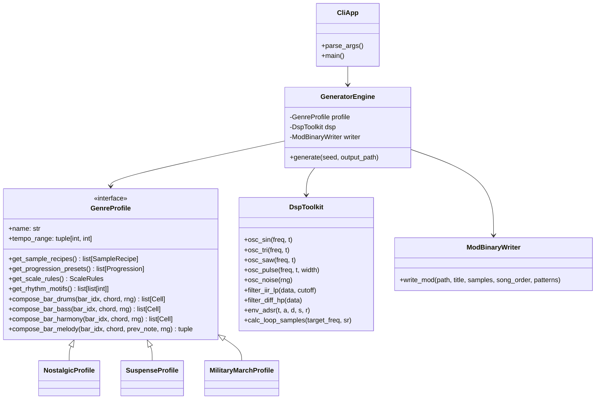

# マルチジャンル対応・手続き型MOD生成エンジン 拡張仕様検討書

> **本書の位置づけ**: 本書は最初期の拡張構想（検討書）であり、[EXTENSION_DESIGN.md](EXTENSION_DESIGN.md) が
> 設計具体化版として本書を置き換えている（両者が食い違う場合は EXTENSION_DESIGN.md を正とする。同書 §13
> に訂正一覧）。クラス名・ディレクトリ構成（`DspToolkit` 等）は検討段階のものであり実装とは異なる。
> 本書が対象とした第一段階（nostalgic / suspense-slow / suspense-chase / march の4ジャンル）は実装完了済み。
> さらに第二段階の拡張（EXT-1〜6。[CORE_EXTENSION_DESIGN.md](CORE_EXTENSION_DESIGN.md)）も一部実装済みで、
> `swing-jazz` / `prog-rock` の2ジャンルが追加されている。現在の構成・最新のジャンル一覧は
> [README.md](README.md) の「ファイル構成」および `--list-genres`、サンプル合成基盤は
> [CORE_EXTENSION_DESIGN.md](CORE_EXTENSION_DESIGN.md) §8 を参照。

## 1. 概要と目的

### 1.1. 本書の目的
本書は、現行のノスタルジック楽曲特化型MOD生成スクリプト（`twilight_pad.py`）を、**「サスペンス」「行進曲（マーチ）」をはじめとする多様なジャンルに柔軟に対応できる手続き型音楽生成プラットフォーム**へと拡張するための技術仕様検討書である。

実装担当者がアーキテクチャの骨格、データ構造、抽象インターフェース、具象クラスの設計、および具体的な音響・音楽理論パラメータを即座にコードへ落とし込めるレベルまで詳細化して定義する。

### 1.2. 拡張の基本方針
- **不変のコア（共通インフラ: 約75%）** と **可変のスタイル（曲調プロファイル: 約25%）** を完全分離する（Strategy パターン）。
- ProTrackerバイナリシリアライズ、DSP波形合成ライブラリ、シーケンス構築基盤は共通エンジンとして流用し、重複コードを徹底排除する。
- 曲調の変更は「プロファイル定義ファイル」の差し替え・追加のみで完結させる。

---

## 2. システムアーキテクチャ設計

### 2.1. 全体コンポーネント図



### 2.2. データフロー

```
[CLI 引数 (--genre, --seed, -o)]
       │
       ▼
[GenreProfile のインスタンス化 (例: SuspenseProfile)]
       │
       ▼
[DSP Toolkit によるサンプル波形一括合成 (8-bit PCM × 7音色)]
       │
       ▼
[Procedural Composer (Profile の和声・リズムルールを適用して4chシーケンス構築)]
       │
       ▼
[ModBinaryWriter (ProTracker 'M.K.' 形式バイナリ生成)]
       │
       ▼
[出力ファイル (.mod) の保存]
```

---

## 3. 共通コアエンジン仕様（流用する75%）

### 3.1. DSP ツールキット (`DspToolkit`)
音色合成に必要な数理処理を共通関数群としてライブラリ化する。

```python
class DspToolkit:
    SR: float = 3546895.0 / (214.0 * 2.0)  # ~8287.1378 Hz (Amiga C-3基準)

    @staticmethod
    def clamp(x: float) -> int:
        return max(-128, min(127, int(round(x))))

    @staticmethod
    def pad_even(b: bytes) -> bytes:
        return b if len(b) % 2 == 0 else b + b"\x00"

    @staticmethod
    def adsr_env(t: float, total_len: float, a: float, d: float, s: float, r: float) -> float:
        """標準ADSRエンベロープ"""
        if t < a:
            return t / a
        elif t < a + d:
            return 1.0 - (1.0 - s) * ((t - a) / d)
        elif t < total_len - r:
            return s
        else:
            rel_t = t - (total_len - r)
            return max(0.0, s * (1.0 - rel_t / r))

    @staticmethod
    def make_seamless_loop(length: int, k_cycles: int, harmonics: list[tuple[float, float]]) -> bytes:
        """整数周期を利用したクリックフリー完全ループPCM生成
        harmonics: [(倍音倍率, 振幅比率), ...]
        """
        data = []
        for i in range(length):
            v = 0.0
            for mult, weight in harmonics:
                phase = 2.0 * math.pi * (k_cycles * mult) * i / length
                v += math.sin(phase) * weight
            v = math.tanh(v)
            data.append(DspToolkit.clamp(v * 127) & 0xFF)
        return DspToolkit.pad_even(bytes(data))
```

### 3.2. ProTracker バイナリシリアライザ (`ModBinaryWriter`)
全ジャンル共通のProTrackerバイナリ構築ロジック。

```python
@dataclass
class ModSampleHeader:
    name: str
    data: bytes
    volume: int         # 0..64
    loop_start: int     # words (bytes // 2)
    loop_length: int    # words (1 = no loop, >1 = looped)
    finetune: int = 0

class ModBinaryWriter:
    @staticmethod
    def pack_cell(period: int, sample_idx: int, effect: int = 0, param: int = 0) -> bytes:
        hi_smp = (sample_idx >> 4) & 0x0F
        lo_smp = sample_idx & 0x0F
        b0 = (hi_smp << 4) | ((period >> 8) & 0x0F)
        b1 = period & 0xFF
        b2 = (lo_smp << 4) | (effect & 0x0F)
        b3 = param & 0xFF
        return bytes([b0, b1, b2, b3])

    @staticmethod
    def write(path: str, title: str, samples: list[ModSampleHeader], song_order: list[int], patterns: list[bytes]):
        # ヘッダー(20B) + 31サンプル(930B) + 曲長(1B) + 0x7F(1B) + オーダー表(128B) + M.K.(4B)
        # + パターンバイナリ + サンプルPCMデータ
        ...
```

---

## 4. 曲調規定インターフェース仕様 (`GenreProfile`)

実装担当者がジャンルを追加・拡張する際に実装すべき基底クラスとデータ構造。

```python
from abc import ABC, abstractmethod

@dataclass
class ChordDef:
    name: str
    root_note: str                 # ベース用根音 (例: "C-2")
    harmony_note: str              # パッド・和音用推奨音 (例: "G-2")
    chord_tones: list[str]         # 強拍に配置可能な和音構成音
    scale_tones: list[str]         # 経過音・装飾音として配置可能な音群

@dataclass
class ScaleRules:
    preferred_intervals: list[int] # 旋律進行時の推奨度数差 (例: [+1, -1, +2, -2])
    leap_probability: float        # 跳躍進行の発生確率 (例: 0.25)
    dissonance_weight: float       # 不協和音（半音・トライトーン）の許容度 (0.0=完全協和, 1.0=極度不協和)

class GenreProfile(ABC):
    name: str
    tempo_range: tuple[int, int]
    default_order: list[int]       # 例: [0, 1, 2, 1, 3]

    @abstractmethod
    def get_sample_recipes(self) -> list[ModSampleHeader]:
        """このジャンル専用の7音色を合成して返す"""
        pass

    @abstractmethod
    def get_progression_presets(self) -> list[tuple[str, list[ChordDef]]]:
        """このジャンルに適したコード進行パターンのリストを返す"""
        pass

    @abstractmethod
    def get_scale_rules(self) -> ScaleRules:
        """旋律形成時の音響規則を返す"""
        pass

    @abstractmethod
    def compose_bar_drums(self, bar_idx: int, chord: ChordDef, rng: random.Random, is_chorus: bool) -> list[bytes]:
        """小節ごとのドラムトラック（16行分のセル）を生成"""
        pass

    @abstractmethod
    def compose_bar_bass(self, bar_idx: int, chord: ChordDef, rng: random.Random, is_chorus: bool) -> list[bytes]:
        """小節ごとのベーストラック（16行分のセル）を生成"""
        pass

    @abstractmethod
    def compose_bar_harmony(self, bar_idx: int, chord: ChordDef, rng: random.Random, is_chorus: bool) -> list[bytes]:
        """小節ごとの和音/伴奏トラック（16行分のセル）を生成"""
        pass

    @abstractmethod
    def compose_bar_melody(self, bar_idx: int, chord: ChordDef, prev_note: str, rng: random.Random, is_chorus: bool) -> tuple[list[bytes], str]:
        """小節ごとの主旋律トラック（16行分のセル）を生成し、終端音を返す"""
        pass
```

---

## 5. 具象プロファイルの詳細設計（実装具体例）

### 5.1. サスペンス調プロファイル (`SuspenseProfile`)

心理的緊張、静寂からの急激なショック、不吉な予感を表現する特化仕様。

#### (1) 基本音楽設定
- **BPM**: 64 〜 72（低速・重苦しい緊張）または 138 〜 148（緊急脱出・緊迫チェイス）
- **キー・モード**: Cフリジアン（C, Db, Eb, F, G, Ab, Bb）および Cディミニッシュ
- **特徴的な音程**: 短2度（半音の軋み）、増4度（トライトーン / 悪魔の音程）、減7度

#### (2) 音色キット設計 (`SampleRecipes`)
| ID | サンプル名 | 特徴と合成アルゴリズム |
|:---|:---|:---|
| 1 | `SubHeartbeat` | 38Hz中心の超低域サイン波。心拍数を模した重苦しく鈍い打音。 |
| 2 | `MetalAnvil` | 金属プレートを叩いたような不協和チャイム音（920Hz, 1430Hz, 2150Hzの混合＋急峻減衰）。 |
| 3 | `NoiseSwoosh` | 帯域制限ホワイトノイズの逆再生風フェードインまたは突発ノイズバースト。 |
| 4 | `LowDroneBass` | 55Hz矩形波＋サブオシレータ＋ローパスで唸るような重低音ドローン（完全ループ）。 |
| 5 | `PizzStab` | 弦楽器のコル・レーニョ／ピチカート風の乾いた不穏な短音（指数減衰 0.08秒）。 |
| 6 | `TensionStrings`| 完全ループ。基音と短2度（半音上）の音をわずかにデチューンして合成し、激しいウネリ（うなり周波数 2Hz）を永続発生させる恐怖のストリングスパッド。 |
| 7 | `ScreamingLead` | 不安を煽る高い倍音を含むテルミン／サイレン調ポルタメントリード。 |

#### (3) 和声進行プリセット
1. **Pedal Tone Terror (固執低音進行)**:
   - `Cdim -> Cdim/Db -> Cdim -> B/C`（ベースはずっと C-1 を連打し、上の和音が半音でぶつかる）
2. **Tritone Nightmare (増4度進行)**:
   - `Cm -> F#dim -> Fm -> Bdim`
3. **Phrygian Suspense (フリジアン下降)**:
   - `Cm -> Dbmaj7 -> Bbm -> C`

#### (4) リズム＆フレージング文法
- **不規則な休符（Silence as Tension）**: 音符をあえて鳴らさず、8行分完全に無音にした後に突発的に `MetalAnvil` や `PizzStab` を最大音量（vol 64）で叩き込む。
- **固執反復（Ostinato）**: `PizzStab` で同じ音（例: `C-3`）を8分音符で狂気的にリピートし、徐々にボリュームを上げてクレッシェンド。

---

### 5.2. 行進曲・マーチ風プロファイル (`MilitaryMarchProfile`)

祝典、軍楽隊、堂々たる行進を表現する特化仕様。

#### (1) 基本音楽設定
- **BPM**: 118 〜 122（厳格な歩調テンポ。2拍子の躍動感、Speed 6）
- **キー・モード**: Bb Major / Eb Major / F Major / C Major（吹奏楽・軍楽隊の王道キー）
- **特徴的な音程**: 完全4度、完全5度、長3度のファンファーレ跳躍

#### (2) 音色キット設計 (`SampleRecipes`)
| ID | サンプル名 | 特徴と合成アルゴリズム |
|:---|:---|:---|
| 1 | `MarchBassDrum`| タイトでパンチのある大太鼓（Bass Drum）。胴鳴り85Hz、減衰0.25秒。 |
| 2 | `MarchSnare`   | マーチング小太鼓。スナッピーノイズ＋明確なヘッド打音トーン（220Hz）。 |
| 3 | `CrashCymbal`  | 祝典のアクセントを告げるシンバル。金属倍音＋ハイパスノイズ（減衰 0.8秒）。 |
| 4 | `TubaBass`     | チューバ／スーザフォン。歯切れの良いスタッカート低音ブラス（三角波＋ローパス矩形波）。 |
| 5 | `BrassHorn`    | ホルン／トロンボーンの後打ち伴奏用ブラス音（減衰0.2秒）。 |
| 6 | `BrassSection` | 完全ループ。金管セクションの厚いユニゾン持続音（豊かな偶数倍音）。 |
| 7 | `PiccoloLead`  | ピッコロ／トランペット。高域で高らかに響く澄んだファンファーレ音。 |

#### (3) 和声進行プリセット
1. **Sousa Classic March (スーザ調行進曲進行)**:
   - `C -> G7 -> C -> F -> C/G -> G7 -> C`
2. **Heroic Fanfare (英雄的ファンファーレ)**:
   - `C -> F -> G -> C -> Am -> Dm -> G7 -> C`
3. **Trio Uplift (祝典トリオ展開)**:
   - `F -> F -> C7 -> F -> Bb -> F -> C7 -> F`

#### (4) リズム＆フレージング文法
- **2拍子の強烈なステップ感（Oom-Pah）**:
  - 拍頭（Row 0, 8）: `TubaBass` が根音（または5度音）を「ブン」と鳴らし、同時に `MarchBassDrum` がドンと踏む。
  - 裏拍（Row 4, 12）: `BrassHorn` が後打ち「チャッ」と刻み、同時に `MarchSnare` がスパンと叩く。
- **スネアロール（Snare Roll）と付点リズム**:
  - `MarchSnare` を1行おき、または行末で16分連打（Row 12, 13, 14, 15）してロールを再現。
- **ファンファーレ主旋律**:
  - リズム骨格: 付点8分＋16分（`[0, 6, 8, 14]`）のスキップ感。
  - 分散和音跳躍: ド・ミ・ソ・ド（C-3 -> E-3 -> G-3 -> C-4）を高らかに駆け上がる旋律。

---

### 5.3. 現行ノスタルジック調 (`NostalgicProfile`)

現行の `twilight_pad.py` は、このアーキテクチャの `NostalgicProfile` として再配置する。

- **BPM**: 88 〜 96
- **サンプル**: LoFiKick, SoftSnare, ClosedHH, WarmBass, MusicBox, TwilightPad, MellowFlute
- **和声**: ステップダウン進行（`Fmaj7 -> Em7 -> Dm7 -> Cmaj7`）、サウダーデ進行
- **文法**: 順次進行優先（75%）、長7度/9thテンション解決、歌うような弱拍ゴースト

---

## 6. ディレクトリ・モジュール構成案

実装移行時の推奨プロジェクト構造：

```text
C:/work/claude/28_ModGenerator/
├── mod_weaver/                  # パッケージ本体
│   ├── __init__.py
│   ├── cli.py                     # コマンドラインエントリーポイント
│   ├── engine.py                  # 生成エンジン統括
│   ├── core/                      # 【不変層】
│   │   ├── __init__.py
│   │   ├── dsp.py                 # DspToolkit (波形・フィルタ・ループ合成)
│   │   ├── binary_writer.py       # ModBinaryWriter (ProTracker 'M.K.' バイナリ出力)
│   │   └── periods.py             # ProTracker Period テーブル定義
│   └── profiles/                  # 【可変層】(ジャンルプロファイル群)
│       ├── __init__.py
│       ├── base.py                # GenreProfile 抽象基底クラス, ChordDef, ScaleRules
│       ├── nostalgic.py           # NostalgicProfile (現行ロジック)
│       ├── suspense.py            # SuspenseProfile (新規)
│       └── march.py               # MilitaryMarchProfile (新規)
├── twilight_pad.py                # 下位互換性用ラッパー (従来のコマンドがそのまま動作)
├── DESIGN.md
├── EXTENSION_SPEC.md              # 本書
├── README.md
└── LICENSE
```

---

## 7. 実装移行ロードマップ

実装担当者が安全かつ迅速に作業を進めるための推奨3ステップ：

### Phase 1: コアエンジンの抽出とリファクタリング（既存機能の等価移行）
1. `core/dsp.py` と `core/binary_writer.py` を作成し、現行の `twilight_pad.py` から共通処理を切り出す。
2. `profiles/base.py` に `GenreProfile` インターフェースを定義。
3. 現行のコードを `profiles/nostalgic.py` にカプセル化。
4. `python -m mod_weaver.cli --genre nostalgic --seed 732501` を実行し、既存の `TwilightPad.mod` とバイナリハッシュが完全一致することを確認（リグレッション防止）。

### Phase 2: 新ジャンルプロファイルの単体実装
1. `profiles/suspense.py` を実装（サスペンス特有のサンプル音色合成、ペダルトーン/フリジアン和声、無音と突発アクセントのシーケンス）。
2. `python -m mod_weaver.cli --genre suspense` で生成し、OpenMPT等でサスペンス音楽としての緊張感と品質を官能評価。
3. `profiles/march.py` を実装（スネアロール、チューバ後打ち、ファンファーレ主旋律）。
4. 同様にマーチとしての躍動感を検証。

### Phase 3: CLI統合とプリセット拡張
1. `--genre` オプションで `[nostalgic, suspense, march]` を自由に選択可能にする。
2. 将来のジャンル（例: `cyberpunk`, `chiptune_rpg`, `lofi_hiphop`）を追加するためのプラグイン登録機構（`PROFILE_REGISTRY`）を整備。

---

## 8. まとめと結論

- 本アーキテクチャを採用することにより、**エンジン全体の約75%を占める低レイヤー（DSP・バイナリ生成）に手を加えることなく、約25%のプロファイル定義を追加・修正するだけで任意のジャンルに特化可能**となります。
- 実装担当者は、複雑なProTrackerバイナリ仕様や波形の整数周期計算を意識することなく、**「純粋な音楽理論（スケール、コード、リズム、音色レシピ）」の記述に100%集中できる環境**が構築できます。
