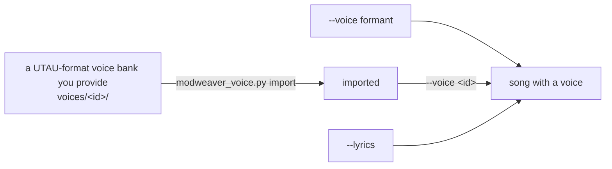

# ModWeaver

[日本語](README.md) | **English**

[](https://www.python.org/)
[](LICENSE)
[](https://openmpt.org/)

**ModWeaver** generates tracker music files entirely automatically, from waveform synthesis to sequencing, using **only the Python standard library** (no third-party packages). With `--format` you can choose ProTracker `.mod` (default), FastTracker II `.xm`, Scream Tracker 3 `.s3m`, Impulse Tracker `.it`, General MIDI `.mid` or `.mp3` (only `.mp3` needs the external program ffmpeg). Besides the nostalgic genre (`nostalgic`), `--genre` switches between 69 genres in three groups: **moods** (9, e.g. `calm`, `melancholic`, `focus`, `uplifting`), **genres** (40, e.g. `rock`, `pop`, `jazz`, `bossa-nova`, `city-pop`, `house`, `classical`, `cinematic`, `gamelan`, `industrial`, `trap`, `orchestral`, `celtic`, `trance`, `baroque`) and **styles** (20, e.g. 80s J-pop `jpop-80s`, JRPG game music `jrpg`, cinematic trailer `trailer`, 8-bit chiptune `chiptune`, late-90s racing game `racing-breaks`, suspense `suspense-slow`, Okinawan folk style `okinawan`, rokyoku style `rokyoku`, mood kayo `mood-kayo`). `--genre random` picks one for you. **The format is chosen first and the song is composed for what that format can do** (16-bit, high-resolution samples and a wide note range for XM and IT, a looser channel limit for IT, XM, S3M and MIDI, and so on). With MOD, each genre uses 4, 6 or 8 channels as its arrangement needs, and most genres also vary the arrangement from song to song (from a small 4-channel combo to a fuller 8-channel one). With XM, S3M, IT and MP3 every part of the genre is included and `--channels` is an upper limit. For the same genre, seed and tempo, the skeleton of the song (melody, chords, rhythm) is the same in every format. (Formerly known as TwilightPad MOD Generator. See `--list-genres` for the current list of genres.)

The default `nostalgic` genre produces bittersweet, wistful pieces: emotional chord progressions that evoke a city at dusk or the walk home, woven from a music box, an enveloping analog pad and a lo-fi beat.

---

## Features

- **An endless supply of different songs (procedural composition engine)**:
  Rather than rolling dice at random, it generates chord progressions, motifs, melodies and rhythms under the constraints of each genre's music theory. Every run yields a different, expressive and hummable piece.
- **Full reproducibility with seeds**:
  When you get a song you like, pass the seed shown in the console as `--seed <number>` to regenerate exactly the same song at any time.
- **Fully standalone synthesis**:
  Instead of loading external audio files (WAV or MP3), it synthesizes PCM samples directly with digital signal processing (DSP): sine waves, harmonics and filtered noise (8-bit at the Amiga playback rate for MOD, 8-bit at a high rate for S3M, 16-bit at a high rate for XM and IT).
- **Nostalgic sound design**:
  - **Music Box / Chime**: a music-box tone modelling the resonance of clear metal tines (inharmonic partials) with a smooth exponential decay.
  - **Twilight Ambient Pad**: warm analog synth strings with integer-period design, so they loop seamlessly with no clicks.
  - **Warm Mellow Bass**: a round, deep acoustic / lo-fi sub bass.
  - **Vintage Lo-Fi Drums**: a pitch-dropping kick, a warm retro snare and a delicate closed hi-hat.
- **Six output formats (`--format`)**:
  The default is Amiga ProTracker 4-channel MOD (`M.K.`). 6- and 8-channel songs (e.g. `pop` in its standard 6 channels, 8-channel `orchestral`) become FastTracker-style multichannel MOD (`6CHN` / `8CHN`). You can also choose `.xm` / `.s3m` / `.it` (tracker formats), General MIDI `.mid` (playable in DAWs and GM synths) and `.mp3` (rendered with ffmpeg). Automated tests play every tracker format with OpenMPT's playback engine (libopenmpt) and check pitch (equal temperament; S3M alone has an error inherited from ST3's period table) and length. XM and IT have a richer high end than MOD, MIDI plays chords as real simultaneous notes and glides as pitch bends.
- **Tempo control (`--tempo`)**:
  Fix the BPM with `--tempo 120`, or give a range such as `--tempo 80-100` to pick one at random within it. With the same seed you get "the same song" at a different tempo.
- **GUI**:
  Pick a genre and settings in a window to generate, play and export songs in other formats without typing commands ([4. Using the GUI](#4-using-the-gui)).

---

## Requirements

- **Python 3.10 or later** (no extra `pip install` needed)
- **Only for the GUI: tkinter** (part of Python's standard library and included in the python.org installers for Windows and macOS; on Linux it may be a separate package, e.g. `sudo apt install python3-tk` on Debian/Ubuntu, or `brew install python-tk` for Homebrew's Python)
- **Only for `--format mp3`: ffmpeg** (built with **libopenmpt** and **libmp3lame**)
  - The MP3 is made by writing the song as `.it` (64 channels, 16-bit, 44.1 kHz), playing it with ffmpeg's built-in libopenmpt (OpenMPT's playback engine) and encoding it to a 320 kbps MP3. ModWeaver itself has no audio playback engine.
  - Put `ffmpeg` on your PATH, or set the environment variable `MODWEAVER_FFMPEG` to the path of the executable.
  - On Windows, builds such as the **full** build from [gyan.dev](https://www.gyan.dev/ffmpeg/builds/) include libopenmpt (the essentials build may not). To check, make sure `ffmpeg -hide_banner -demuxers` lists `libopenmpt` and `ffmpeg -hide_banner -encoders` lists `libmp3lame`.
  - If ffmpeg is not found or lacks a required feature, ModWeaver says what is missing and exits with code `5` (no file is written).
  - Formats other than `.mp3` do not need ffmpeg.

---

## Usage

### 1. Running

Running `python modweaver.py` with no arguments prints the usage (the same as `--help`) and exits. To make a song, give options as shown below. To use a window instead, see [4. Using the GUI](#4-using-the-gui).

**The usage, genre list and results are shown in Japanese by default. Add `-e` (`--english`) to get them in English**, as the examples below do.

#### Generate a new random song (different every run):
```bash
python modweaver.py -e --genre nostalgic
```
Example output:
```text
==================================================
  ModWeaver: TwilightPad Procedural
==================================================
Genre       : nostalgic
Format      : mod
Seed        : 732501
Tempo       : BPM 88
Channels    : 4
Theme A     : Royal Road (Classic Emotion) -> Fmaj7 - G7 - Em7 - Am7
Theme B     : Canon Sunset (Warm Twilight) -> Cmaj7 - G7 - Am7 - Em7
--------------------------------------------------
Output File : output/nostalgic_732501.mod
Success! To reproduce this exact song, run:
  python modweaver.py --genre nostalgic --seed 732501
==================================================
```

If you omit the output path, the file is written to the `output` folder in the current directory as `<genre>_<seed>.mod` (e.g. `output/nostalgic_732501.mod`); the folder is created if needed.

#### Regenerate a favourite song from its seed (`--genre` defaults to `nostalgic`):
```bash
python modweaver.py -e --seed 732501
```

#### Choose the output file name (with `--output` the file is written to that exact path instead of the `output` folder):
```bash
python modweaver.py -e --output MyTwilightSong.mod
```

#### Generate other genres (`--genre` / `-g`):
```bash
python modweaver.py -e --genre suspense-chase
python modweaver.py -e --genre suspense-slow --seed 1
python modweaver.py -e --genre march
python modweaver.py -e --genre swing-jazz
python modweaver.py -e --genre prog-rock
python modweaver.py -e --genre trap
python modweaver.py -e --genre future-bass
python modweaver.py -e --genre maqam
python modweaver.py -e --genre free-jazz
python modweaver.py -e --genre minimalism
python modweaver.py -e --genre orchestral   # 8 channels; 8CHN format with the default mod
python modweaver.py -e --genre calm         # mood: calm (4 channels)
python modweaver.py -e --genre city-pop     # genre: city pop (6 channels)
python modweaver.py -e --genre classical    # genre: string-quartet minuet (3/4)
python modweaver.py -e --genre jrpg         # style: JRPG field theme
python modweaver.py -e --genre gamelan      # genre: gamelan (slendro / pelog tuning)
python modweaver.py -e --genre chiptune     # style: 8-bit game music (pulse, triangle, noise)
python modweaver.py -e --genre industrial   # genre: industrial (distortion and metal)
python modweaver.py -e --genre racing-breaks  # style: late-90s racing game (drum'n'bass / breakbeat)
python modweaver.py -e --genre celtic       # genre: Celtic dance tunes (jig, reel or hornpipe, chosen by the seed)
python modweaver.py -e --genre gagaku       # genre: gagaku-style court music (jo-ha-kyu tempo)
python modweaver.py -e --genre enka         # genre: enka (scoops and kobushi, final-chorus key change)
python modweaver.py -e --genre okinawan     # style: Okinawan folk (Ryukyu scale; slow shima-uta or swung kachashi)
python modweaver.py -e --genre reggae       # genre: reggae / ska (one drop, skank)
python modweaver.py -e --genre samba        # genre: samba (surdo and tamborim; pagode or batucada)
python modweaver.py -e --genre flamenco     # genre: flamenco (Andalusian cadence, 12-beat compas)
python modweaver.py -e --genre raga         # genre: raga (tanpura and sitar, alap to gat)
```

#### Pick a genre at random (`--genre random` / `-g r`):
```bash
python modweaver.py -e --genre random
python modweaver.py -e -g r --tempo 120     # picks among genres that can play at 120 BPM
```
The chosen genre is shown in the banner as `Genre       : trap (random)` (with `-e`), and the reproduce command names it (e.g. `--genre trap`). The genre choice does not depend on `--seed` and is random every time (use the reproduce command to make the same song again).

#### Choose the output format (`--format` / `-f`; defaults to `mod`):
```bash
python modweaver.py -e --format xm          # FastTracker II
python modweaver.py -e --format s3m         # Scream Tracker 3
python modweaver.py -e --format it          # Impulse Tracker
python modweaver.py -e --format midi        # General MIDI (extension .mid)
python modweaver.py -e --format mp3         # MP3 (needs ffmpeg; see Requirements)
```
When the output path is omitted, the extension follows the format (e.g. `output/nostalgic_732501.it`).

#### Set the tempo (`--tempo` / `-t`; chosen per genre if omitted):
```bash
python modweaver.py -e --tempo 120          # generate at 120 BPM
python modweaver.py -e --tempo 80-100       # pick a random BPM from 80 to 100
```
With a range, the BPM actually chosen is shown on the banner's `Tempo` line, and the reproduce command contains the resolved value (e.g. `--tempo 92`).

#### Set the number of channels (`--channels` / `-c`; the meaning depends on the format):
```bash
python modweaver.py -e --genre pop --channels 4                 # MOD: small 4-channel combo, Amiga-compatible (M.K.)
python modweaver.py -e --genre pop --channels 8                 # MOD: 8 channels with a counter-melody and echo added
python modweaver.py -e --genre pop --format xm --channels 12    # XM: upper limit on the channels used (default 32)
```
With MOD the number must be one the genre declares (the ch column of the genre list, e.g. `4/6/8`; chosen by the genre for each song if omitted). With XM, S3M, IT and MP3 it is an upper limit: the genre's parts are fitted into it by merging drum kit pieces and baking chords into single samples (the format's maximum if omitted; an error if the parts cannot fit). It cannot be given for MIDI. For MOD genres with several numbers in the ch column, the same seed gives the same melody and chords in every arrangement; only the thickness and the number of channels change.

#### List the available genres:
```bash
python modweaver.py -e --list-genres
```

#### Show everything in English (`-e` / `--english`):
```bash
python modweaver.py -e                   # English usage
python modweaver.py -e --list-genres     # genre descriptions in English
python modweaver.py -e --genre trap      # English result banner
```
The usage, the genre descriptions and the result banner switch to English. `-e` does not change the generated song. The summary lines a genre adds to the banner (chord progression names etc.) and error/warning messages (stderr) are in English either way.

#### Show the version:
```bash
python modweaver.py -e --version
```
```text
ModWeaver 1.1.0
https://github.com/himayah/ModWeaver
```

### 2. Command-line options

`python modweaver.py` and `python -m mod_weaver` accept the same options. Started with no options at all, it prints the same usage as `--help` and exits (code 0).

| Option | Short | Default | Description |
|:---|:---|:---|:---|
| `--genre` | `-g` | `nostalgic` | Genre id to generate (see the table below). `random` / `r` picks one of the available genres at random (with `--tempo`, among the genres that support that tempo). An unknown id is an error (exit code 2) |
| `--seed` | `-s` | random (100000–999999) | Seed for reproducibility (any integer, negative values allowed). The same genre + seed (+ format + tempo) always produces an identical file |
| `--format` | `-f` | `mod` | Output format: `mod` / `xm` / `s3m` / `it` / `midi` / `mp3` (see the table below) |
| `--tempo` | `-t` | chosen per genre | A BPM (`120`) or a range (`80-100`, random within it), 32–255. A range the genre cannot play is an error (exit code 2); a range only partly outside is clipped to the supported range with a warning |
| `--output` | `-o` | `output/<genre>_<seed>.<ext>` (e.g. `output/nostalgic_732501.mod`); the folder is created if needed | Output path. When given, the file is written to exactly that path (a missing parent folder is an error) |
| `--channels` | `-c` | MOD: chosen by the genre for each song; other formats: the format's maximum | Number of channels; the meaning depends on the format. **MOD**: one of the `4` / `6` / `8` the genre declares (the ch column of the genre list; an unavailable number is an error, exit code 2). **XM / S3M / IT / MP3**: an upper limit (exit code 2 if the genre's parts cannot fit). **MIDI**: not allowed (exit code 2). With `--genre random`, only genres that can build that format with that number are picked |
| `--output-dir` | – | `output` | Output folder when `--output` is omitted (created if missing). Cannot be combined with `--output` |
| `--list-genres` | – | – | Print the id, aliases and description of every available genre, grouped into moods, genres and styles, then exit (code 0). Nothing is generated |
| `--json` | – | – | Print the genre list (`--list-genres`) or the generation result as machine-readable JSON (for the GUI and other programs; see [DESIGN.md](DESIGN.md) §8.8) |
| `--voice` | – | none | Add a sung part: `formant` (built-in voice) or the id of a voice bank imported with `modweaver_voice.py`. Only genres with a vocal part (okinawan, enka, mood-kayo) and the IT, XM, MP3 and MIDI formats. See [Adding a singing voice](#5-adding-a-singing-voice---voice----lyrics) |
| `--lyrics` | – | none | Lyrics (hiragana, katakana or romaji): a string or `@FILE`. Needs `--voice` |
| `--voices-dir` | – | `voices/` etc. | Where voice banks are searched |
| `--list-voices` | – | – | List the imported voice banks and exit (`--json` for machine-readable output) |
| `--english` | `-e` | – | Show the usage, genre descriptions and results in English (Japanese by default) |
| `--version` | `-v` | – | Print the version and the GitHub repository URL, then exit (code 0) |
| `--help` | `-h` | – | Print the usage and the option list (ending with the genre ids per group), then exit (code 0) |

#### Output formats

| `--format` | Extension | Channels | Notes |
|:---|:---|:---|:---|
| `mod` (default) | `.mod` | 4 (`M.K.`), 6, 8 (`xCHN`) | 8-bit samples. Genres with other than 4 channels (6 or 8) use FastTracker-style multichannel MOD. Plays in OpenMPT, MilkyTracker, libxmp and others, but not in the original ProTracker or on a real Amiga. The genre's stereo placement is lost and the player's default L R R L panning is used |
| `xm` | `.xm` | limit 1–32 | **16-bit, high-rate samples**, volume in the volume column. Per-instrument panning the genre declares (Amiga-style L R R L if it declares none) |
| `s3m` | `.s3m` | limit 1–16 | 8-bit, high-rate samples (at most 64000 bytes each). Expressed as channel panning |
| `it` | `.it` | limit 1–64 | **16-bit, high-rate samples**, instrument mode. Expressed as channel panning |
| `midi` | `.mid` | not allowed (16 MIDI channels) | General MIDI (SMF format 1, PPQ 480). Every part is included and chords are real simultaneous notes. Instruments are the GM programs each genre assigns to its parts, not the synthesized samples themselves. Glides are pitch bends, vibrato is modulation (CC1), and microtones are pitch bends |
| `mp3` | `.mp3` | limit 1–64 (same as IT) | 44.1 kHz stereo, 320 kbps (rendered through IT). **Needs ffmpeg** (see Requirements) |

#### What the tempo (BPM) means

`--tempo` and the banner's `Tempo` are **quarter-note BPM** (the same as the tracker's `Fxx` value). The exception is `trap`, a half-time genre written on a fine 32nd-note grid, whose BPM is counted the way trap usually is (e.g. 150 feels like 75 in half time). `free-jazz` is a genre whose tempo drifts continuously; `--tempo` sets the starting BPM (later tempo changes are scaled by the same ratio; allowed range 44–163).

#### Available genres

**Moods (mood)** — 9

| Genre id | Aliases | ch | Description |
|:---|:---|:---|:---|
| `calm` | – | 4 | Calm and relaxed: soft pads and slow piano arpeggios |
| `cool` | – | 4/6/8 | Cool: glassy synths over a light two-step beat |
| `dark-tense` | – | 4/6/8 | Dark and tense: low ostinato, ticking pulse and heavy hits |
| `dreamy` | – | 4/6/8 | Dreamy: echoing arpeggios over lush pads |
| `energetic` | – | 4/6/8 | Energetic: fast, drum-driven rock with driving guitars and bass |
| `focus` | – | 4 | Focus: minimal lo-fi loop with a steady, unchanging groove |
| `melancholic` | – | 4 | Melancholic piano ballad in a minor key over soft strings |
| `uplifting` | – | 4/6/8 | Uplifting anthem: four-on-the-floor, bright arpeggios and supersaw chords |
| `warm` | – | 4/6 | Warm: acoustic guitar and piano in a gentle major key |

**Genres (genre)** — 40

| Genre id | Aliases | ch | Description |
|:---|:---|:---|:---|
| `ambient` | – | 4 | Ambient: layered pads and sparse bells with little or no beat |
| `baroque` | – | 4/6/8 | Baroque style: circle-of-fifths harmony, melodic sequences, harpsichord and walking continuo, cadential trill, terraced dynamics |
| `bossa-nova` | – | 4/6 | Bossa nova: soft nylon guitar and light percussion in 2/4 |
| `celtic` | – | 4/6/8 | Celtic-style dance tunes: jig, reel or hornpipe, AABB repeats, drone and cuts (no traditional melodies) |
| `cinematic` | – | 6/8 | Cinematic: piano ostinato building to soaring strings and horns |
| `city-pop` | – | 4/6/8 | City pop: jazzy electric piano, bouncy bass and funky guitar cutting |
| `classical` | – | 4 | Classical: a Classical-era minuet for string quartet with clear cadences |
| `edm` | – | 4/6/8 | EDM: synth-driven builds that explode into the drop |
| `enka` | – | 4/6/8 | Enka: pentatonic minor melody with scoops and kobushi, strings, plucked guitar, shamisen fills, final-chorus key change (no vocals) |
| `fado` | – | 4/6 | Fado style: ornamented Portuguese-guitar-like melody, nylon arpeggios, slow minor key, a guitarrada interlude (no vocals) |
| `flamenco` | – | 4/6 | Flamenco style: phrygian dominant with the Andalusian cadence, rasgueado, palmas and cajon, a 12-beat compas or 4/4 rumba |
| `folk` | – | 4/6 | Folk: strummed acoustic guitar and fiddle over simple progressions |
| `free-jazz` | – | 4 | Free jazz: tone clusters, probabilistic density textures, rubato (continuous tempo changes) |
| `future-bass` | – | 4 | Future bass: kick-triggered sidechain, vocal chops, Eb I-V-vi-IV |
| `gagaku` | – | 4/6 | Gagaku-style court music: sho-like sustained chords, hichiriki-like melody with scoops, jo-ha-kyu tempo (not a faithful reproduction) |
| `gamelan` | – | 6 | Gamelan style: interlocking bronze metallophones and gongs in slendro or pelog tuning |
| `hiphop` | – | 4/6 | Hip hop: boom-bap beats and sample-style loops that leave room for rap |
| `house` | – | 4/6/8 | House: steady four-on-the-floor groove with offbeat organ stabs |
| `industrial` | – | 6 | Industrial: distorted beats and metal clangs, a roaring distorted bass and factory noise |
| `jazz` | – | 4 | Modal jazz: dorian vamps, quartal piano voicings and muted trumpet |
| `klezmer` | – | 4/6 | Klezmer style: 2/4 oom-pah, freygish clarinet with sobs, a doina-like intro and an accelerating coda |
| `lofi-hiphop` | – | 4/6/8 | Lo-fi hip hop: swung beats, jazzy electric piano and vinyl noise |
| `maqam` | – | 4 | Middle Eastern maqam (Rast on G): oud taqsim and maqsum usul with neutral intervals |
| `march` | – | 4 | Military march: oom-pah and snare rolls, fanfares, modulation into the trio |
| `minimalism` | – | 4 | Minimal / phase music: four parts with 16/12/8/6-row cycles drift apart and realign |
| `orchestral` | – | 8 | Full orchestra / film score: 8 channels, six-voice strings + woodwinds + brass + timpani |
| `pop` | – | 4/6/8 | Pop: bright major-key melodies, piano and a catchy chorus |
| `prog-rock` | – | 4 | Odd-meter prog / math rock: a 7/8+7/8+5/8 riff contrasted with a 4/4 chorus |
| `raga` | – | 4/6 | Hindustani raga style: tanpura drone, sitar-like melody, alap to gat with accelerating tabla (the raga is chosen by the seed) |
| `reggae` | – | 4/6/8 | Reggae / ska style: one-drop beat, offbeat skank, heavy spacious bass, organ bubble and dub echo |
| `rnb-soul` | – | 4/6/8 | R&B / soul: smooth extended chords and a singing melody in a slow jam |
| `rock` | – | 4/6/8 | Rock: guitar riffs over a straight eight-beat |
| `russian-folk` | – | 4/6/8 | Russian folk style: balalaika tremolo, bayan oom-pah, harmonic minor; a lyric song or an accelerating dance |
| `samba` | – | 4/6/8 | Samba style: 2/4 surdo with tamborim, agogo and pandeiro sixteenths, cavaquinho strumming, 7th chords (relaxed pagode or full batucada) |
| `swing-jazz` | – | 4 | Swing jazz: ride cymbal, walking bass and piano comping over Bb rhythm changes (AABA) |
| `synthwave` | – | 4/6/8 | Synthwave: 80s synths, gated snare and a pulsing eighth-note bass |
| `tango` | – | 4/6 | Argentine tango style: marcato four, 3-3-2 accents, dragging violin, bandoneon chords and a chan-chan ending |
| `techno` | – | 4 | Minimal techno: a hypnotic four-on-the-floor with slowly mutating sequences |
| `trance` | – | 4/6/8 | Trance: 136-142 BPM four-on-the-floor, rolling bass, 3-3-2 gated pads, a long breakdown into the drop |
| `trap` | – | 4 | Trap / drill: 32nd-note hi-hat rolls and 808 glides over a two-chord Cm-Ab loop |

**Styles (style)** — 20

| Genre id | Aliases | ch | Description |
|:---|:---|:---|:---|
| `acoustic-ssw` | – | 4/6 | Acoustic singer-songwriter style: fingerpicked guitar, light percussion and a vocal-like melody |
| `ambient-drone` | – | 4 | Ambient drone: long sustained tones that shift very slowly |
| `anime-ost` | – | 4/6/8 | Anime soundtrack style: driving strings with jazz harmony and brass hits |
| `chiptune` | – | 4 | 8-bit chiptune style: pulse-wave melody and arpeggios, triangle bass, noise drums and jump sounds |
| `debayashi` | – | 4/6 | Debayashi (entrance music) style: miyako-bushi scale without chords, shamisen, drums, gong and flute hishigi, speeding up on each repeat |
| `gospel-shout` | – | 4/6/8 | Gospel shout: swung shuffle, shout chord changes, handclaps, organ glissandi and a double-time vamp |
| `indie-rock` | – | 4/6/8 | Indie rock style: live-sounding drums, ringing guitar arpeggios and light overdrive |
| `jpop-80s` | – | 4/6/8 | 80s J-pop style: bright chords, city brass, a light beat and a final key change |
| `jrock-90s` | – | 4/6/8 | 90s J-rock style: loud guitars over a fast beat, a guitar solo and a final key change |
| `jrpg` | – | 4/6/8 | JRPG game music style: melodic adventure theme with harp, strings and horn |
| `lofi-chill` | – | 4/6/8 | Lo-fi chill: soft guitar and flute, pumping sidechain and rain ambience |
| `mood-kayo` | – | 4/6/8 | Mood kayo style: scooping tenor sax, Hawaiian steel guitar, strings, rumba or cha-cha-cha and 7th chords (no vocals) |
| `neo-soul` | – | 4/6/8 | Neo soul style: laid-back off-grid beats and lush electric piano chords |
| `nostalgic` | – | 4 | Lo-fi beat and music box evoking nostalgia at dusk (the original TwilightPad) |
| `okinawan` | – | 4/6 | Okinawan folk style: Ryukyu scale, sanshin-like plucked strings and flute, a slow shima-uta or a swung kachashi dance |
| `racing-breaks` | – | 4/6/8 | Late-90s racing game style: drum'n'bass / breakbeat with 9th-chord e.piano and deep sub bass |
| `rokyoku` | – | 4/6 | Rokyoku style: sparse shamisen-led ensemble, melodic fushi alternating with spoken-style tanka gaps, wide tempo swings (no voice) |
| `suspense-chase` | – | 4 | Emergency escape / pursuit: heartbeat on every beat, driving eighth notes, impacts out of silence |
| `suspense-slow` | `suspense` | 4 | Slow, heavy tension: heartbeat and silence, sudden metallic hits |
| `trailer` | – | 6/8 | Cinematic trailer style: taiko and brass hits, driving strings and choir in three acts |

You can also check the current list with `python modweaver.py -e --list-genres` or `python modweaver.py -e --help` (if genres are added, that output is always authoritative). Without `-e` the descriptions are printed in Japanese.

#### Exit codes

| Code | Meaning |
|:---|:---|
| `0` | Success (including running with no arguments, `--help`, `--list-genres` and `--version`) |
| `2` | Argument error, unknown genre, or a tempo or channel count the genre cannot use (including `--genre random` when no genre supports it) |
| `3` | Generation or structure-check error |
| `4` | Output error (e.g. the file cannot be written) |
| `5` | `--format mp3` and ffmpeg is not found, or lacks libopenmpt / libmp3lame |
| `1` | Unexpected exception (a stack trace is printed) |

### 3. Playing the results

The generated `.mod` / `.xm` / `.s3m` / `.it` files play right away in the trackers and players below (`.mid` plays in GM synths, DAWs and media players; `.mp3` in any music player):

- **Recommended trackers (for editing and inspection)**:
  - [OpenMPT (Open ModPlug Tracker)](https://openmpt.org/) (Windows)
  - [MilkyTracker](https://milkytracker.org/) (Windows / macOS / Linux)
  - [Schism Tracker](http://schismtracker.org/) (cross-platform)
- **Media players**:
  - [XMPlay](https://www.un4seen.com/xmplay.html) (Windows / high-quality tracker playback)
  - [VLC media player](https://www.videolan.org/vlc/)
  - [Audacious](https://audacious-media-player.org/)

> **Tip (playing in OpenMPT)**:
> Opened in OpenMPT, you can watch and edit each pattern's note data, the samples used (headers and loop points), the tempo (BPM) setting and what each channel is playing, in real time.

### 4. Using the GUI

You can also use ModWeaver from a window instead of the command line (it uses Python's built-in tkinter; if tkinter is missing on Linux, see [Requirements](#requirements)).

```bash
python modweaver_gui.pyw             # start the GUI
python -m mod_weaver.gui             # the same
python modweaver_gui.pyw --lang=ja   # Japanese (the default follows the OS language; also switchable from the View menu)
```

On Windows, **double-click `modweaver_gui.bat`** (no console window). It works even when no application is associated with `.pyw` files (e.g. Python installed without the `py` launcher). If `pythonw` is not on PATH, set the `PYW` environment variable to the Python to use (e.g. `set PYW=py -3w`).

- Pick a genre from the list on the left (search and filter by group, or tick "Pick a random genre"), set the tempo, channels, seed, format and output folder, then press "Generate" (Ctrl+Enter / F5). Picking a genre fills the tempo fields with its typical tempo (Fixed) and its usual range (Range); the channel field depends on the format (buttons for the numbers the genre offers for MOD, an upper-limit field for XM, S3M, IT and MP3, unavailable for MIDI).
- From the "Songs" list you can play a song (in the application your OS associates with the file), show it in its folder, copy the command that reproduces it, **Export As** another format (the same song as MP3, MIDI, ...), or **Load into Settings** (keep the seed and change only the tempo or format).
- For genres with a vocal part (IT, XM, MP3, MIDI), the "Voice" field lists the imported voice banks (`--list-voices --json`) and the "Lyrics" field takes the lyrics (see [Adding a singing voice](#5-adding-a-singing-voice---voice----lyrics)). The fields are disabled where they cannot be used.
- The genre list and available formats are read from the CLI (`--list-genres --json`) at startup. The GUI runs `modweaver.py` behind the scenes, so it can do exactly what the CLI can.

### 5. Adding a singing voice (`--voice` / `--lyrics`)

Some genres (**okinawan, enka, mood-kayo**) have a sung part that follows the main melody. It sounds only when you pass `--voice` (songs without it are byte-for-byte what they were). Supported formats: IT, XM, MP3, MIDI (MOD and S3M are not supported).



**No voice data ships with ModWeaver.** A voice bank (UTAU-style `oto.ini` + wav files) is something you **download yourself** from its distributor. ModWeaver does not redistribute any bank.

#### Try it without a bank

```bash
python modweaver.py --genre enka --format it --voice formant
```

The built-in voice (`formant`) is a code-generated vowel choir ("ah~"). **It is retro and mechanical and hard to mistake for a person**, so treat it as a bonus. It cannot sing lyrics (syllables with consonants are sung as their vowel).

#### Preparing a bank

1. **Read the terms**: commercial use, modification (cutting, looping, pitch changes), conditions for publishing songs (credit, prohibited content) and use inside software. The voice ends up **embedded in the song as samples**. Checking is your responsibility (this is not legal advice).
2. **Choose**: a single-note (CV) bank with fairly long vowels works best. Connected (VCV, CVVC) banks are not supported.
3. **Place it**: extract it so that `oto.ini` and the wav files sit **directly** in `voices/<id>/` (no nesting; use an ASCII folder name). Garbled zip names can be avoided with e.g. `unzip -O cp932 x.zip` (Linux). `voices/` is in `.gitignore`.
4. **Import it**:

```bash
python modweaver_voice.py check  voices/<id>     # read-only inspection
python modweaver_voice.py import voices/<id>     # import (about a minute for 150 syllables)
python modweaver_voice.py audition <id>          # listen to it alone
python modweaver_voice.py list
```

If `modweaver.json` is missing, `import` writes a template `voices/<id>/modweaver.json` and stops with an error. Fill in `credit` (as the distributor requires), `terms_url` and `terms_checked` yourself, then run `import` again.

#### Making a song sing

```bash
python modweaver.py --genre enka --seed 3 --format it --voice <id>                     # sings "ah" (vocalise)
python modweaver.py --genre enka --seed 3 --format it --voice <id> --lyrics "ゆうやけこやけで ひがくれて"
python modweaver.py --genre enka --seed 3 --format it --voice <id> --lyrics @song.txt
```

Adding a voice does not change the other parts' notes. A `<output>.credits.txt` with the bank's credit is written next to the song.

#### Writing lyrics

- Allowed: hiragana, katakana, romaji (Hepburn and Kunrei may be mixed), the long-vowel mark ー, small kana (ゃゅょぁぃぅぇぉ), the sokuon っ and the moraic ん. **Kanji are not supported** (write particles as sung: わ, え, お). Anything else is an error with the line number (exit code 2).
- Spaces and punctuation (、。 etc.) are **rests** (they skip one melody note). っ shortens the previous note slightly; ー holds the same vowel.
- One syllable goes to one note, and **once the lyrics run out the remaining notes are not sung**; write more lyrics if you want more singing.
- A plain string is poured into the sung sections in order. To lay lyrics out per section, use `@FILE`:

```text
# comment
[verse]
ゆうやけこやけで ひがくれて
[chorus]
らららー
```

`[name]` is a section name of the song (`verse`, `chorus`, ... they differ per genre). A name the song does not have is an error; sections you do not list are sung as "ah". A repeated section sings the same lyrics.
- A syllable missing from the bank (e.g. no p-row) is sung as its vowel, with a warning.

#### Before publishing or using commercially

The song contains the bank's voice. Follow the bank's terms (credit, prohibited content, commercial use). If `terms_checked` is `false` for the bank, a reminder is printed.

**Do not attach files containing a bank's voice to the repository, Issues or PRs.**

---

## Tracks and parts

The parts (drums, bass, chords, melody, pad, …), their roles and instruments differ per genre and are declared in `mod_weaver/genres/*.py`;
the MOD channel counts (4, 6 or 8) are in the ch column of the genre list. Assigning parts to channels (merging drum kit pieces, baking chords into one sample, and so on) is done automatically per format.
Below is the MOD (4-channel) layout of the default `nostalgic` genre (a balanced stereo image
following the Amiga's fixed panning: 1: left, 2: right, 3: right, 4: left). For other genres, see the `parts` declaration in each `genres/*.py`,
or the per-genre sections in §6 of [DESIGN.md](DESIGN.md) (§6.16 for the 35 band-style genres; in Japanese).

| Channel | Pan | Part | Instruments | Role |
|:---|:---|:---|:---|:---|
| **Channel 1** | Left | Drums | LoFiKick, SoftSnare, ClosedHH | A laid-back chill-hop / lo-fi beat |
| **Channel 2** | Right | Bass | WarmBass | A singing bass line supporting the chord roots |
| **Channel 3** | Right | Pad | TwilightPad | Sustained analog chords filling the background with dusk colours |
| **Channel 4** | Left | Melody | MusicBox | A poignant lead melody (music box) |

---

## Project layout

```text
.
├── modweaver.py       # Top-level launcher (prints the usage when run with no arguments)
├── modweaver_gui.pyw  # GUI launcher (same as `python -m mod_weaver.gui`)
├── modweaver_gui.bat  # Windows: double-click to start the GUI (works without a .pyw file association)
├── listen_samples.py  # Renders listening samples (3 per item of DESIGN.md §11) into output/listen/
├── listen_samples.bat # Windows: double-click to run the script above
├── mod_weaver/        # The package. Also runnable as `python -m mod_weaver`
│   ├── core/          # Music and format layers: pitch, harmony, melody, DSP, sample synthesis (Patch system, high-resolution
│   │                   #   rendering), and the writers/verifiers of each format (writer / native_s3m / native_xm / native_it /
│   │                   #   native_midi / verify / render (mp3)), output loudness boost (native_level)
│   ├── framework/     # The composition framework: Target (format capabilities), Score (format-independent score), Genre base,
│   │                   #   generator parts (gens/), Realizers (realize/: tracker and MIDI), measured per-genre peaks (levels)
│   ├── genres/        # Genre modules (one file = one genre; registered just by being there; 69 genres)
│   └── gui/           # GUI (tkinter). Runs the CLI as a child process
├── tools/             # For development: calibrate_levels.py (re-measures per-genre peaks with ffmpeg; DESIGN.md §7.9),
│                      #   update_golden.py (updates the output baseline tests/regression/golden.json; DESIGN.md §10)
├── output/            # Generated music files (default output folder, e.g. nostalgic_732501.mod)
├── DESIGN.md          # Design document (the current specification; Japanese)
├── DESIGN_HISTORY.md  # Design history (reasons for decisions, corrections, dropped ideas; Japanese)
├── README.md          # README (Japanese; shown first on GitHub)
└── README.en.md       # This document (English)
```

The design documents are written in Japanese: [DESIGN.md](DESIGN.md) describes the current specification, and [DESIGN_HISTORY.md](DESIGN_HISTORY.md) records why things are the way they are, earlier plans and corrections.

---

## How to exit and things to be aware of

- **Exiting**: the command line exits by itself once it has written a song (or printed the usage or the list; exit code `0`; see the exit-code table above for failures). Press `Ctrl+C` to stop it midway. The GUI exits when you close the window (menu "File → Quit"); a generation in progress can be stopped with "Cancel".
- Giving the name of an existing file overwrites it (the write goes through a temporary file, so a failure midway leaves the original intact). A song whose structural check reports an error is not written at all.
- 6- and 8-channel MOD files are FastTracker-style and do not play in the original ProTracker or on a real Amiga (use OpenMPT, MilkyTracker and the like). For an Amiga-compatible file use `--channels 4` or pick a 4-channel genre.
- The same genre, seed, format, tempo and channel count give the same file, but because the waveform synthesis uses floating point, a different Python version or OS can rarely change the end of a sample by one bit (it is the same song).
- Playback differences between formats: XM and IT are high-resolution (16-bit) while MOD and S3M are 8-bit, so the same song has a richer high end in XM and IT. S3M alone has a pitch error inherited from ST3's period table (up to about 12 cents).
- MIDI sounds as your GM synth or DAW renders it. Listening on a GM synth has not been verified in this environment.
- The "style" genres (gagaku, Okinawan folk, rokyoku, debayashi, Celtic, enka, mood kayo, Russian folk and so on) are procedural **approximations** that capture a few markers of each music (scale, rhythm, timbre, form); they are not faithful reproductions. No real tune, lyric, shout, performer or school is used, and there are no vocals or narration. The sounds are 8-bit synthesis on at most eight channels, so instrument timbres stay "-like".

---

## About AI coding

The code, tests, design documents and README of this project were created with AI coding (Claude Code). Design decisions, listening checks and the decision to publish are made by the author.

---

## License

This project is released under the [Apache License 2.0](http://www.apache.org/licenses/LICENSE-2.0).

```
Copyright 2026

Licensed under the Apache License, Version 2.0 (the "License");
you may not use this file except in compliance with the License.
You may obtain a copy of the License at

    http://www.apache.org/licenses/LICENSE-2.0

Unless required by applicable law or agreed to in writing, software
distributed under the License is distributed on an "AS IS" BASIS,
WITHOUT WARRANTIES OR CONDITIONS OF ANY KIND, either express or implied.
See the License for the specific language governing permissions and
limitations under the License.
```
