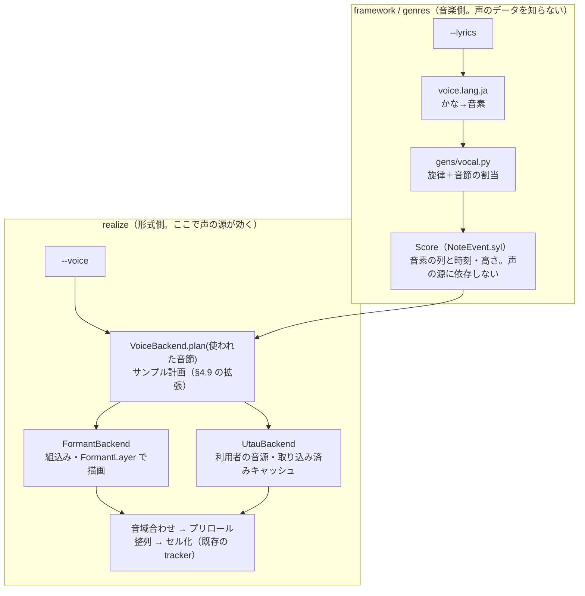
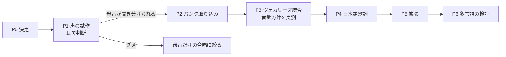
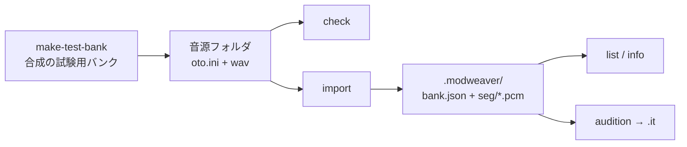
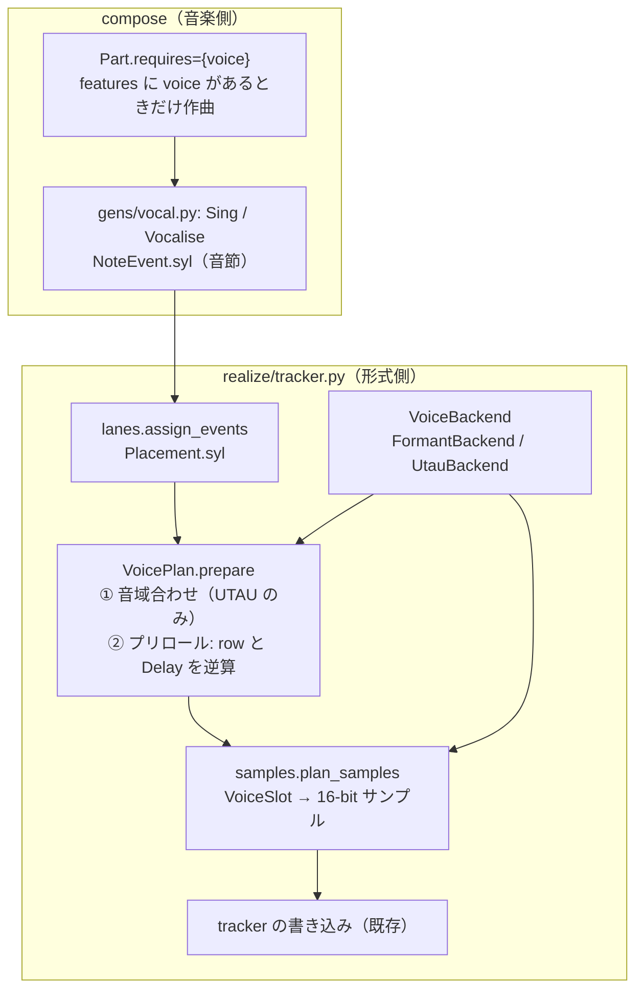
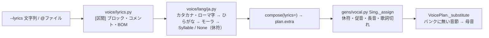

# 歌声（vocal）機能 設計草案

| 項目 | 内容 |
|:---|:---|
| 状態 | **草案・未実装**（2026-10-05。P0 の3決定は §10 に記録済み）。実装が終わったら DESIGN.md へ統合し、決定の経緯は DESIGN_HISTORY.md へ移す（FRAMEWORK_REDESIGN.md と同じ扱い） |
| 対象 | `--voice` で歌声パートを足す。ヴォカリーズ（母音・「らー」など）が先、日本語歌詞が次、多言語は設計で塞がないだけ |
| 前提となる既存設計 | DESIGN.md §2（層）・§3.3（Score）・§4.5（synth）・§4.9（サンプル計画）・§5.1（Genre 宣言）・§7.6（TrackerRealizer）・§8（CLI） |

---

## 0. 決定済みの方針（これまでの議論の結論）

| # | 決定 | 理由 |
|:---|:---|:---|
| D1 | **リポジトリに声のデータを一切含めない**（wav・oto.ini・変換済みバンク・生成した声入りの曲を含む） | 再配布禁止・非商用・改変不可などの規約と衝突しない。グレーゾーンを作らない |
| D2 | **本体は標準ライブラリのみ**（NFR-1 を維持）。外部の歌声合成（NNSVS・DiffSinger 等）は本体に入れない | 依存とデータ規約の両方を避ける |
| D3 | 声の源は2つ。**(A) 組込みのフォルマント合成**（コードだけで声を作る。データ不要＝何も置かなくても鳴る標準の声）、**(B) 利用者が自分で用意する UTAU 形式（oto.ini）の音源**（高品質・歌詞対応） | A はライセンス問題が無い。B は日本語の既存音源が最も豊富で、1音節＝1 wav という構造がトラッカーのサンプルに直結する |
| D4 | **歌声は opt-in**。`--voice` を付けない限り、既存の全ジャンルの出力はバイト単位で変わらない（golden 不変） | DESIGN.md §2.3 原則9 |
| D5 | 対応形式は **IT・XM・MP3（IT 経由）を主**にする。S3M は低優先、MOD は後回し（8-bit・約8kHz・31サンプルで声には厳しい）、MIDI は声ではなく GM の合唱音色＋歌詞メタイベント | 16-bit・高レート・サンプル数に余裕のある形式で品質を確保する |
| D6 | **音素を共通の単位**にし、日本語（かな）は最初の「前段（フロントエンド）」として切り出す。バンクの引き当ては言語ごとの対応表で行う | 多言語の可能性を潰さない。人工言語 `xx` のテストで検査する（§9） |
| D7 | 開発中のデバッグ・品質評価は、**再配布しない個人利用で規約上問題のない音源**を `voices/`（gitignore）に置いて行う。CI とテストは実音源に依存しない（合成した試験用バンクを使う） | D1 と両立させる |

---

## 1. 要件

### 1.1 機能要件

| ID | 内容 |
|:---|:---|
| V-1 | `--voice <id>` で歌声パートを加える。`<id>` は `formant`（組込み）か、導入済みの音源の id |
| V-2 | 歌詞なしならヴォカリーズ（ジャンルが宣言した母音・音節で歌う）。`--lyrics` を渡せば日本語（ひらがな・カタカナ・ローマ字）の歌詞で歌う |
| V-3 | 同じ genre・seed・format・tempo・voice（バンクの内容が同じ）・lyrics からは同じファイルを出力する（FR-2 の拡張） |
| V-4 | 同じ genre・seed・tempo なら、**声の源（formant／音源A／音源B）や歌詞が違っても、他パートの音符と、歌声パートの音符の時刻・高さは同じ**（骨格は声の源に依存しない。I1 の拡張） |
| V-5 | `--voice` 無しの出力は従来と同一 |
| V-6 | 音源の取り込み・検査・試聴を行う別コマンド（`modweaver_voice.py`）を持つ |
| V-7 | 声の源が要求するクレジット・規約の要点を、バナー・`--json`・サイドファイル（`<出力>.credits.txt`）・形式内のメタ情報に自動で出す |
| V-8 | 非対応の形式で `--voice` を指定したら、黙って無視せず、引数エラー（終了コード 2）にする |

### 1.2 非機能要件

| ID | 内容 |
|:---|:---|
| NV-1 | 実行時の依存は標準ライブラリのみ。wav の読み込みは `wave`、設定は `json` |
| NV-2 | 音源が1つも無い環境でも、全テストと `--voice formant` が動く |
| NV-3 | 取り込み（重い DSP）と生成（毎回）を分ける。生成時にバンク全体を再解析しない |
| NV-4 | 声のデータを git に入れない仕組みをテストで強制する（§9.4） |

### 1.3 非目標（この設計では扱わない）

- 漢字かな交じり文からの読みの自動変換（形態素解析が標準ライブラリに無い）。かな・ローマ字だけを受け付け、ルビ記法で拡張する余地を残す。
- 機械学習による合成（DiffSinger・NNSVS）。将来 `VoiceBackend` を足せるが、本体には入れない。
- 他人の声の無断利用を助ける機能（声の権利は利用者の責任）。

---

## 2. 全体像



**鉄則**: `compose()` は声の源に問い合わせない。音域・音節の有無・プリロールは、すべて Realizer が吸収する（V-4）。

### 2.1 追加するモジュール

| モジュール | 役割 | 依存してよい側 |
|:---|:---|:---|
| `mod_weaver/voice/phoneme.py` | `Phoneme`・`Syllable`・音素表（言語共通の記号）。純データ | genres・framework・realize のすべて |
| `mod_weaver/voice/lang/__init__.py`・`ja.py` | 歌詞の前段（`LangFrontend` の登録簿と日本語）。純関数 | 同上 |
| `mod_weaver/voice/bank/` | **I/O と DSP**: `utau.py`（oto.ini・prefix.map・wav の読み込み）、`cut.py`（切り出し）、`loopfind.py`（母音ループ）、`resample.py`、`pitch.py`（基本周波数の推定）、`cache.py`、`credit.py` | realize だけ（genres は import 禁止） |
| `mod_weaver/voice/formant.py` | 組込みの声の定義（母音・子音の表、音節の組立て） | realize だけ |
| `framework/gens/vocal.py` | `Vocal`・`Vocalise`・（後で）`Choir` ジェネレータ | genres が使う |
| `framework/realize/voice.py` | `VoiceBackend` の選択・サンプル計画・音域合わせ・プリロール | realize 内部 |
| `core/synth.py` | `FormantLayer`（Layer の1種。§4.5 の直交原則に沿う） | |
| `mod_weaver/voice_cli.py`・`modweaver_voice.py` | 音源の `check`／`import`／`list`／`info`／`audition` | |

層の検査（`tests/framework/test_layering.py` を拡張）: `genres` は `voice.bank`・`voice.formant`・`realize` を import しない。`voice.phoneme`・`voice.lang` は I/O を持たない（ast で `open`・`wave`・`os` の import を禁止）。

---

## 3. データモデル

### 3.1 音素と音節（言語共通。`voice/phoneme.py`）

```python
@dataclass(frozen=True)
class Syllable:
    text: str                       # 元の表記（表示・MIDI の歌詞・クレジットの確認用）。例 "か"
    lang: str                       # "ja" など。バンクの引き当て表を選ぶ鍵
    onset: tuple[str, ...] = ()     # 頭子音の音素列。例 ("k",)。母音だけなら空
    nucleus: str = "a"              # 核（母音、または音節性の鼻音 "N"）
    coda: tuple[str, ...] = ()      # 末尾子音（日本語は空。他言語用）
    kind: str = "normal"            # "normal" | "geminate"（促音の閉鎖。無音＋短い子音）| "extend"（長音。前の母音の延長）
```

- 音素記号は **X-SAMPA 風の ASCII**（`k`・`S`・`ts`・`N`・`a`・`i`・`M`（日本語の「う」）など）。表は `phoneme.py` に1つだけ置き、言語の前段はこの表の記号だけを出す。
- **日本語の前段（`ja.py`）が持つ知識はここまで**: かな → モーラ → 音素。バンクの別名（oto.ini の `あ`／`a`／`ka`）への変換は**バンク側**の対応表（§5.3）の役目で、前段は知らない。

### 3.2 Score への追加（`framework/score.py`）

```python
@dataclass(frozen=True)
class NoteEvent:
    ...                              # 既存
    syl: Optional[Syllable] = None   # 歌声の音符だけが持つ。既存の音符は None のまま
```

- `Instrument` を拡張せず、**歌声の楽器は別の宣言型 `Voice`** にする（`patch` を持たない）:

```python
@dataclass(frozen=True)
class Voice:
    timbre: str                      # "female" | "male" | "child" | "choir" — バンクを選ぶ手がかりと、formant の声種
    gm: GmVoice                      # MIDI の代替（合唱音色 52・53・54 など）。必須
    volume: Optional[int] = None
    pan: Optional[int] = None
    release_s: Optional[float] = None
    range: tuple[int, int] = (12, 36)   # 旋律を書く logical note の範囲（Realizer が音域合わせで使う目安）
```

- `Genre.instruments` は `Mapping[str, Instrument | Voice]`。クラス定義時の検査に「`Voice` の楽器は `pitched`＝真」「`NoteEvent.syl` は `Voice` の楽器にだけ付く」を足す。
- **`Part.requires: frozenset[str] = frozenset()`**: 例 `Part("vocal", Vocal(...), requires=frozenset({"voice"}))`。`--voice` が無い曲では、このパートは**存在しない**扱い（作曲もしない・lane も数えない）。D4 を成り立たせる仕組み。`--voice` がある曲ではパートの乱数は専用（`...:part:vocal`）なので、**他パートの音符は変わらない**（既存の「パートごとの乱数」原則）。
- **予算**: `Part.min_channels` を使う。歌声は単音（`poly=1`）。ヴォカリーズの合唱（和音）は声部として `poly` を増やす後の段階。MOD 4ch では既定で外す（`min_channels=6`）。

### 3.3 Target への追加（`framework/target.py`）

`features` に `"voice"`（IT・XM・S3M・MP3 で ○、MOD は後の段階まで ✕、MIDI は ○ だが代替表現）と、`SampleCaps` の値をそのまま使う（16-bit・44.1kHz・`max_samples`）。**形式の判定をジェネレータに持ち込まない**ため、`Vocal` ジェネレータは features を見ない。`--voice` と非対応形式の組合せは `engine.build` の入口で `ChannelCountError` と同種の引数エラーにする（V-8）。

---

## 4. 歌詞と旋律（音楽側）

### 4.1 `--lyrics` の入力

| 形 | 例 | 意味 |
|:---|:---|:---|
| 文字列 | `--lyrics "ゆうやけこやけで ひがくれて"` | 区間の名前を指定しない。歌う区間（`Vocal` パートが鳴る区間）に、出現順に流し込む |
| ファイル | `--lyrics @song.txt` | 区間ごとの歌詞 |

ファイルの書式（UTF-8。BOM 可。改行は LF・CRLF）:

```text
# コメント行
[verse]
ゆうやけこやけで
ひがくれて
[chorus]
らららー
```

- `[名前]` は **区間の名前**（`Section` のキー）。無い区間は歌詞なし（ヴォカリーズ）。区間は名前ごとに1回だけ作曲され `order` で繰り返される（DESIGN.md §3.3）ので、**繰り返した区間は同じ歌詞を歌う**。別の歌詞にしたいときは区間名を分ける（既存の a1／a2 の仕組み）。
- 受け付ける文字: ひらがな・カタカナ・長音「ー」・小書き（ゃゅょぁぃぅぇぉ）・促音「っ」・撥音「ん」・ローマ字（ヘボン式・訓令式の混在可）・空白・句読点（休符の目安）。**漢字・英字単語は `LyricsError`**（終了コード 2）で、行番号と文字を示す。助詞（は・へ・を）は**歌う発音で書く**（「わ」「え」「お」）。将来のルビ記法 `{夕焼け|ゆうやけ}` の余地として、`{`・`|`・`}` は予約文字にする。

### 4.2 前段（`voice/lang/ja.py`）の出力

`parse(text) -> list[Syllable]`。仕様:

- モーラ単位に分け、`Syllable(text=…, lang="ja", onset, nucleus, kind)` にする。拗音（きゃ→ `ky`+`a`）、促音（`kind="geminate"`）、撥音（`nucleus="N"`）、長音「ー」（`kind="extend"`）。
- 母音の無声化・連母音の融合・アクセントは**扱わない**（歌では発音どおり歌うため）。
- 句読点・空白は `Syllable` ではなく「休符」の印（`None`）として列に入れる。

### 4.3 割当（`framework/gens/vocal.py`）

`Vocal(inst, rules, motifs, vol, gate, *, vibrato=0, vocalise=("あ",))` は `Lead` と同じ旋律生成（`MelodyGenerator`・動機 A・B）で音符を作り、**音符の列に音節を流し込む**:

1. 区間の歌詞があれば、前段の音節列を取り出す。無ければ `vocalise` を循環させる（既定は日本語なら「あ」。ジャンルが「ら」「ん」「ほ」などを選べる）。
2. **1音符＝1音節**を基本にする。音節が尽きたら、残りの音符は最後の母音の**メリスマ**（`kind="extend"` の音節）にする。音節が余ったら、**次の区間へ繰り越さず切り捨てる**（`LyricsWarning`、終了コードは 0）。
3. 長い音符（`dur` が大きい）に音節が続くとき、`vibrato` を後半に付ける（`Lead` と同じ）。短い音符（1 step）の連続は子音を保てるので問題ない。
4. 促音は直前の音符の末尾を詰める（`dur` を1 step 短くする）。長音は直前の音符に `Glide` を使わず、同じ母音のメリスマ音符にする。
5. **乱数は旋律にだけ使い、割当は決定的**（歌詞の長さで旋律の乱数列が変わらない。歌詞を変えても音符の時刻・高さは同じ。V-4）。

> 要確認: `MelodyGenerator` は区間単位で音符数が決まる。歌詞の長さに旋律を合わせる方式（フレーズを歌詞の行に合わせる）は、旋律の乱数列を歌詞に依存させるので採らない。長い歌詞を全部歌わせたい用途は、区間を増やす（`--lyrics` の区間名）で対応する。

### 4.4 声部（合唱）の拡張

`Choir(inst, vol, *, vowel="あ")` は `Pad` と同じ形（和音の変わり目に `dur=None`）で、**音節は全声部が同じ母音**にする。lane は和音の声部（既存の ladder: 声部→焼く）。ただし**歌声の和音は「焼く」ことができない**（実録音の和音サンプルは作れない）ので、ladder の R3 を歌声パートでは飛ばし、収まらなければ声部数を減らす（`Choir` の宣言に `max_voices`）。第2段階で実装する。

---

## 5. 声の源（形式側）

### 5.1 `VoiceBackend`（`framework/realize/voice.py`）

```python
class VoiceBackend(Protocol):
    id: str
    def info(self) -> VoiceInfo: ...                       # 名前・言語・home_note・クレジット・規約メモ・指紋
    def coverage(self, syl: Syllable) -> Optional[Recipe]: ...   # 引き当て。無ければ None
    def render(self, recipe: Recipe, *, note_hint: int, target: Target, lead_ms: float) -> SampleSpec: ...
```

選択（`engine.build(..., voice=)`）: `formant` → `FormantBackend`。それ以外は `voices/` の探索（§5.3.1）で見つけた `UtauBackend`。見つからなければ `VoiceNotFoundError`（終了コード 2）。**引き当てに失敗した音節**（その音源に無い）は次の順で代替し、代替ごとに WARNING を1回だけ出す:

1. 同じ母音の単独母音（`あ`）
2. 組込みの `FormantBackend` の同じ音節（音源と混ざるので最後の手段。`--voice-strict` で禁止できる）

### 5.2 組込み: フォルマント合成（`voice/formant.py`・`core/synth.py`）

**音源データは持たない**（コードだけで描画）。

- `FormantLayer(source, formants, glide)`: 声門音源（のこぎり波に近い周期波形＋息成分）→ 2〜4個の共鳴フィルタ（中心周波数・帯域・振幅）。`glide` は子音から母音への遷移（開始値→終了値、ミリ秒）。`core/synth.py` の Layer の1種として足し、既存の `Patch`・後処理・`Finish`（`Loop`）をそのまま使う。
- 母音: あ・い・う・え・お（IPA の a・i・M・e・o）。声種（`male`・`female`・`child`）ごとにフォルマントの表を持つ。**値は耳で調整する初期値**であり、DESIGN.md には調整後の値を書く。
- 子音クラス: 破裂（k・t・p・b・d・g）、摩擦（s・S・h・z・dZ）、鼻（m・n・N）、弾き（r）、半母音（j・w）。`NoiseLayer`（フィルタ付き雑音）と `PitchSweepLayer` の組合せで、短い立ち上がり（20〜80 ms）にする。
- 音節サンプル＝ **[子音部（ワンショット）][母音部（ループ）]**。ループは既存の `seamless_loop`（周期数が整数になるループ設計。§4.4）を使い、母音の周期数・ループ長は声種と音高から決める。
- **高さ別描画**: フォルマントは音高に追従しない（チップマンク化を避ける）。`FormantBackend.render` は `note_hint`（その音節が鳴る音域の代表音）で F0 を決めて描画する。音域は半オクターブ刻みの高さのバケットに分け、使われたバケットだけを描く（SampleKey に入る）。
- 品質の期待値: 「レトロで機械的だが母音が聞き分けられる」。**最初の試作の合否基準は §8 の P1**。

### 5.3 利用者の音源: UTAU 形式（`voice/bank/`）

#### 5.3.1 置き場所と探索順

```text
1. --voices-dir <path>              （指定があればそこだけ）
2. 環境変数 MODWEAVER_VOICES        （; または : 区切りで複数可）
3. <リポジトリ>/voices/             （既定。.gitignore 済み）
4. ~/.modweaver/voices/             （Windows は %USERPROFILE%\.modweaver\voices\）
```

各音源は1フォルダ = 1つの id（フォルダ名。ASCII の英数・`-`・`_` のみ。それ以外は import 時に別名を求める）。

```text
voices/<id>/
  oto.ini  *.wav  [prefix.map] [character.txt] [readme.txt]     ← 利用者が置くもの（配布元のまま）
  modweaver.json                                                ← 利用者が書く（クレジット・言語。無ければ import が雛形を作る）
  .modweaver/                                                   ← import が作る（キャッシュ。消してよい）
      bank.json  seg/*.pcm  report.txt
```

#### 5.3.2 `modweaver.json`（利用者が書く・音源ごとの規約メモ）

```json
{
  "id": "example",
  "lang": "ja",
  "alias_style": "auto",
  "credit": "声素材: 〇〇（作者名）  https://example.invalid/",
  "terms_url": "https://example.invalid/terms",
  "terms_checked": false,
  "notes": "商用可・加工可・再配布不可。公開する曲にはクレジットが必要",
  "alias_map": {}
}
```

- `credit` は**必須**（クレジット不要の音源は `"credit": ""` と `"credit_required": false` を明示する）。無ければ import がエラーにする。
- `terms_checked` が `false` のままの音源で生成すると、バナーに「規約を確認してください: <terms_url>」を出す（エラーにはしない）。
- 値は利用者が自分で入力する。**ModWeaver は規約の内容を判断しない**。

#### 5.3.3 取り込み（`modweaver_voice.py import <フォルダ>`）

1. **読み込み検査**: `oto.ini` の文字コードを判定（UTF-8 の厳密デコードを試し、失敗したら cp932。両方で読めなければエラー）。wav は `wave` で開く（PCM 8/16/24/32-bit、モノラル・ステレオ（モノラルに混ぜる）、任意のレート。**浮動小数点 wav・圧縮 wav は非対応**で、どのファイルかを示してエラー）。
2. **方式の判定**: 別名の集合から、`hiragana`（`あ`・`か`…）、`romaji`（`a`・`ka`…）、`vcv`／`cvvc`（`a か`・`- か`・`a k` のような形）を判定。**v1 は CV（単独音）だけ**を取り込み、VCV／CVVC は「未対応（連続音。§8 P5）」で、使える CV の別名があればそれだけを取り込み、無ければエラー。
3. **切り出し**（oto.ini の5値。単位 ms）: `offset`（頭から捨てる）、`consonant`（伸ばさない固定部）、`cutoff`（終端。**負値は末尾からの長さ、正値は offset からの長さ**。UTAU の流儀。実音源で確認する＝P2 の受け入れ項目）、`preutterance`（子音の終わり＝母音の頭の位置）、`overlap`（前の音との重なり。**v1 は使わない**）。
4. **音量の正規化**: 切り出した各音節を RMS ではなく**母音部のピーク**で揃え（音源内の差を縮める）、音源全体の基準を `bank.json` に記録する。
5. **サンプル変換**: 目標レート（形式の `target_rate`＝44.1kHz。XM・IT。S3M は長さの上限で下げる）へリサンプリング（窓付き sinc の純 Python 実装。取り込み時だけ。生成時は変換済みを読む）。
6. **母音ループの検出**（`loopfind.py`）: 母音部の後半で、基本周期の整数倍・振幅と位相が連続する区間を自己相関で探し、**ループ境界にクロスフェードを焼き込む**（IT・XM の順方向ループ）。安定した区間が短い（例: 120 ms 未満）音節は「ループ不可」とし、その音節は**ワンショット**（長い音符では止める）にする。ループ品質（継ぎ目の不連続の大きさ、ビブラート周期との整合）を `report.txt` に残す。
7. **基本周波数の推定**（`pitch.py`、YIN 系）: 母音部の代表 F0 を求め、音源全体の `home_note`（中央値）を `bank.json` に記録する。
8. **指紋**: 取り込んだファイル群の内容ハッシュ（SHA-256 を連結したもの）を `bank.json` に記録する（V-3。バナーに先頭8桁を出す）。
9. `report.txt`: 取り込めた音節数・取り込めなかった別名とその理由・ループ不可の一覧・`home_note`・警告。

#### 5.3.4 引き当て（バンクの対応表）

`UtauBackend.coverage(syl)` の手順:

1. `lang` が音源の言語と違えば、**対応表（`alias_map`）に当たらない限り** `None`。
2. 音素 → 別名: 音源の `alias_style` ごとの規則表（`hiragana`: かな文字への逆引き、`romaji`: 音素からローマ字へ）。`alias_map` が最優先（利用者が個別に直せる）。
3. `prefix.map`（音高帯ごとの接頭辞・接尾辞）がある音源は、**音域のバケット**（§5.5）に対応する別名を選ぶ。多音高の音源（例: 低・中・高の3版）は、バケットごとに別のサンプルになる。
4. 見つからなければ `None`（§5.1 の代替へ）。

> 多言語の見通し: 英語などは音素列から別名（`ka` ではなく `k a` や `- ka` など）への規則表と、`alias_style` の追加で足せる。`Syllable` と `VoiceBackend` の形は変えない。

### 5.4 サンプルの計画（`framework/realize/samples.py` の拡張）

- `SampleKey = (楽器名, 和音の形, セント, パン)` に**第5要素 `voice: Optional[tuple[str, int]]`**＝（音節の鍵 `onset+nucleus+kind`、音高バケット）を足す。歌声以外では `None`（既存のキーは変わらない）。
- 描画は `render_for`（§4.8）と並べて `render_voice(recipe, target)`。結果は `SampleSpec`（`bits=16`、`rate_hz` は再生レートの基準、`loop` はクロスフェード済みの母音ループ、`sounding_hz` は基準音高）。**`sounding_hz` は音源の `home_note` の F0 から求める**（MIDI と音高検算が使う）。
- **サンプル数**: 歌声は「使われた音節の種類 × 音高バケット数」だけ増える。`max_samples`（IT 99・XM 128・S3M 99）から他の楽器の数を引いた残りを歌声の上限にする。超えるときは、使用回数の少ない音節から**同じ母音の単独母音へ置き換え**（WARNING 1行）。MOD の 31 では実質的に歌詞は不可（D5）。
- サンプル名（ASCII 22 文字）: `v:<id先頭8>:<音節の鍵>`。IT・XM の楽器名・サンプル名に入る（クレジットの一部。§6.3）。

### 5.5 音域合わせ（Realizer。`framework/realize/voice.py`）

声の高さの扱いは「再生レートを変えるとフォルマントも動く」ことが最大の弱点なので、**移調量を最小にする**:

1. 歌声パートの音高（logical note）の中央値を `m`、音源の `home_note` を `h` とする。
2. **オクターブ単位だけ**全体を移す: `shift_oct = round((m − h)/12)`。半音単位では動かさない（調を変えない）。
3. 残る差（−6〜+6 半音）は再生レートで吸収する。**範囲を超える個別の音**は、その音だけ1オクターブ折り返す（旋律の輪郭が少し変わる。WARNING 1行にまとめる）。
4. 多音高バンクは、各音を最も近い音高版へ割り当て、再生レートでの移調は±2 半音以内にする。

この処理は**形式側**の写像であり、Score の `pitch` は変えない（V-4）。

### 5.6 プリロール整列（子音を拍の前に出す）

UTAU の音節は「子音→母音」で、母音が拍に乗る（`preutterance` の位置が拍）。トラッカーはセルの先頭＝発音なので、そのまま置くと**子音が拍に乗り、母音が遅れる**。次のとおり整える:

1. 曲の初期 BPM から 1 tick の長さ `tick_ms = 2500/BPM` を求める。使われた音節の `preutterance` の最大値 `P` を、`L = ceil(P / tick_ms)` tick に丸める（`L·tick_ms ≥ P`）。
2. 各サンプルの先頭に**無音 `L·tick_ms − pre_i`** を足す（母音の頭が必ず `L·tick_ms` の位置に来る）。
3. 歌声の音符は、拍の位置より **L tick 前**に置く: `k = ceil(L / row_ticks)` row 戻した行に、`Delay(k·row_ticks − L)`（0 なら付けない）を付けて発音する（既存の `Delay` の制約「row の tick 数未満」を満たす）。
4. 区間の先頭 k 行に入る音符は、行0・`Delay 0` に置く（母音がずれて遅れる。DEBUG ログ）。曲の頭の数 step は歌い出しが遅れるのを許容する。
5. 直前の音符の末尾は、次の音節のプリロールで**自動的に L tick 短くなる**（同じ lane で新しい発音が来るため）。歌唱としても自然（子音が前の母音を食う）。

> 要確認: `tracker.py` のセル化（`_candidates`・`_write_note`）が row 単位で `Delay` を扱う形のままで、1 row 前に置く操作を足せるか。スウィング（偶数・奇数 step の tick 数が違う）と `TempoEvent` の途中変化では `tick_ms` が変わるので、**初期 BPM とスウィングなしの row_ticks で計算し、ずれは許容**する（P3 で実測して許容範囲を決める）。実装は `tracker` に「発音の先行（lead）」という汎用の仕組みとして足し、歌声以外は使わない。

### 5.7 奏法の扱い

| Score の指定 | 歌声での扱い |
|:---|:---|
| `Vibrato` | そのまま（持続する母音に効く。実録音の母音ループ自体にビブラートがある音源は、ループ検出がビブラート周期を避ける） |
| `Glide` | 同じ母音のメリスマ音符間は、**サンプルを切り替えずに**ポルタメントとして使う（こぶし・しゃくり。enka・okinawan・raga・fado）。音節が変わる境目では普通の発音（既存の規則「鳴り終わっていれば普通の発音」） |
| `Delay`・`Retrig`・`Cut`・`Arpeggio` | 歌声では使わない（付いていれば Realizer が無視） |
| 音量・`Automation("volume")` | そのまま |
| メリスマ（`kind="extend"`） | `Glide` が無ければ**単独母音のサンプル**で新たに発音（母音が続く） |

### 5.8 音量

- 各音節は、取り込み時に母音部のピークを揃える。バックエンドが返す `SampleSpec.volume` は音源全体の基準。
- **既存の「音量の底上げ」（§7.9）との関係**: ジャンル × 形式の最大振幅の測定値（`framework/levels.py`）は歌声を含まずに測っている。歌声を加えると最大振幅が変わるので、`--voice` ありの曲は**底上げを行わず**、歌声パートの既定音量を控えめ（`vol` の初期値は耳で調整）にして、クリップを出さない（実プレイヤーの音割れ検査 §9.2 に歌声あり版を足す）。
  > 要確認: `native_level` が測定値の表を前提にしている点と、底上げなしで他の曲と聴感の音量差が出る点。P3 で実測して、歌声ありの底上げ方式（曲ごとにレンダリングして測る等）を決める。

### 5.9 MIDI

`MidiRealizer` は歌声の楽器の `gm`（合唱音色）で鳴らし、`NoteEvent.syl.text` を **Lyric メタイベント（FF 05）**として入れる。音声は GM 音源に依存する（声の源は無関係）。`--voice` を MIDI で指定してもバンクは読まない（警告なし。MIDI では `voice` の値は声の有無の旗としてだけ使う）。

---

## 6. CLI・GUI・出力

### 6.1 生成 CLI（`cli.py`）

| オプション | 既定 | 説明 |
|:---|:---|:---|
| `--voice ID` | なし | 歌声パートを加える。`formant` か導入済みの音源 id。付けなければ歌声なし（従来どおり） |
| `--lyrics TEXT` / `--lyrics @FILE` | なし（ヴォカリーズ） | §4.1 |
| `--voices-dir PATH` | §5.3.1 の探索 | 音源の置き場所 |
| `--voice-strict` | オフ | 音源に無い音節を組込みの声で補わず、エラーにする |
| `--list-voices` | – | 導入済みの音源を、id・言語・音節数・クレジット・規約確認の状態で表示して終了（`--json` で機械向け） |

終了コード: 未導入の id・形式非対応は 2（引数エラー）、歌詞の誤りは 2、取り込み済みキャッシュの破損は 3（`VoiceBankError`）。`errors.py` に `VoiceBankError`・`VoiceNotFoundError`・`LyricsError` を足す（`ModGenError` 系）。

### 6.2 音源の管理 CLI（`modweaver_voice.py`。標準ライブラリのみ・ASCII のバッチ（`.bat`）から呼べる）

| サブコマンド | 動作 |
|:---|:---|
| `check <フォルダ>` | 読めるか、方式（CV／VCV）、別名の数、wav の形式、注意点を表示するだけ（書き込まない） |
| `import <フォルダ> [--id ID] [--lang ja]` | §5.3.3。`modweaver.json` が無ければ雛形を作り、`credit` が空なら取り込まずに記入を求める |
| `list` | `--list-voices` と同じ |
| `info <id>` | クレジット・規約メモ・指紋・`home_note`・取り込めなかった別名 |
| `audition <id> [--text "あいうえお"] [--out FILE]` | 音源だけを鳴らす最小の曲（IT）を作り、**音節の聴き比べ・母音ループ・プリロールの確認**ができる。品質評価・デバッグの主な入口 |

### 6.3 クレジットの自動出力（V-7）

| 出力先 | 内容 |
|:---|:---|
| バナー・`--json` | 声の源の id・指紋の先頭8桁・クレジット文・`terms_checked` の状態・規約の URL |
| `<出力>.credits.txt`（常に出す。声を使った曲のみ） | クレジット文・規約の URL・`terms_checked`・ModWeaver の版・「この曲には音源のサンプルが含まれます。音源の規約が曲の公開・商用利用に及びます」 |
| IT | 曲のメッセージ欄に1〜2行のクレジット |
| XM・S3M・MOD | 楽器名・サンプル名（`v:<id>:…`）。メッセージ欄が無いため。主なクレジットはサイドファイルとバナー |
| MP3 | ID3 は付けない（ffmpeg の引数が増える。サイドファイルで代替。要望があれば後の段階） |

### 6.4 GUI（`gui/`）

`--list-voices --json` で選択肢を取得（ジャンルをハードコードしない方針と同じ。音源も固定しない）。画面: 「声」（なし／formant／導入済みの音源）、「歌詞」（複数行テキスト、`[区間]` 書式の説明）、「音源フォルダを開く」ボタン、音源が無い場合の案内（README の該当節へのリンク）。音源のクレジットを画面に表示し、`terms_checked` が偽の音源には警告を出す。

---

## 7. リポジトリの運用（D1・D7）

### 7.1 置かないものを仕組みで守る

- `.gitignore` に `/voices/`、`/output/`（既存）、`*.credits.txt`、`/.modweaver/`、`*.wav`（**リポジトリ全体で wav をコミット禁止**。テストの試験用 wav は実行時に一時フォルダへ生成する）、`oto.ini` を足す。
- `tests/unit/test_no_voice_data.py`: `git ls-files` に `*.wav`・`oto.ini`・`.modweaver/`・`prefix.map` が無いこと、`voices/` 配下が無いことを検査する（git が無い環境は skip）。
- `output/` にある声入りの曲は共有しない（README に注意）。Issue・PR に声入りのファイルを添付しない旨を CONTRIBUTING 相当の節に書く。

### 7.2 開発中のデバッグ・品質評価

| 項目 | 運用 |
|:---|:---|
| 音源 | 個人利用で規約上問題のない音源を1〜2つ、`voices/<id>/`（gitignore）か、リポジトリ外（`MODWEAVER_VOICES`）に置く。**再配布しない**。選ぶときは、商用・加工が可で、取り込み（サンプルの切り出し）を禁じていないことを、原文で確認する。候補（要・原文確認）: 小春音アミ（amitaro.net/utau/）。つくよみちゃんは「音声合成ソフトウェアとしての利用」に事前相談が要る旨の規約があり、**本ツールがそれに当たる可能性があるため、使う前に作者へ確認する** |
| CI・テスト | 実音源に依存しない。試験用バンクは `tests/helpers_voice.py` が**フォルマント合成の出力から wav と oto.ini を生成**して一時フォルダに作る（実音源の模倣ではなく、形式の検査用） |
| 実音源のテスト | `-m voicebank` のマーカー。`MODWEAVER_VOICE_TEST_ID` が設定されているときだけ走る（既定は skip） |
| 評価 | `tools/voice_eval.py`: 指定した音源・歌詞・ジャンル・形式で曲を生成し、(a) 聴取用の mp3／wav（`output/voice_eval/`。gitignore）、(b) 客観指標のレポートを出す。指標: 母音ループの継ぎ目の不連続（dB）、母音の頭の位置と拍の誤差（ms。libopenmpt でレンダリングして立ち上がりを検出）、基本周波数と目標音高の差（セント。既存の実プレイヤー検査と同じ手法）、ピークと RMS、クリップの有無、使ったサンプル数 |
| 聴取チェックリスト | 母音の判別、子音の明瞭さ、拍との合い、ループの「うなり」、音域端のこもり、他パートとの音量バランス、歌詞の誤読（`audition`・`voice_eval` の両方） |

---

## 8. 段階と受け入れ基準

| 段階 | 内容 | 受け入れ基準 |
|:---|:---|:---|
| **P0** | 本草案のレビュー、DESIGN.md への統合方針の確認、`xx`（人工言語）の前段を含む型の確定 | 未決事項（§10）の回答 |
| **P1** 試作（コードは使い捨て可） | `FormantLayer` の試作。母音5つ・子音数種を `listen_samples.py` 流に聴けるようにする | **母音が聞き分けられる**（耳で判断）。ダメなら D3(A) を見直す（母音だけの合唱的な声に絞る、など） |
| **P2** バンク取り込み | `voice/bank/`（oto.ini・wav・切り出し・ループ・F0・キャッシュ）と `modweaver_voice.py` の `check`・`import`・`audition`（単独の曲）。試験用バンクと、手元の実音源で確認 | 試験用バンクでの単体テスト通過。実音源で `audition` が鳴り、ループの「うなり」が許容範囲。**cutoff の符号規約を実音源で確定**（§5.3.3） |
| **P3** 生成への統合（ヴォカリーズ） | Score の `syl`・`Voice`・`Part.requires`、`gens/vocal.py`、samples・音域合わせ・プリロール整列、CLI の `--voice`、クレジット出力。IT・XM・MP3 | `--voice` 無しの全 golden が不変。`--voice formant` と実音源の両方で IT・XM が実プレイヤーで鳴り、**母音の頭と拍の誤差が ±1 tick 以内**、音高が±10セント以内（ループ音節）。クリップ無し |
| **P4** 日本語歌詞 | `voice/lang/ja.py`、`--lyrics`、割当、メリスマ・促音・長音、`LyricsError` | 試験用の歌詞で単体テスト通過。実音源で歌詞が聞き取れる（耳） |
| **P5** 拡張 | VCV（連続音）音源、多音高音源（`prefix.map`）、`Choir`、MIDI の歌詞、GUI、S3M | 各項目ごとに別の受け入れ基準を、着手時に書く |
| **P6** 多言語の足場の検証 | 2つ目の前段（例: 英語の簡易 g2p）を、**実装して `ja` と同じ API で動かす** | `Syllable`・`VoiceBackend`・バンクの対応表の変更が不要（または最小）であること |



各段階の終わりに、実プレイヤー・単体・結合・golden の全テストが通ること（既存の方針どおり）。

### P2 の実施状況（2026-10-05）



- 実装済み: `voice/bank/`（`wavio`・`otoini`・`cut`・`resample`・`pitch`・`loopfind`・`credit`・`cache`・`importer`・`discover`・`audition`・`synthetic`）、`voice_cli.py`、`modweaver_voice.py`（`check`・`import`・`list`・`info`・`audition`・`make-test-bank`）。
- **合成した試験用バンクでのみ検証済み**。実音源での再評価（cutoff の符号規約 §5.3.3・文字コード・zip の文字化け・ループの「うなり」）は未実施で、利用者が実音源を `voices/` に置いてから行う（R6）。cutoff の規約は `voice/bank/cut.py` の定数 1 つで反転できる。
- 取り込みの速度（R9）: 25 音節で約 4 秒（純 Python）。

### P3 の実施状況（2026-10-05）



- 実装済み: `Voice`・`Part.requires`・`NoteEvent.syl`・`Score.skipped_parts`、`gens/vocal.py`（`Sing`・`Vocalise`）、`voice/phoneme.py`・`voice/formant.py`・`voice/credits.py`、`realize/voice.py`（`VoiceBackend`・`FormantBackend`・`UtauBackend`・`VoicePlan`）、`--voice`・`--voices-dir`・`--list-voices`、`<出力>.credits.txt`、IT・XM・MP3・MIDI。最初のジャンルは okinawan・enka・mood-kayo。
- **設計からの変更**:
  - 最初のジャンルの歌声は、独自の旋律ではなく **`lead` の旋律をなぞる `Sing`**（島唄・演歌は歌と楽器が同じ旋律をなぞる）。`Vocalise`（歌声パート自身が旋律を作る）は部品として用意した。
  - 組込みの声は `core/synth.py` の Layer ではなく **`voice/formant.py` が直接描画**する（周期が整数サンプルの母音をループにするため。`Patch` の後処理は不要）。
  - プリロールは §5.6 の「スウィングなしの row_ticks で近似」をやめ、**row ごとの tick 長（スウィング含む）から逆算**した（row と `Delay` を決める）。2:1・3:1 のスウィングでも母音の頭が拍に ±0 tick で乗る（単体テスト）。テンポ変化（`TempoEvent`）の途中は未対応（初期 BPM で近似）。
  - 引き当てられない音節（P3 は母音のみ）は代替せず `PlanError`（§5.1 の代替は P4 で実装）。
- **R3（音量）の決定**: 歌声ありの曲も底上げするが、測定値（歌声なし）に **+1.0 dB の余裕**を足す（`VOICE_HEADROOM_DB`）。実プレイヤーで 3 ジャンル × IT・XM × 数 seed を測り、歌声ありの最大振幅は 0.3〜1.0 の内、歌声なしの 70% 以上で、音割れなし。
- **試聴の結果（P3 後）**: 最初の実装は「声に聞こえない・楽器のよう・母音が聞き分けられない」だった。原因は、P1 の試作にあった揺れ（ビブラート・ジッタ・息）を本実装で落とし、**静的な周期波形をループ**にしていたこと（オルガン・リードに聞こえる）。加えて、全音符が同じ「あ」で母音の差が出ていなかった。対策: `voice/formant.py` を、**ビブラート・ジッタ・シマー・息をループ長に整数周期入る形で焼き込む**作りに替えた（ループは継ぎ目なしのまま）。高い音では F1 を基本周波数の少し上へ（フォルマントチューニング）。`choir`（3 声を離調して重ねる）を追加。`Sing` はビブラートをサンプルに任せる。**結果は未確認（再試聴待ち）**。それでも「声」に聞こえない場合は、R1 のとおり実音源（UTAU）が本命で、組込みの声は合唱の「ア〜」に絞る。
- 未実施: IT の曲メッセージ欄へのクレジット（P3 では楽器名・サンプル名・サイドファイル・バナーのみ）、歌声ありの `tools/calibrate_levels.py`、GUI。
- 実音源（重音テト単独音）での初回評価（2026-10-05）: **cutoff の符号は仮定と逆**（正＝末尾から捨てる）だった。直す前は全 152 音節が数十 ms に切れてループ不可になった。直したあとも、ループ検出が実声（ビブラート・振幅の揺れ）では不一致が大きかった（96/152 が mismatch>0.35）ため、`loopfind` を、複数の長さ・始点・F0 のオクターブ違いを試す探索に改め、不一致は 0.04〜0.2 に下がった。取り込みは 152 音節で約 80 秒（R9）。

### P4 の実施状況（2026-10-06・かなのみ）



- 実装済み: `voice/lang/ja.py`、`voice/lyrics.py`、`--lyrics`（`engine.build/generate(lyrics=)`、再現コマンドにも出す）、`Sing` の割当、バンクに無い音節の母音への代替（WARNING は音節ごとに1回。バナーにも出す）。`tests/voice/test_lyrics.py`。
- 区間名を指定しない歌詞（文字列）は、**歌う区間へ作曲順に流し込む**（区間をまたぐ。尽きた後の区間はヴォカリーズ）。`[区間]` 書式は、無い区間をヴォカリーズで歌う。区間名がこの曲に無ければ `LyricsError`。
- **設計からの変更**:
  - 音節が尽きたとき、残りの音符は**最後の母音のメリスマにせず歌わない**（§4.3 の2）。数十音符が同じ母音の連打になって聞くに堪えないため。このとき歌声パートの音符数は歌詞の長さで変わる（V-4 は「音符の時刻・高さが同じ」を、歌う音符については保つ）。メリスマは長音「ー」だけ。
  - 句読点・空白は「その位置の音符を1つ飛ばす」休符。改行は区切りにしない。
  - 代替は「同じ母音」まで。組込み formant への代替は P3 の formant が母音しか出せないため行わない（`--voice-strict` も同じ理由で未実装）。
  - formant の子音は未実装（formant では子音付きの音節は母音で歌う）。
  - MIDI は音符のみ（歌詞メタイベントは P5）。MOD・S3M は対象外のまま。
- **耳での確認は未実施**: `output/listen/vocal_lyrics/`（A: 歌詞あり、B: ヴォカリーズ）で、歌詞が聞き取れるか・子音が拍の前に出ているかを聴く。

### README・GUI の実施状況（2026-10-06）

- README（ja/en）に「歌声を加える」の章（`--voice`・音源の用意・取り込み・歌詞の書式・公開前の注意）とオプション表の行を追加。
- GUI: 「歌声」（なし／`--list-voices --json` の声）と「歌詞」（複数行）。対応ジャンル・形式は `--list-genres --json` の `vocal`・`voice_formats` から決め、使えないときは欄を無効にして理由を出す（ジャンル名などは GUI に書かない）。「別の形式でも書き出す」「設定に読み込む」は声と歌詞を引き継ぐ（非対応形式へは声を渡さない）。`--lyrics` の文字列は、ファイルと同じ書式（`[区間]` ブロック可）。結果 JSON に `lyrics` を追加。
- 未実施: 実機の GUI 表示確認（テストは xvfb で通過）、音源フォルダを開くボタン、規約未確認の警告の見た目の調整。

---

## 9. テスト戦略

### 9.1 単体（実音源不要）

- `voice.lang.ja`: 全かな表・拗音・促音・撥音・長音・ローマ字（ヘボン・訓令）・漢字の拒否・予約文字。
- 歌詞ファイルの解析（`[区間]`・コメント・BOM・CRLF）。
- 割当: 音節の過不足・メリスマ・決定性（歌詞を変えても音符の時刻・高さが同じ）。
- oto.ini の読み込み（UTF-8・cp932・不正行・空行・コメント）、切り出し（offset・cutoff の正負）、`prefix.map`。
- `loopfind`: 周期信号に対して継ぎ目の不連続が閾値以下であること。ビブラート付き信号。ループ不可の判定。
- `resample`: 正弦波の周波数・振幅が保たれること（スペクトルで検査）。
- `pitch`: 既知の周波数の合成波で推定誤差が閾値以下。
- プリロールの tick 計算（k・Delay・無音の長さ）。

### 9.2 結合・実プレイヤー

- `--voice formant` で IT・XM・MP3 が生成でき、検証器（`verify`）が通る。
- 試験用バンクで IT・XM を libopenmpt でレンダリングし、**母音の頭の位置と音高を測る**（既存の `tests/realplayer/` の流儀）。
- 音割れ検査に歌声あり版を足す。
- 決定性: 同じ入力で2回生成して同一バイト。指紋が違うバンクで出力が変わること。

### 9.3 回帰

- `--voice` 無しの全ジャンル × 全形式で、既存の golden が不変（`tests/regression/golden.json`）。
- 全ジャンル × 全予算の生成テストに、`--voice formant` ありの組合せを足す（歌声を宣言したジャンルだけ）。

### 9.4 リポジトリの衛生

- `test_no_voice_data.py`（§7.1）。
- 層の検査（§2.1）。
- **人工言語 `xx`**: `tests/` 内に、日本語と違う音節構造（子音で終わる CVC など）の前段とバンクの対応表を置き、`Syllable`・`VoiceBackend`・サンプル計画が `ja` を前提にしていないことを検査する（D6）。

---

## 10. 未決事項・リスク

| # | 項目 | 対応 |
|:---|:---|:---|
| R1 | フォルマント合成の品質が「声」に聞こえない | P1 で判断。ダメなら標準の声を「母音だけの合唱（あー）」に絞る。音源が無い環境では歌声なし、を許容 |
| R2 | プリロールを `tracker.py` に足せるか（row 単位のセル化、スウィング、テンポ変化） | P3 で実装して実測。ずれの許容範囲を決める（§5.6）。**P2 の audition（IT・テンポ固定・スウィングなし）で先行実測済み**: 母音の頭と拍の誤差は約 ±3 ms（実プレイヤー）。残る確認はスウィング・テンポ変化・`tracker` への組込み |
| R3 | 歌声ありの音量（底上げ §7.9 との関係） | **P3 で決定**: 底上げは行い、測定値に +1.0 dB の余裕を足す（P3 の実施状況） |
| R4 | UTAU の単一音高の音源は、移調で音色が変わる（フォルマントのずれ） | 音域合わせ（§5.5）で最小化。多音高音源を推奨（README） |
| R5 | 母音部が短い音源はループできない | ワンショット代替・`report.txt` で警告。README に「母音が長めの音源」を選ぶ指針 |
| R6 | oto.ini の cutoff の符号規約、文字コード、zip の文字化け（OS の展開ツール） | P2 で実音源で確認。README に展開方法を詳述（§付録 A） |
| R7 | サンプル数の上限（MOD の 31 など） | D5。IT・XM は余裕あり。超過時の置換規則（§5.4） |
| R8 | 規約の解釈（生成した曲に声のサンプルが含まれる点、`terms_checked` を信用できない点） | ツールは判断しない。README・クレジット・サイドファイルで利用者に明示（付録 A）。**法的な助言ではない** |
| R9 | 純 Python のリサンプリング・自己相関の速度 | 取り込み時だけ（NV-3）。キャッシュ。遅ければ取り込みの進捗表示とフォルダ単位の並列（`multiprocessing`）を足す |
| R10 | 歌詞の長さと旋律の長さの不一致 | §4.3 の方針（切り捨て・メリスマ）。区間名での分割を README に例示 |
| R11 | 音源の `modweaver.json` の `credit` を空にして使うこと | 防げない（利用者の責任）。ただし空は `credit_required: false` の明示を要求し、既定では取り込みを止める |

### P0 の決定（2026-10-05、推奨案を採用）

1. **最初に歌声パートを宣言するジャンル**: okinawan・enka・mood-kayo（民謡・演歌系。旋律が声向きで、母音中心でも成立する）。gospel-shout・gagaku は P5 の `Choir` 後、pop 系はその後。
2. **音源管理**: 別コマンド `modweaver_voice.py`（既存 CLI にサブコマンドが無いため）。
3. **歌声ありの音量**: §5.8 の方針は P3 で実測してから決める。

---

## 付録 A. README に書く内容（利用者向けの章立てと要点）

> 実装後に、実際のコマンド名・出力に合わせて書き直す。**文面の骨子**として残す。

### A.1 章立て

1. **歌声機能とは**: 何ができるか（ヴォカリーズ・日本語歌詞）、必要なもの、対応形式（IT・XM・MP3 が主）。
2. **まず試す（音源なし）**: `python modweaver.py --genre <id> --format it --voice formant`。
3. **本体に声のデータは入っていません**（理由と、自分で用意する手順の全体像の図）。
4. **音源を選ぶ**: 規約の確認項目のチェックリスト（下の A.2）、探せる場所、**取り込みに向く音源の条件**（単独音＝CV・母音が長め・複数音高があればなお良い・wav が PCM）。
5. **入手する**: 配布元の公式サイトから**自分でダウンロード**する。**ModWeaver は音源を再配布しません**。手順は音源ごとの配布元に従う（登録・ログインが要る音源もある）。
6. **配置する**（Windows／macOS／Linux それぞれ）: 展開 → `voices/<id>/` へ → `oto.ini` と wav が `voices/<id>/` の直下にあること（入れ子にしない）。**zip の文字化け**（Linux: `unzip -O cp932 x.zip`、`7z x -mcp=932`、Windows 標準の展開は通常可）。フォルダ名は ASCII（`example` など）。
7. **`modweaver.json` を書く**: `credit`（配布元の指定どおり）・`terms_url`・`notes`・`terms_checked`。
8. **取り込む**: `python modweaver_voice.py check voices/example` → `import` → `audition`。`report.txt` の読み方。
9. **曲に歌わせる**: `--voice example`、`--lyrics`（書式と例）、区間名の調べ方（`--json` の plan）。
10. **公開・商用利用の前に**: 曲には音源のサンプルが含まれる。音源の規約（クレジット、禁止される内容、商用可否、事後報告の要否）に従う。`<出力>.credits.txt` の使い方。**これは法的な助言ではなく、確認は利用者の責任**。
11. **トラブルシュート**: 文字化け・音節が見つからない・ループがうなる・音が小さい・歌い出しが遅い・サンプル数超過・`VoiceBankError`。
12. **リポジトリに声のデータを入れないでください**（Issue・PR に声入りのファイルを添付しない）。

### A.2 音源の規約を確認するチェックリスト（README に載せる文面案）

- [ ] **商用利用**の可否（収益化する動画・配信・ゲーム・販売曲に使うか）
- [ ] **加工**の可否（ノイズ除去・ピッチ変更・サンプルの切り出し・ループ化。本ツールは音源の wav を**切り出して加工し、曲のファイルに埋め込む**）
- [ ] **曲の公開**の条件（クレジットの書き方、禁止される内容: R18・政治・宗教・暴力など）
- [ ] **ソフトウェア等への利用**の可否（音源を読み込んで声を出すツールで使うことに制限が無いか。無許可の「音声合成ソフトの組込み」を禁じる音源がある）
- [ ] **事後報告・事前相談**の要否
- [ ] **再配布**の禁止（元の wav や、取り込み後のキャッシュを他人に渡さない。本ツールは渡すこと自体を想定しない）

### A.3 配布元の案内（README に載せる表の骨子）

| 音源 | 配布元 | 規約の確認ポイント（要点。**必ず原文を読む**） |
|:---|:---|:---|
| 小春音アミ | 公式サイト（amitaro.net/utau/） | 商用可・加工可・クレジット必須・事後報告の要望・禁止される内容。ソフトウェアでの利用の扱いは原文を確認 |
| つくよみちゃん | 公式サイト（tyc.rei-yumesaki.net） | 商用可・加工可・クレジットは用途で異なる。**「音声合成ソフトウェアとしての利用」は事前相談**の記載。本ツールの利用が当たるかを作者に確認 |
| そのほかの UTAU 音源 | 各配布元 | 二次配布禁止が多い。上のチェックリストで確認 |

（README の表は**確認済みの日付**を併記し、規約は変わりうるため必ず配布元の最新の原文を読むよう明記する。）

---

## 付録 B. 変更が及ぶ既存ファイルの一覧（実装時）

| ファイル | 変更 |
|:---|:---|
| `framework/score.py` | `NoteEvent.syl`（既定 None） |
| `framework/genre.py` | `Voice` 宣言型、`Part.requires`、宣言の検査 |
| `framework/compose.py`・`context.py` | `requires` を満たさないパートの除外、`ctx` に歌詞の区間割当 |
| `framework/gens/vocal.py`（新） | `Vocal`・`Vocalise`（のち `Choir`） |
| `framework/target.py` | `features` に `voice`、非対応形式の判定 |
| `framework/realize/samples.py` | `SampleKey` の拡張、歌声のサンプル計画・置換規則 |
| `framework/realize/voice.py`（新） | `VoiceBackend`、音域合わせ、プリロール |
| `framework/realize/tracker.py` | 発音の先行（lead）の汎用機能 |
| `framework/realize/lanes.py` | 歌声パートの lane（単音）、歌声の和音を焼かない規則（Choir） |
| `framework/realize/midi.py` | 歌声の `gm`・Lyric メタイベント |
| `core/synth.py` | `FormantLayer` |
| `engine.py` | `build(..., voice=, lyrics=, voices_dir=)` |
| `cli.py` | `--voice`・`--lyrics`・`--voices-dir`・`--voice-strict`・`--list-voices`、バナー・JSON、`MESSAGES` |
| `errors.py` | `VoiceBankError`・`VoiceNotFoundError`・`LyricsError` |
| `gui/` | 声・歌詞の入力、`--list-voices --json` |
| `.gitignore`・`tests/` | §7.1・§9 |
| `README.md`・`README.en.md`・`DESIGN.md` | 付録 A の反映、DESIGN への統合 |
